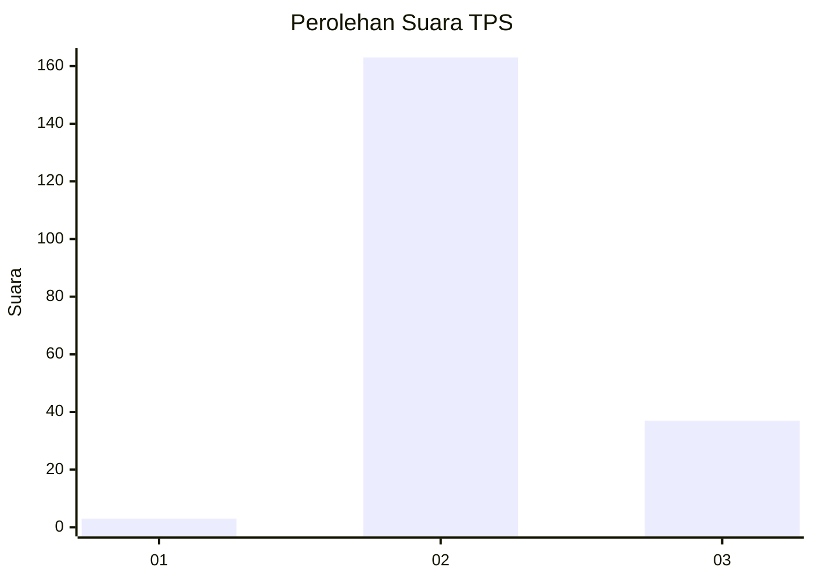
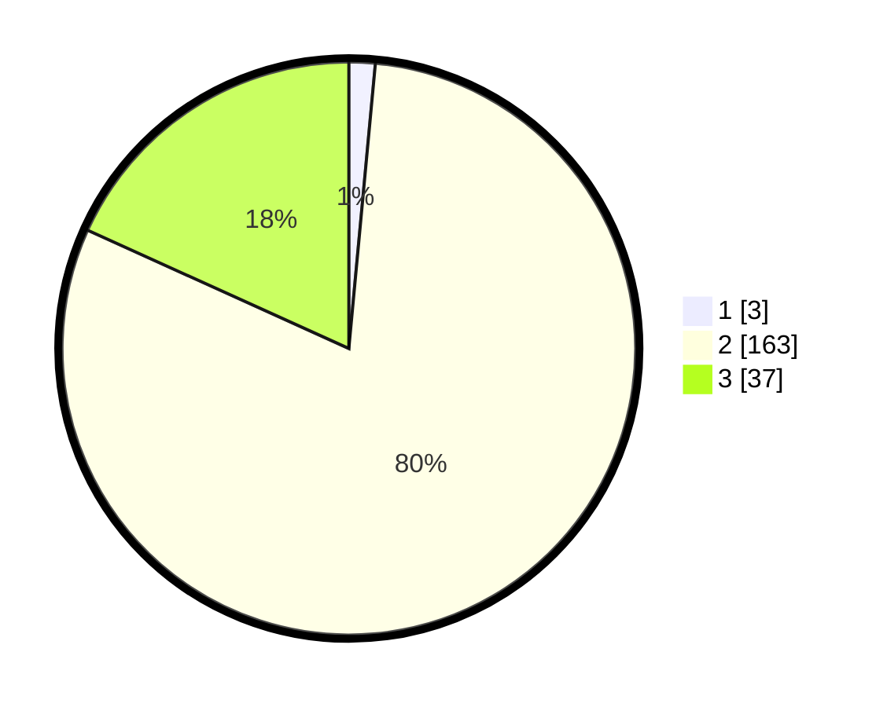

# Hasil

## Grafik

## Tabel

| No. | Nama Paslon    | Suara | Suara (raw) | Persentase |
|:--- |:-------------- | -----:| -----------:| ----------:|
| 1   | ANIES MUHAIMIN | 3     | [3][p-1]    | 1,48       |
| 2   | PRABOWO GIBRAN | 163   | [163][p-2]  | 80,30      |
| 3   | GANJAR MAHFUD  | 37    | [37][p-3]   | 18,23      |

[p-1]: https://github.com/gigit-pemilu/pemilu-2024/blob/main/pilpres/hitung-suara/sub/33-jawa-tengah/sub/17-rembang/sub/03-gunem/sub/2006-dowan/sub/003-tps/sub/paslon-1.txt
[p-2]: https://github.com/gigit-pemilu/pemilu-2024/blob/main/pilpres/hitung-suara/sub/33-jawa-tengah/sub/17-rembang/sub/03-gunem/sub/2006-dowan/sub/003-tps/sub/paslon-2.txt
[p-3]: https://github.com/gigit-pemilu/pemilu-2024/blob/main/pilpres/hitung-suara/sub/33-jawa-tengah/sub/17-rembang/sub/03-gunem/sub/2006-dowan/sub/003-tps/sub/paslon-3.txt

## Foto C Plano

https://sirekap-obj-formc.kpu.go.id/9296/pemilu/ppwp/33/17/03/20/06/3317032006003-20240216-112533--d195d1db-e99b-43df-b849-f2eb31bb4e8e.jpg

https://sirekap-obj-formc.kpu.go.id/9296/pemilu/ppwp/33/17/03/20/06/3317032006003-20240216-141410--c7d83c1e-ebaf-483e-b01c-12d05e81ccc3.jpg

https://sirekap-obj-formc.kpu.go.id/9296/pemilu/ppwp/33/17/03/20/06/3317032006003-20240216-142239--cf6b3dab-9670-45b3-8bb2-bc83e41a8a8d.jpg

## Metadata

| Key        | Value               |
| ---------- | ------------------- |
| Time Stamp | 2024-02-16 14:30:33 |

## DATA PEMILIH TETAP

Jumlah pemilih dalam DPT: **250**.
 * L: **400**.
 * P: **220**.

## DATA PENGGUNA HAK PILIH

Jumlah pengguna hak pilih dalam DPT: **235**.
 * L: **11**.
 * P: **467**.

Jumlah pengguna hak pilih dalam DPTb: **220**.
 * L: **0**.
 * P: **200**.

Jumlah pengguna hak pilih dalam DPK: **445**.
 * L: **10**.
 * P: **420**.

Jumlah pengguna hak pilih: **801**.
 * L: **80**.
 * P: **446**.

## JUMLAH SUARA SAH DAN TIDAK SAH

JUMLAH SELURUH SUARA SAH: **209**.

JUMLAH SUARA TIDAK SAH: **12**.

JUMLAH SELURUH SUARA SAH DAN SUARA TIDAK SAH: **221**.

