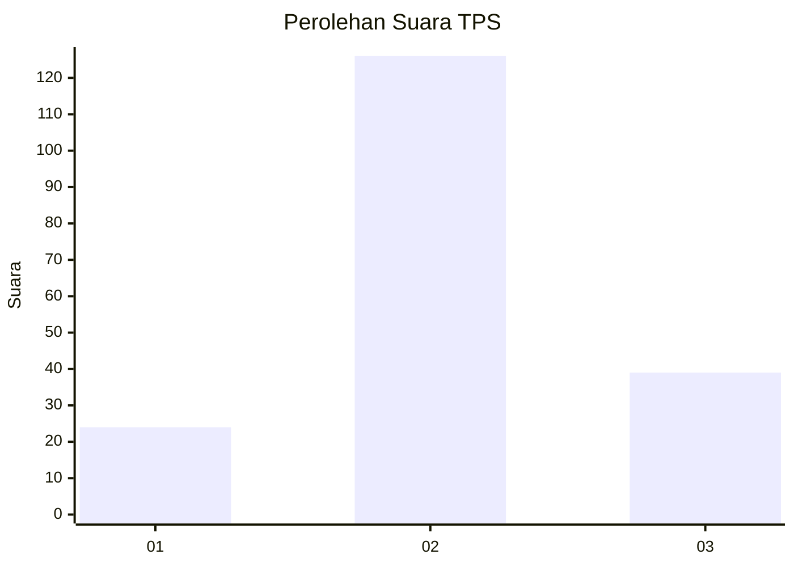
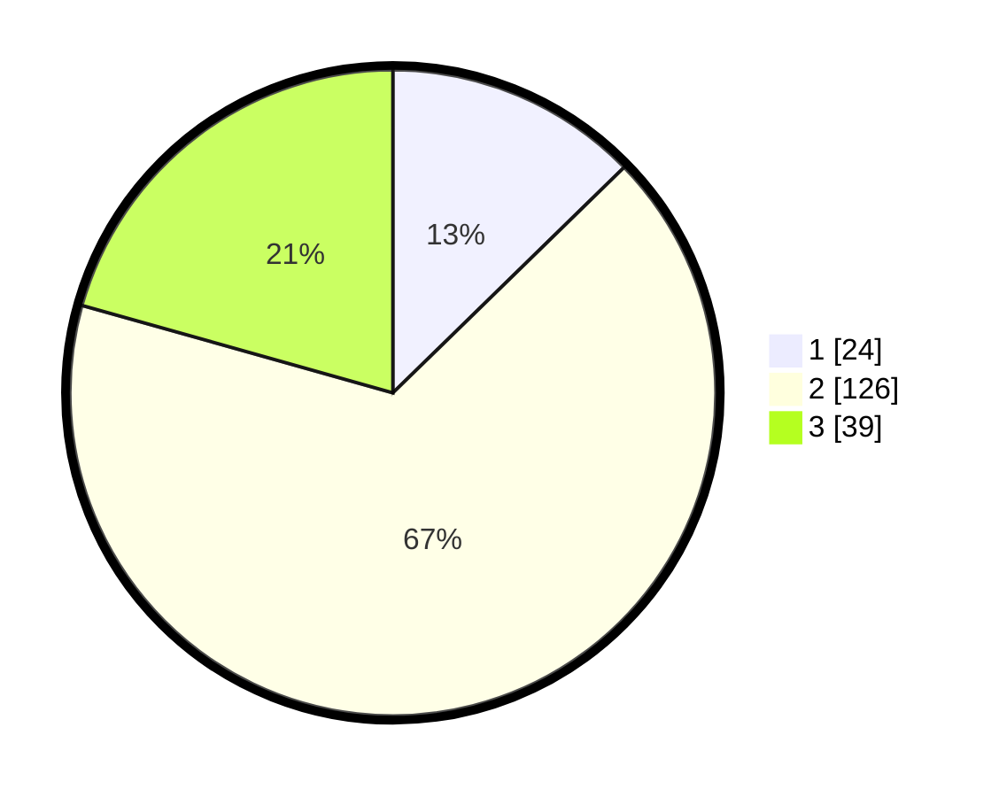

# Hasil

## Grafik

## Tabel

| No. | Nama Paslon    | Suara | Suara (raw) | Persentase |
|:--- |:-------------- | -----:| -----------:| ----------:|
| 1   | ANIES MUHAIMIN | 24    | [24][p-1]   | 12,70      |
| 2   | PRABOWO GIBRAN | 126   | [126][p-2]  | 66,67      |
| 3   | GANJAR MAHFUD  | 39    | [39][p-3]   | 20,63      |

[p-1]: https://github.com/gigit-pemilu/pemilu-2024-33-jawa-tengah/blob/main/pilpres/hitung-suara/sub/33-jawa-tengah/sub/17-rembang/sub/04-sale/sub/2002-mrayun/sub/001-tps/sub/paslon-1.txt
[p-2]: https://github.com/gigit-pemilu/pemilu-2024-33-jawa-tengah/blob/main/pilpres/hitung-suara/sub/33-jawa-tengah/sub/17-rembang/sub/04-sale/sub/2002-mrayun/sub/001-tps/sub/paslon-2.txt
[p-3]: https://github.com/gigit-pemilu/pemilu-2024-33-jawa-tengah/blob/main/pilpres/hitung-suara/sub/33-jawa-tengah/sub/17-rembang/sub/04-sale/sub/2002-mrayun/sub/001-tps/sub/paslon-3.txt

## Foto C Plano

https://sirekap-obj-formc.kpu.go.id/e346/pemilu/ppwp/33/17/04/20/02/3317042002001-20240216-152150--5779362a-e0a2-4893-9ea4-41f0bd76b6c8.jpg

https://sirekap-obj-formc.kpu.go.id/e346/pemilu/ppwp/33/17/04/20/02/3317042002001-20240216-152209--6dad95d0-5d54-4392-b45c-e327c4ad3f7f.jpg

https://sirekap-obj-formc.kpu.go.id/e346/pemilu/ppwp/33/17/04/20/02/3317042002001-20240216-152238--354cba9e-8763-4763-9d42-d1cde838512a.jpg

## Metadata

| Key        | Value               |
| ---------- | ------------------- |
| Time Stamp | 2024-02-16 16:25:10 |

