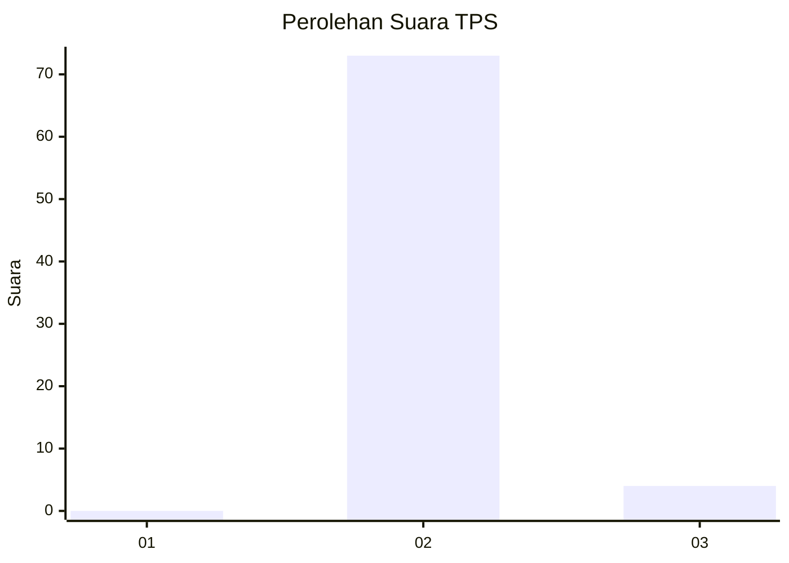
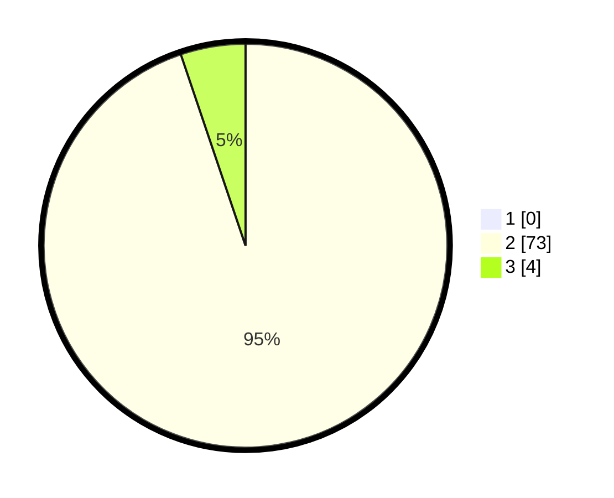

# Hasil

## Grafik

## Tabel

| No. | Nama Paslon    | Suara | Suara (raw) | Persentase |
|:--- |:-------------- | -----:| -----------:| ----------:|
| 1   | ANIES MUHAIMIN | 0     | [0][p-1]    | 0,00       |
| 2   | PRABOWO GIBRAN | 73    | [73][p-2]   | 94,81      |
| 3   | GANJAR MAHFUD  | 4     | [4][p-3]    | 5,19       |

[p-1]: https://github.com/gigit-pemilu/pemilu-2024/blob/main/pilpres/hitung-suara/sub/33-jawa-tengah/sub/17-rembang/sub/05-sarang/sub/2002-lodanwetan/sub/011-tps/sub/paslon-1.txt
[p-2]: https://github.com/gigit-pemilu/pemilu-2024/blob/main/pilpres/hitung-suara/sub/33-jawa-tengah/sub/17-rembang/sub/05-sarang/sub/2002-lodanwetan/sub/011-tps/sub/paslon-2.txt
[p-3]: https://github.com/gigit-pemilu/pemilu-2024/blob/main/pilpres/hitung-suara/sub/33-jawa-tengah/sub/17-rembang/sub/05-sarang/sub/2002-lodanwetan/sub/011-tps/sub/paslon-3.txt

## Foto C Plano

https://sirekap-obj-formc.kpu.go.id/3ed6/pemilu/ppwp/33/17/05/20/02/3317052002011-20240216-125011--35798f8a-394d-4547-b405-19df963d5550.jpg

https://sirekap-obj-formc.kpu.go.id/3ed6/pemilu/ppwp/33/17/05/20/02/3317052002011-20240216-191656--61b74c4f-3caa-4e36-9927-007b29f148a2.jpg

https://sirekap-obj-formc.kpu.go.id/3ed6/pemilu/ppwp/33/17/05/20/02/3317052002011-20240216-191549--3ff35030-2027-407e-b1e9-1724311d6373.jpg

## Metadata

| Key        | Value               |
| ---------- | ------------------- |
| Time Stamp | 2024-02-16 21:01:00 |

