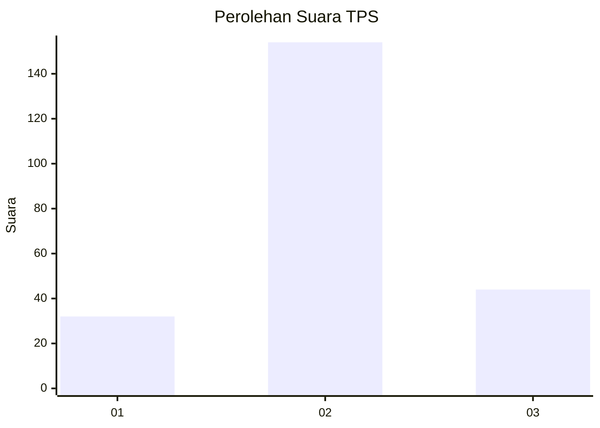
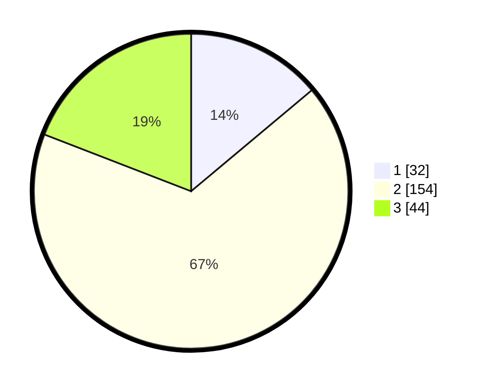

# Hasil

## Grafik

## Tabel

| No. | Nama Paslon    | Suara | Suara (raw) | Persentase |
|:--- |:-------------- | -----:| -----------:| ----------:|
| 1   | ANIES MUHAIMIN | 32    | [32][p-1]   | 13,91      |
| 2   | PRABOWO GIBRAN | 154   | [154][p-2]  | 66,96      |
| 3   | GANJAR MAHFUD  | 44    | [44][p-3]   | 19,13      |

[p-1]: https://github.com/gigit-pemilu/pemilu-2024-33-jawa-tengah/blob/main/pilpres/hitung-suara/sub/33-jawa-tengah/sub/17-rembang/sub/05-sarang/sub/2020-karangmangu/sub/001-tps/sub/paslon-1.txt
[p-2]: https://github.com/gigit-pemilu/pemilu-2024-33-jawa-tengah/blob/main/pilpres/hitung-suara/sub/33-jawa-tengah/sub/17-rembang/sub/05-sarang/sub/2020-karangmangu/sub/001-tps/sub/paslon-2.txt
[p-3]: https://github.com/gigit-pemilu/pemilu-2024-33-jawa-tengah/blob/main/pilpres/hitung-suara/sub/33-jawa-tengah/sub/17-rembang/sub/05-sarang/sub/2020-karangmangu/sub/001-tps/sub/paslon-3.txt

## Foto C Plano

https://sirekap-obj-formc.kpu.go.id/cc69/pemilu/ppwp/33/17/05/20/20/3317052020001-20240214-192220--11a45dd0-c71c-48a6-9820-1880f57993d7.jpg

https://sirekap-obj-formc.kpu.go.id/cc69/pemilu/ppwp/33/17/05/20/20/3317052020001-20240214-193956--8ee6667e-5d85-4191-9f29-68fb7aa5ba74.jpg

https://sirekap-obj-formc.kpu.go.id/cc69/pemilu/ppwp/33/17/05/20/20/3317052020001-20240214-193000--7ffe064a-bd24-4d15-a8b4-57a6fcb246b3.jpg

## Metadata

| Key        | Value               |
| ---------- | ------------------- |
| Time Stamp | 2024-02-15 23:29:50 |

## DATA PEMILIH TETAP

Jumlah pemilih dalam DPT: **1**.
 * L: **0**.
 * P: **0**.

## DATA PENGGUNA HAK PILIH

Jumlah pengguna hak pilih dalam DPT: **1**.
 * L: **0**.
 * P: **0**.

Jumlah pengguna hak pilih dalam DPTb: **291**.
 * L: **494**.
 * P: **104**.

Jumlah pengguna hak pilih dalam DPK: **40**.
 * L: **604**.
 * P: **40**.

Jumlah pengguna hak pilih: **10**.
 * L: **14**.
 * P: **0**.

## JUMLAH SUARA SAH DAN TIDAK SAH

JUMLAH SELURUH SUARA SAH: **230**.

JUMLAH SUARA TIDAK SAH: **4**.

JUMLAH SELURUH SUARA SAH DAN SUARA TIDAK SAH: **234**.

