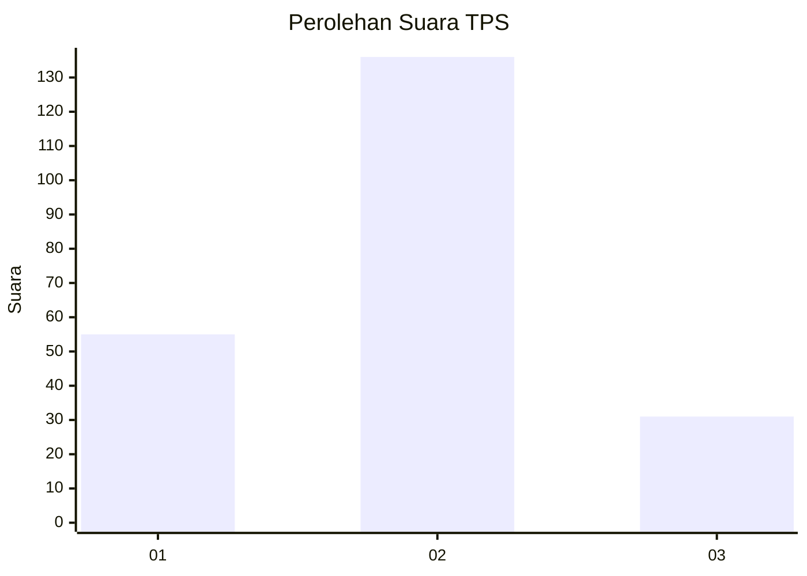
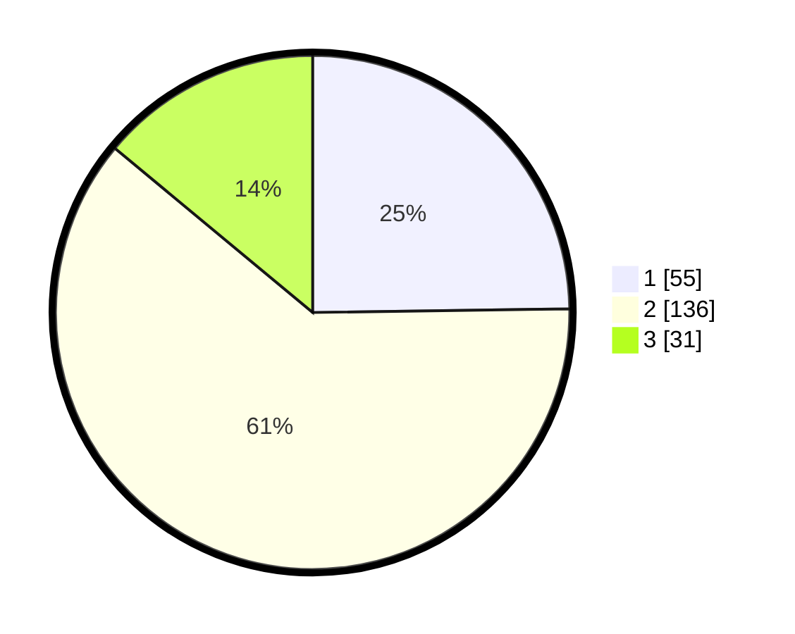

# Hasil

## Grafik

## Tabel

| No. | Nama Paslon    | Suara | Suara (raw) | Persentase |
|:--- |:-------------- | -----:| -----------:| ----------:|
| 1   | ANIES MUHAIMIN | 55    | [55][p-1]   | 24,77      |
| 2   | PRABOWO GIBRAN | 136   | [136][p-2]  | 61,26      |
| 3   | GANJAR MAHFUD  | 31    | [31][p-3]   | 13,96      |

[p-1]: https://github.com/gigit-pemilu/pemilu-2024/blob/main/pilpres/hitung-suara/sub/33-jawa-tengah/sub/17-rembang/sub/05-sarang/sub/2023-sarangmeduro/sub/005-tps/sub/paslon-1.txt
[p-2]: https://github.com/gigit-pemilu/pemilu-2024/blob/main/pilpres/hitung-suara/sub/33-jawa-tengah/sub/17-rembang/sub/05-sarang/sub/2023-sarangmeduro/sub/005-tps/sub/paslon-2.txt
[p-3]: https://github.com/gigit-pemilu/pemilu-2024/blob/main/pilpres/hitung-suara/sub/33-jawa-tengah/sub/17-rembang/sub/05-sarang/sub/2023-sarangmeduro/sub/005-tps/sub/paslon-3.txt

## Foto C Plano

https://sirekap-obj-formc.kpu.go.id/ac89/pemilu/ppwp/33/17/05/20/23/3317052023005-20240214-222840--8a61ea03-ed32-4593-b6d7-99cc4ea006ff.jpg

https://sirekap-obj-formc.kpu.go.id/ac89/pemilu/ppwp/33/17/05/20/23/3317052023005-20240214-222847--118780af-cf66-495b-99e3-2ed4735673dc.jpg

https://sirekap-obj-formc.kpu.go.id/ac89/pemilu/ppwp/33/17/05/20/23/3317052023005-20240214-222854--a25cac50-5859-41ad-bae8-4c7b4227e68c.jpg

## Metadata

| Key        | Value               |
| ---------- | ------------------- |
| Time Stamp | 2024-02-15 17:30:25 |

