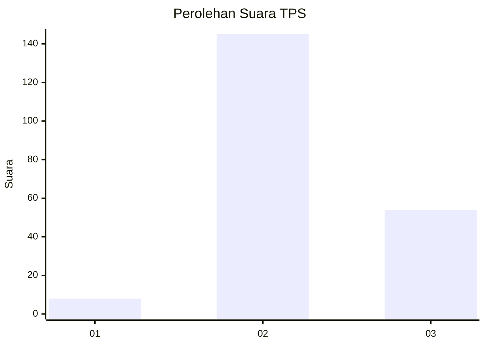
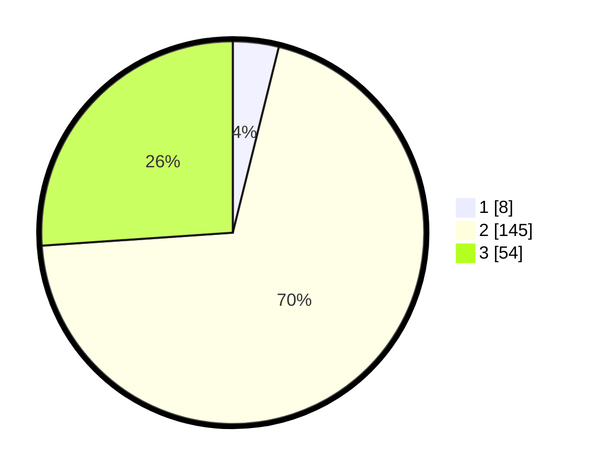

# Hasil

## Grafik

## Tabel

| No. | Nama Paslon    | Suara | Suara (raw) | Persentase |
|:--- |:-------------- | -----:| -----------:| ----------:|
| 1   | ANIES MUHAIMIN | 8     | [8][p-1]    | 3,86       |
| 2   | PRABOWO GIBRAN | 145   | [145][p-2]  | 70,05      |
| 3   | GANJAR MAHFUD  | 54    | [54][p-3]   | 26,09      |

[p-1]: https://github.com/gigit-pemilu/pemilu-2024/blob/main/pilpres/hitung-suara/sub/33-jawa-tengah/sub/17-rembang/sub/06-sedan/sub/2002-pacing/sub/001-tps/sub/paslon-1.txt
[p-2]: https://github.com/gigit-pemilu/pemilu-2024/blob/main/pilpres/hitung-suara/sub/33-jawa-tengah/sub/17-rembang/sub/06-sedan/sub/2002-pacing/sub/001-tps/sub/paslon-2.txt
[p-3]: https://github.com/gigit-pemilu/pemilu-2024/blob/main/pilpres/hitung-suara/sub/33-jawa-tengah/sub/17-rembang/sub/06-sedan/sub/2002-pacing/sub/001-tps/sub/paslon-3.txt

## Foto C Plano

https://sirekap-obj-formc.kpu.go.id/54dd/pemilu/ppwp/33/17/06/20/02/3317062002001-20240215-003802--38f99740-2c76-4800-a121-d163c6d5f90c.jpg

https://sirekap-obj-formc.kpu.go.id/54dd/pemilu/ppwp/33/17/06/20/02/3317062002001-20240215-092813--cc28ed19-ac33-4a9f-a825-d74cb7777fb3.jpg

https://sirekap-obj-formc.kpu.go.id/54dd/pemilu/ppwp/33/17/06/20/02/3317062002001-20240216-075951--ec1fe6e3-b533-4c59-bffa-e184ec0ee0c8.jpg

## Metadata

| Key        | Value               |
| ---------- | ------------------- |
| Time Stamp | 2024-02-16 08:00:28 |

