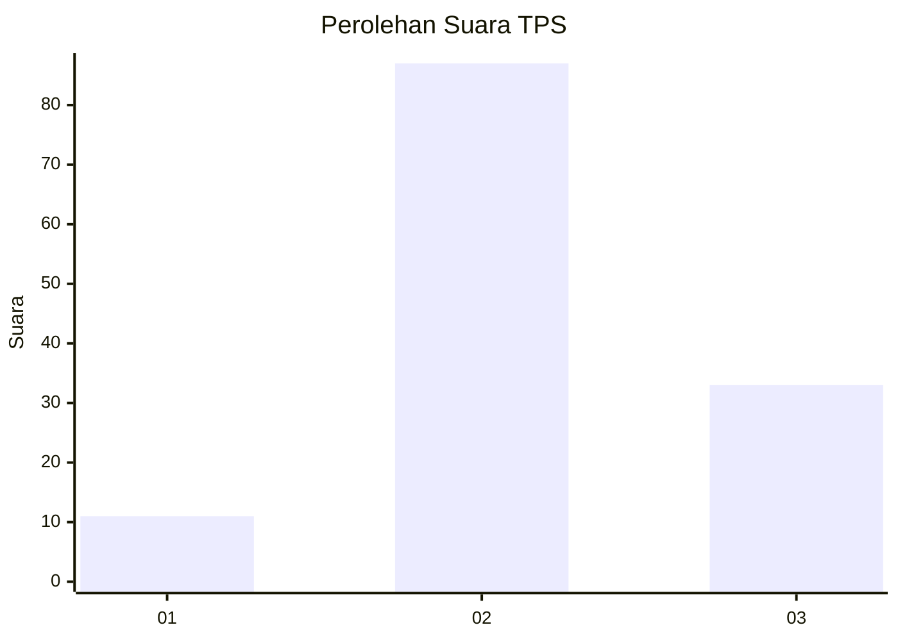
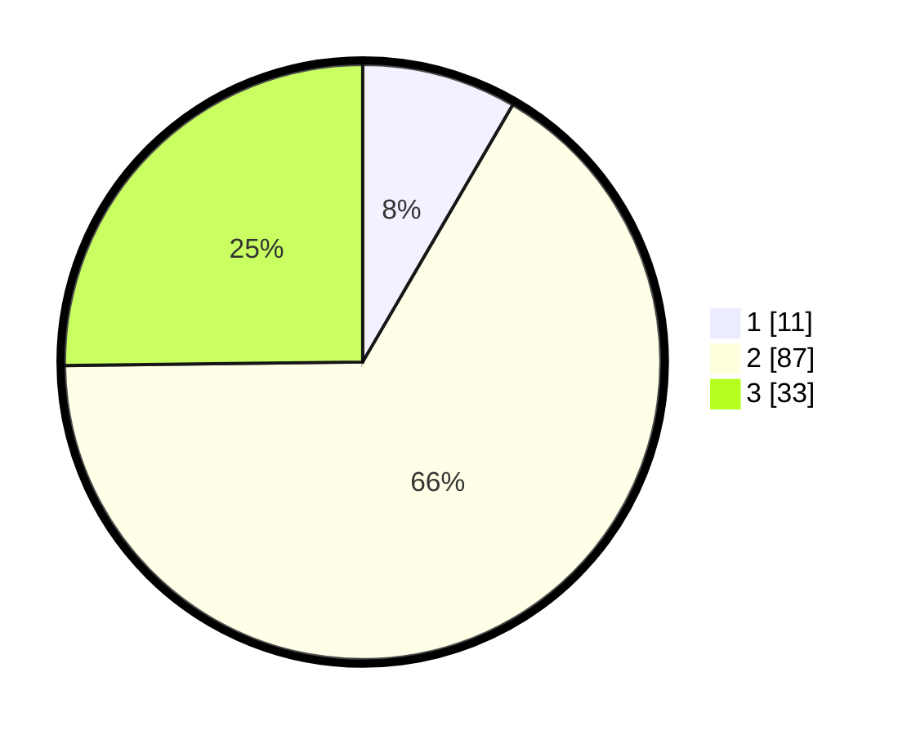

# Hasil

## Grafik

## Tabel

| No. | Nama Paslon    | Suara | Suara (raw) | Persentase |
|:--- |:-------------- | -----:| -----------:| ----------:|
| 1   | ANIES MUHAIMIN | 11    | [11][p-1]   | 8,40       |
| 2   | PRABOWO GIBRAN | 87    | [87][p-2]   | 66,41      |
| 3   | GANJAR MAHFUD  | 33    | [33][p-3]   | 25,19      |

[p-1]: https://github.com/gigit-pemilu/pemilu-2024/blob/main/pilpres/hitung-suara/sub/33-jawa-tengah/sub/17-rembang/sub/06-sedan/sub/2007-sedan/sub/007-tps/sub/paslon-1.txt
[p-2]: https://github.com/gigit-pemilu/pemilu-2024/blob/main/pilpres/hitung-suara/sub/33-jawa-tengah/sub/17-rembang/sub/06-sedan/sub/2007-sedan/sub/007-tps/sub/paslon-2.txt
[p-3]: https://github.com/gigit-pemilu/pemilu-2024/blob/main/pilpres/hitung-suara/sub/33-jawa-tengah/sub/17-rembang/sub/06-sedan/sub/2007-sedan/sub/007-tps/sub/paslon-3.txt

## Foto C Plano

https://sirekap-obj-formc.kpu.go.id/c6e1/pemilu/ppwp/33/17/06/20/07/3317062007007-20240214-213227--4d870874-b4e6-431c-b1fd-42143373c95b.jpg

https://sirekap-obj-formc.kpu.go.id/c6e1/pemilu/ppwp/33/17/06/20/07/3317062007007-20240214-213436--3a5578b9-4cf9-4670-837e-8d08fb2ca169.jpg

https://sirekap-obj-formc.kpu.go.id/c6e1/pemilu/ppwp/33/17/06/20/07/3317062007007-20240214-214231--14783397-3ed7-4641-a090-f7bd825567ea.jpg

## Metadata

| Key        | Value               |
| ---------- | ------------------- |
| Time Stamp | 2024-02-15 03:06:03 |

