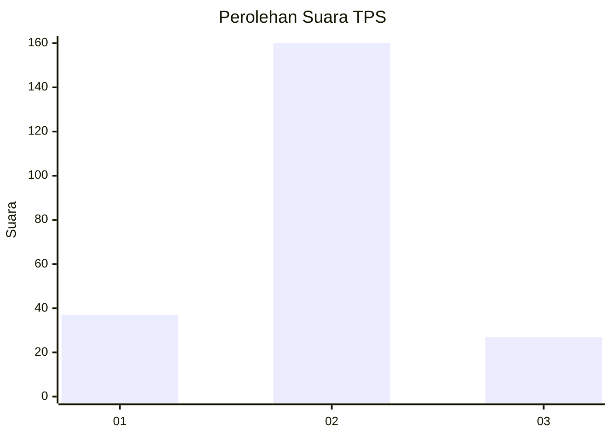
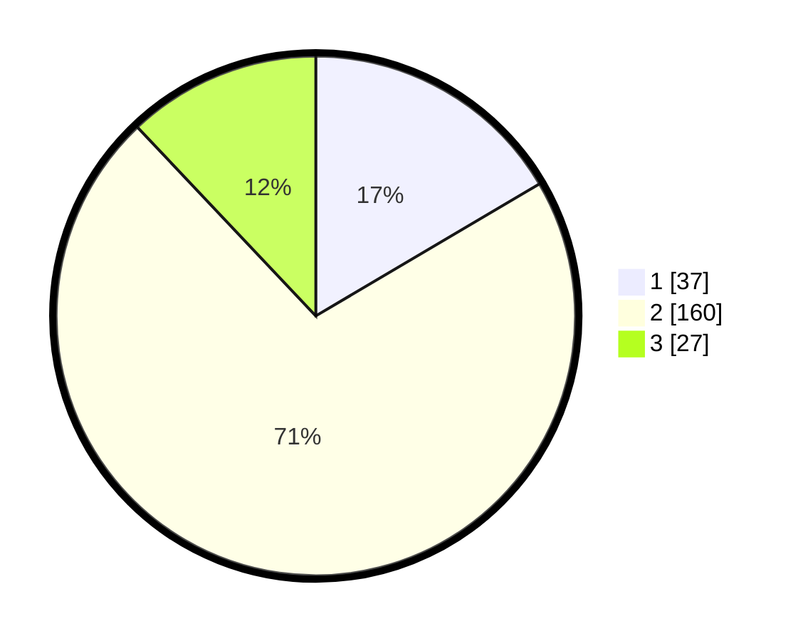

# Hasil

## Grafik

## Tabel

| No. | Nama Paslon    | Suara | Suara (raw) | Persentase |
|:--- |:-------------- | -----:| -----------:| ----------:|
| 1   | ANIES MUHAIMIN | 37    | [37][p-1]   | 16,52      |
| 2   | PRABOWO GIBRAN | 160   | [160][p-2]  | 71,43      |
| 3   | GANJAR MAHFUD  | 27    | [27][p-3]   | 12,05      |

[p-1]: https://github.com/gigit-pemilu/pemilu-2024/blob/main/pilpres/hitung-suara/sub/33-jawa-tengah/sub/17-rembang/sub/06-sedan/sub/2011-kedungringin/sub/004-tps/sub/paslon-1.txt
[p-2]: https://github.com/gigit-pemilu/pemilu-2024/blob/main/pilpres/hitung-suara/sub/33-jawa-tengah/sub/17-rembang/sub/06-sedan/sub/2011-kedungringin/sub/004-tps/sub/paslon-2.txt
[p-3]: https://github.com/gigit-pemilu/pemilu-2024/blob/main/pilpres/hitung-suara/sub/33-jawa-tengah/sub/17-rembang/sub/06-sedan/sub/2011-kedungringin/sub/004-tps/sub/paslon-3.txt

## Foto C Plano

https://sirekap-obj-formc.kpu.go.id/9022/pemilu/ppwp/33/17/06/20/11/3317062011004-20240214-213721--425d2f06-8d00-4ed3-9698-9dde699ca7e2.jpg

https://sirekap-obj-formc.kpu.go.id/9022/pemilu/ppwp/33/17/06/20/11/3317062011004-20240214-213811--be9fc8ab-66bf-4730-a7dc-9c2d3c194050.jpg

https://sirekap-obj-formc.kpu.go.id/9022/pemilu/ppwp/33/17/06/20/11/3317062011004-20240214-213841--1e0e3a45-1ab4-4d2a-b9cd-134ce42b3af2.jpg

## Metadata

| Key        | Value               |
| ---------- | ------------------- |
| Time Stamp | 2024-02-16 08:30:27 |

