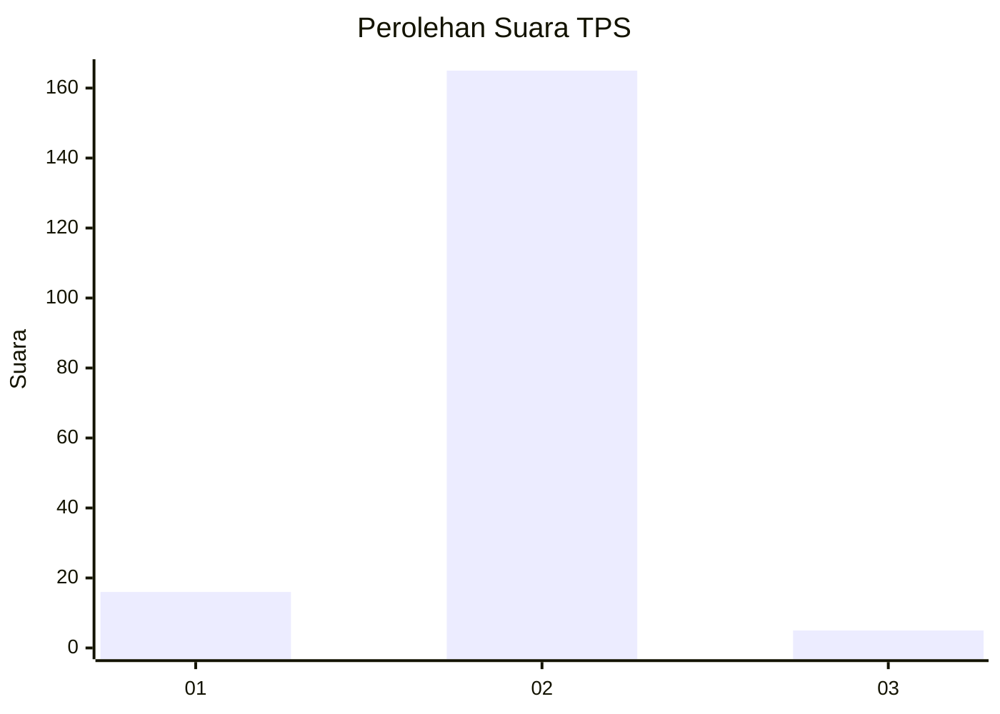
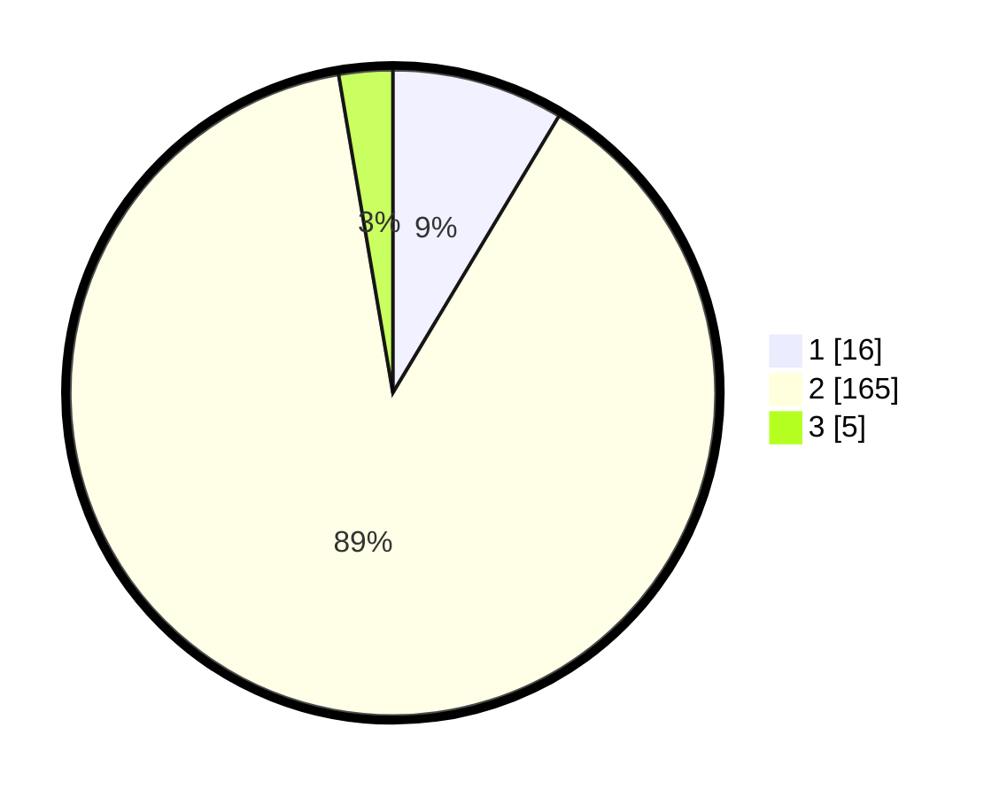

# Hasil

## Grafik

## Tabel

| No. | Nama Paslon    | Suara | Suara (raw) | Persentase |
|:--- |:-------------- | -----:| -----------:| ----------:|
| 1   | ANIES MUHAIMIN | 16    | [16][p-1]   | 8,60       |
| 2   | PRABOWO GIBRAN | 165   | [165][p-2]  | 88,71      |
| 3   | GANJAR MAHFUD  | 5     | [5][p-3]    | 2,69       |

[p-1]: https://github.com/gigit-pemilu/pemilu-2024/blob/main/pilpres/hitung-suara/sub/33-jawa-tengah/sub/17-rembang/sub/06-sedan/sub/2021-menoro/sub/008-tps/sub/paslon-1.txt
[p-2]: https://github.com/gigit-pemilu/pemilu-2024/blob/main/pilpres/hitung-suara/sub/33-jawa-tengah/sub/17-rembang/sub/06-sedan/sub/2021-menoro/sub/008-tps/sub/paslon-2.txt
[p-3]: https://github.com/gigit-pemilu/pemilu-2024/blob/main/pilpres/hitung-suara/sub/33-jawa-tengah/sub/17-rembang/sub/06-sedan/sub/2021-menoro/sub/008-tps/sub/paslon-3.txt

## Foto C Plano

https://sirekap-obj-formc.kpu.go.id/bc0a/pemilu/ppwp/33/17/06/20/21/3317062021008-20240216-144436--73c34f1b-a5f5-44f8-9753-1aefbd31ce41.jpg

https://sirekap-obj-formc.kpu.go.id/bc0a/pemilu/ppwp/33/17/06/20/21/3317062021008-20240216-144248--a8da9f6e-283a-4f1f-b02e-98c159622895.jpg

https://sirekap-obj-formc.kpu.go.id/bc0a/pemilu/ppwp/33/17/06/20/21/3317062021008-20240216-144820--bfd917fd-81aa-4239-8c4b-504fc162fb6c.jpg

## Metadata

| Key        | Value               |
| ---------- | ------------------- |
| Time Stamp | 2024-02-16 16:25:10 |

