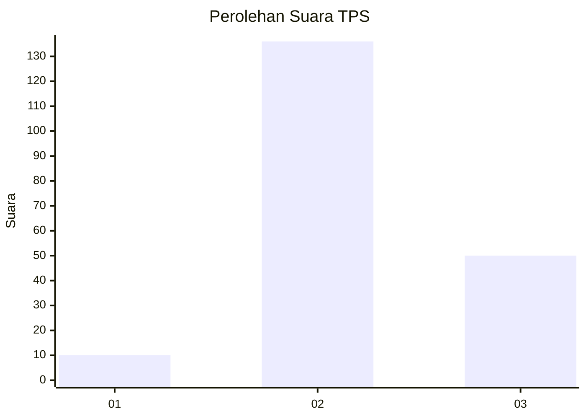
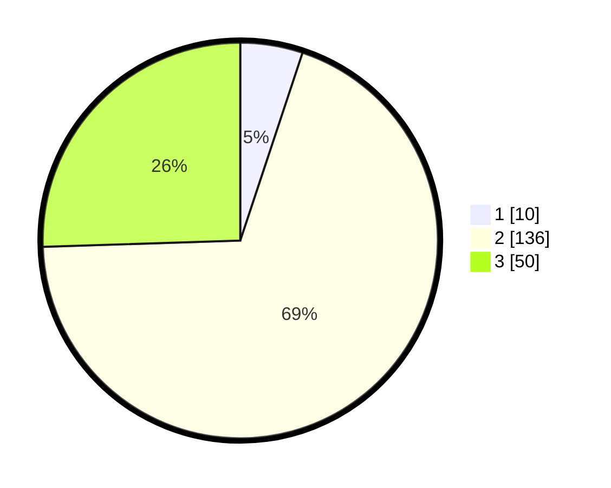

# Hasil

## Grafik

## Tabel

| No. | Nama Paslon    | Suara | Suara (raw) | Persentase |
|:--- |:-------------- | -----:| -----------:| ----------:|
| 1   | ANIES MUHAIMIN | 10    | [10][p-1]   | 5,10       |
| 2   | PRABOWO GIBRAN | 136   | [136][p-2]  | 69,39      |
| 3   | GANJAR MAHFUD  | 50    | [50][p-3]   | 25,51      |

[p-1]: https://github.com/gigit-pemilu/pemilu-2024-33-jawa-tengah/blob/main/pilpres/hitung-suara/sub/33-jawa-tengah/sub/17-rembang/sub/07-pamotan/sub/2001-megal/sub/002-tps/sub/paslon-1.txt
[p-2]: https://github.com/gigit-pemilu/pemilu-2024-33-jawa-tengah/blob/main/pilpres/hitung-suara/sub/33-jawa-tengah/sub/17-rembang/sub/07-pamotan/sub/2001-megal/sub/002-tps/sub/paslon-2.txt
[p-3]: https://github.com/gigit-pemilu/pemilu-2024-33-jawa-tengah/blob/main/pilpres/hitung-suara/sub/33-jawa-tengah/sub/17-rembang/sub/07-pamotan/sub/2001-megal/sub/002-tps/sub/paslon-3.txt

## Foto C Plano

https://sirekap-obj-formc.kpu.go.id/cce8/pemilu/ppwp/33/17/07/20/01/3317072001002-20240218-134611--d62a4153-ee11-4cf5-ae2e-fcbc241bf99e.jpg

https://sirekap-obj-formc.kpu.go.id/cce8/pemilu/ppwp/33/17/07/20/01/3317072001002-20240218-134638--15b250e9-eef5-4f3f-a0e5-57103fb881f6.jpg

https://sirekap-obj-formc.kpu.go.id/cce8/pemilu/ppwp/33/17/07/20/01/3317072001002-20240218-154852--684d8905-6952-4c72-95ba-59a68903dfae.jpg

## Metadata

| Key        | Value               |
| ---------- | ------------------- |
| Time Stamp | 2024-02-24 22:31:28 |

