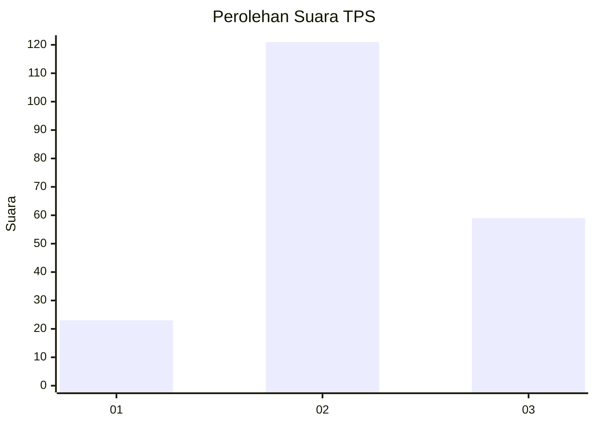
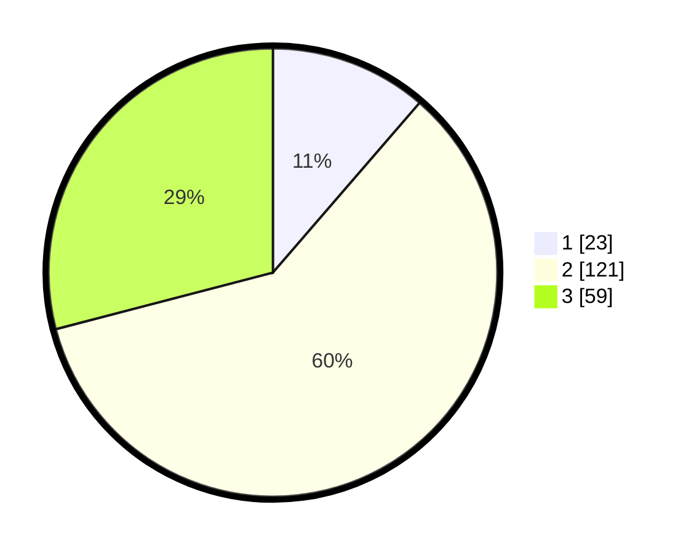

# Hasil

## Grafik

## Tabel

| No. | Nama Paslon    | Suara | Suara (raw) | Persentase |
|:--- |:-------------- | -----:| -----------:| ----------:|
| 1   | ANIES MUHAIMIN | 23    | [23][p-1]   | 11,33      |
| 2   | PRABOWO GIBRAN | 121   | [121][p-2]  | 59,61      |
| 3   | GANJAR MAHFUD  | 59    | [59][p-3]   | 29,06      |

[p-1]: https://github.com/gigit-pemilu/pemilu-2024/blob/main/pilpres/hitung-suara/sub/33-jawa-tengah/sub/17-rembang/sub/08-sulang/sub/2002-kemadu/sub/001-tps/sub/paslon-1.txt
[p-2]: https://github.com/gigit-pemilu/pemilu-2024/blob/main/pilpres/hitung-suara/sub/33-jawa-tengah/sub/17-rembang/sub/08-sulang/sub/2002-kemadu/sub/001-tps/sub/paslon-2.txt
[p-3]: https://github.com/gigit-pemilu/pemilu-2024/blob/main/pilpres/hitung-suara/sub/33-jawa-tengah/sub/17-rembang/sub/08-sulang/sub/2002-kemadu/sub/001-tps/sub/paslon-3.txt

## Foto C Plano

https://sirekap-obj-formc.kpu.go.id/b3e1/pemilu/ppwp/33/17/08/20/02/3317082002001-20240214-212928--beacb0c5-3d23-4681-8960-9b96a939e6f6.jpg

https://sirekap-obj-formc.kpu.go.id/b3e1/pemilu/ppwp/33/17/08/20/02/3317082002001-20240214-213212--52d5b909-0ad8-4783-880a-48e8a1893e5b.jpg

https://sirekap-obj-formc.kpu.go.id/b3e1/pemilu/ppwp/33/17/08/20/02/3317082002001-20240214-213616--cf7754da-1c35-4ef2-b69d-b8ada98f86d0.jpg

## Metadata

| Key        | Value               |
| ---------- | ------------------- |
| Time Stamp | 2024-02-15 09:00:24 |

