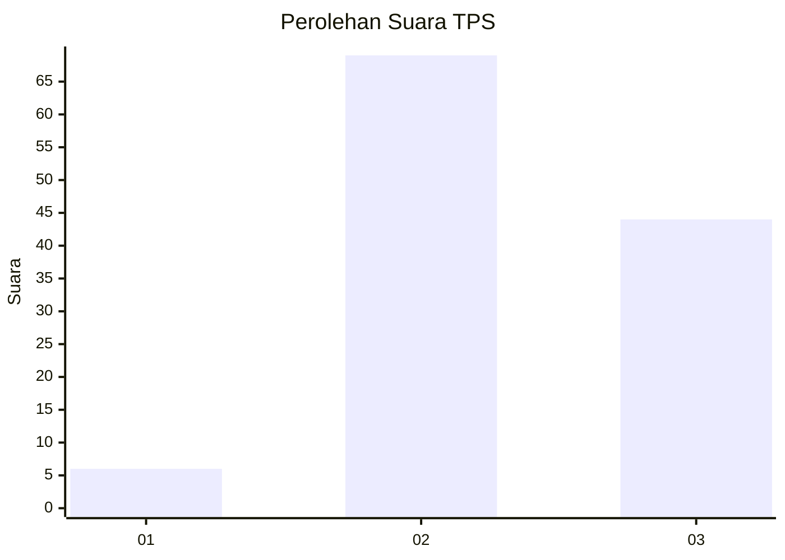
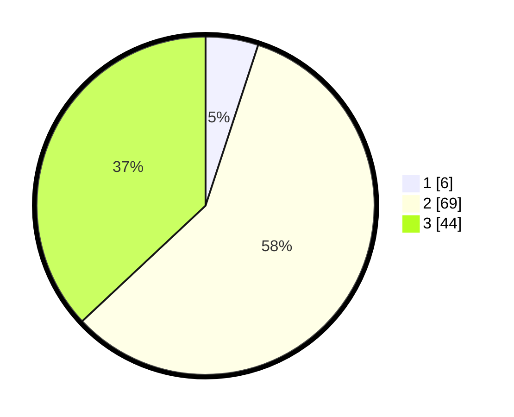

# Hasil

## Grafik

## Tabel

| No. | Nama Paslon    | Suara | Suara (raw) | Persentase |
|:--- |:-------------- | -----:| -----------:| ----------:|
| 1   | ANIES MUHAIMIN | 6     | [6][p-1]    | 5,04       |
| 2   | PRABOWO GIBRAN | 69    | [69][p-2]   | 57,98      |
| 3   | GANJAR MAHFUD  | 44    | [44][p-3]   | 36,97      |

[p-1]: https://github.com/gigit-pemilu/pemilu-2024/blob/main/pilpres/hitung-suara/sub/33-jawa-tengah/sub/17-rembang/sub/10-rembang/sub/2002-turusgede/sub/004-tps/sub/paslon-1.txt
[p-2]: https://github.com/gigit-pemilu/pemilu-2024/blob/main/pilpres/hitung-suara/sub/33-jawa-tengah/sub/17-rembang/sub/10-rembang/sub/2002-turusgede/sub/004-tps/sub/paslon-2.txt
[p-3]: https://github.com/gigit-pemilu/pemilu-2024/blob/main/pilpres/hitung-suara/sub/33-jawa-tengah/sub/17-rembang/sub/10-rembang/sub/2002-turusgede/sub/004-tps/sub/paslon-3.txt

## Foto C Plano

https://sirekap-obj-formc.kpu.go.id/92b9/pemilu/ppwp/33/17/10/20/02/3317102002004-20240220-175646--5833ddba-b131-462c-84dd-0249017be3ac.jpg

https://sirekap-obj-formc.kpu.go.id/92b9/pemilu/ppwp/33/17/10/20/02/3317102002004-20240220-173746--ff43a1e8-f1fd-4a31-944a-951e62904d33.jpg

https://sirekap-obj-formc.kpu.go.id/92b9/pemilu/ppwp/33/17/10/20/02/3317102002004-20240220-173856--48d7ad72-87d8-4c28-b48a-d8a960d9e013.jpg

## Metadata

| Key        | Value               |
| ---------- | ------------------- |
| Time Stamp | 2024-02-27 21:00:04 |

