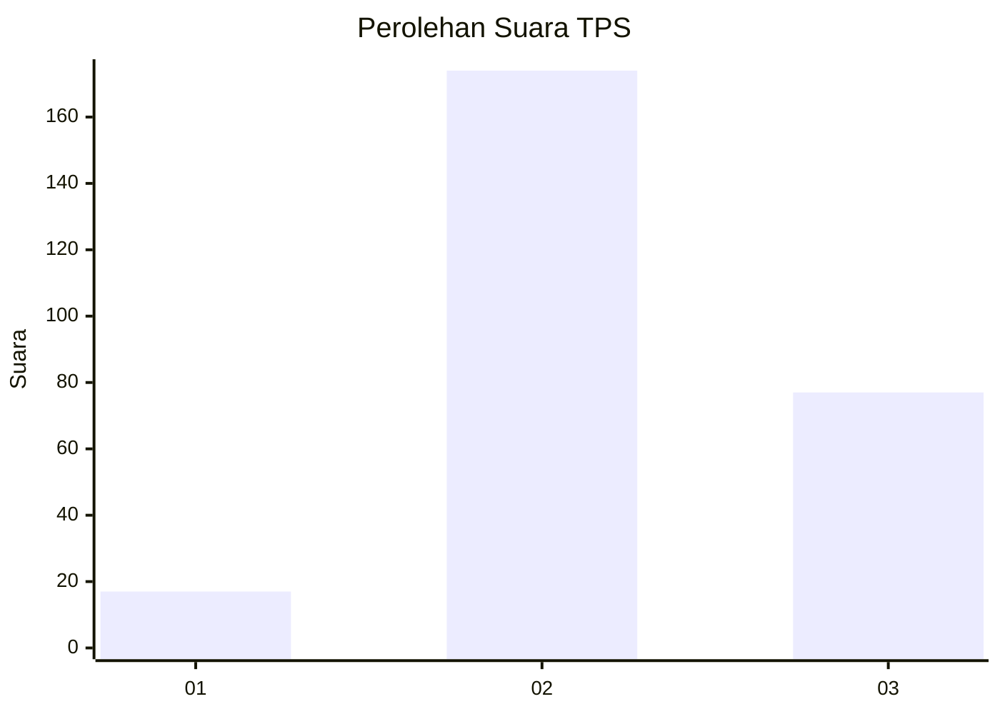
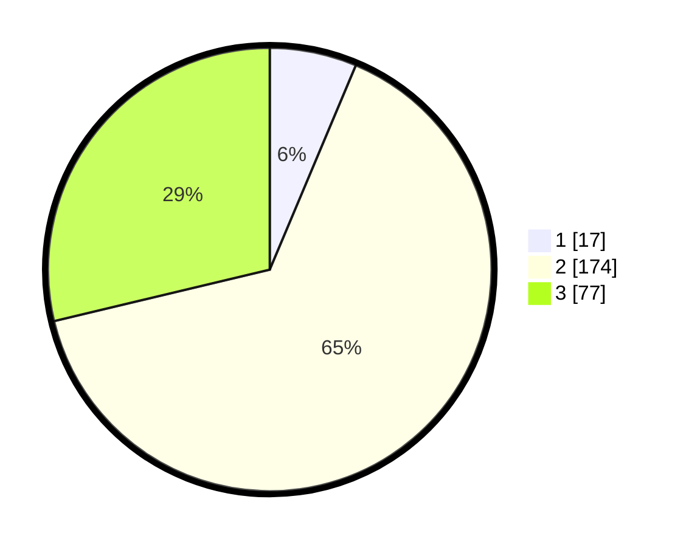

# Hasil

## Grafik

## Tabel

| No. | Nama Paslon    | Suara | Suara (raw) | Persentase |
|:--- |:-------------- | -----:| -----------:| ----------:|
| 1   | ANIES MUHAIMIN | 17    | [17][p-1]   | 6,34       |
| 2   | PRABOWO GIBRAN | 174   | [174][p-2]  | 64,93      |
| 3   | GANJAR MAHFUD  | 77    | [77][p-3]   | 28,73      |

[p-1]: https://github.com/gigit-pemilu/pemilu-2024/blob/main/pilpres/hitung-suara/sub/33-jawa-tengah/sub/17-rembang/sub/10-rembang/sub/2005-pandean/sub/004-tps/sub/paslon-1.txt
[p-2]: https://github.com/gigit-pemilu/pemilu-2024/blob/main/pilpres/hitung-suara/sub/33-jawa-tengah/sub/17-rembang/sub/10-rembang/sub/2005-pandean/sub/004-tps/sub/paslon-2.txt
[p-3]: https://github.com/gigit-pemilu/pemilu-2024/blob/main/pilpres/hitung-suara/sub/33-jawa-tengah/sub/17-rembang/sub/10-rembang/sub/2005-pandean/sub/004-tps/sub/paslon-3.txt

## Foto C Plano

https://sirekap-obj-formc.kpu.go.id/8d29/pemilu/ppwp/33/17/10/20/05/3317102005004-20240217-162236--652d0697-1fac-43f6-b552-264199dc24df.jpg

https://sirekap-obj-formc.kpu.go.id/8d29/pemilu/ppwp/33/17/10/20/05/3317102005004-20240219-235614--65e92546-8cbe-45a9-b4c6-00f91f40f93c.jpg

https://sirekap-obj-formc.kpu.go.id/8d29/pemilu/ppwp/33/17/10/20/05/3317102005004-20240219-090921--bf382321-851d-4a79-9c3b-01e53124aa11.jpg

## Metadata

| Key        | Value               |
| ---------- | ------------------- |
| Time Stamp | 2024-02-20 00:00:00 |

