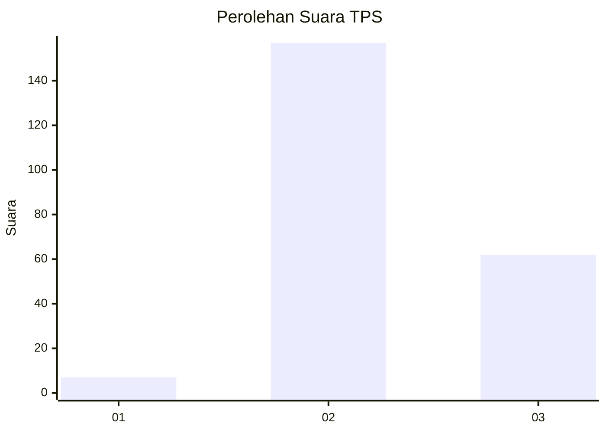
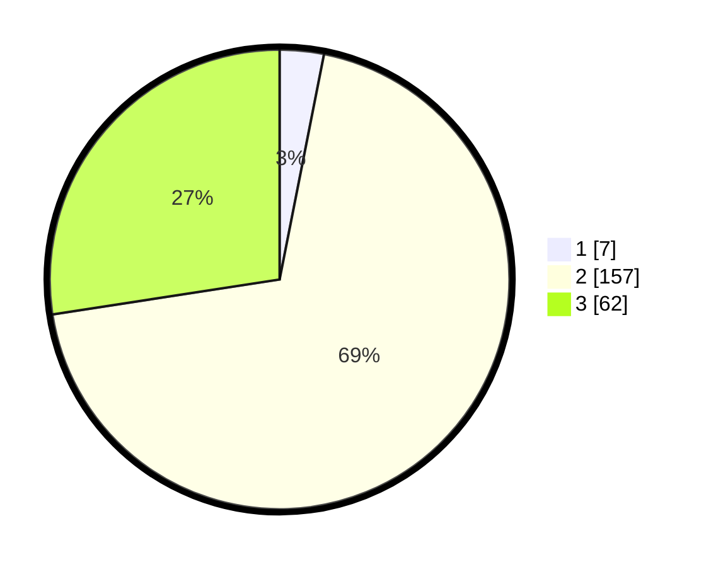

# Hasil

## Grafik

## Tabel

| No. | Nama Paslon    | Suara | Suara (raw) | Persentase |
|:--- |:-------------- | -----:| -----------:| ----------:|
| 1   | ANIES MUHAIMIN | 7     | [7][p-1]    | 3,10       |
| 2   | PRABOWO GIBRAN | 157   | [157][p-2]  | 69,47      |
| 3   | GANJAR MAHFUD  | 62    | [62][p-3]   | 27,43      |

[p-1]: https://github.com/gigit-pemilu/pemilu-2024/blob/main/pilpres/hitung-suara/sub/33-jawa-tengah/sub/17-rembang/sub/10-rembang/sub/2006-tlogomojo/sub/003-tps/sub/paslon-1.txt
[p-2]: https://github.com/gigit-pemilu/pemilu-2024/blob/main/pilpres/hitung-suara/sub/33-jawa-tengah/sub/17-rembang/sub/10-rembang/sub/2006-tlogomojo/sub/003-tps/sub/paslon-2.txt
[p-3]: https://github.com/gigit-pemilu/pemilu-2024/blob/main/pilpres/hitung-suara/sub/33-jawa-tengah/sub/17-rembang/sub/10-rembang/sub/2006-tlogomojo/sub/003-tps/sub/paslon-3.txt

## Foto C Plano

https://sirekap-obj-formc.kpu.go.id/0b0c/pemilu/ppwp/33/17/10/20/06/3317102006003-20240215-004505--531ceffd-fba5-47b1-a49a-514fac21f152.jpg

https://sirekap-obj-formc.kpu.go.id/0b0c/pemilu/ppwp/33/17/10/20/06/3317102006003-20240215-001418--321108a5-5ca6-4d65-9d2b-c01a831293e2.jpg

https://sirekap-obj-formc.kpu.go.id/0b0c/pemilu/ppwp/33/17/10/20/06/3317102006003-20240215-001510--bbc484f4-b947-4d8c-bbb2-e010ec9b3ae3.jpg

## Metadata

| Key        | Value               |
| ---------- | ------------------- |
| Time Stamp | 2024-02-15 19:30:26 |

