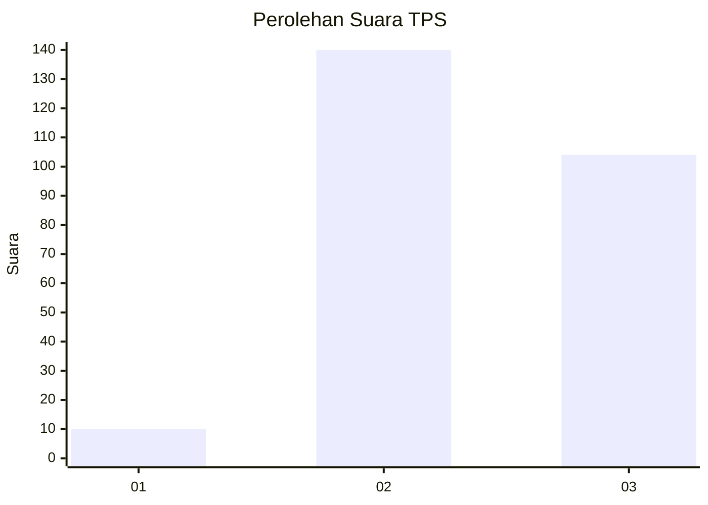
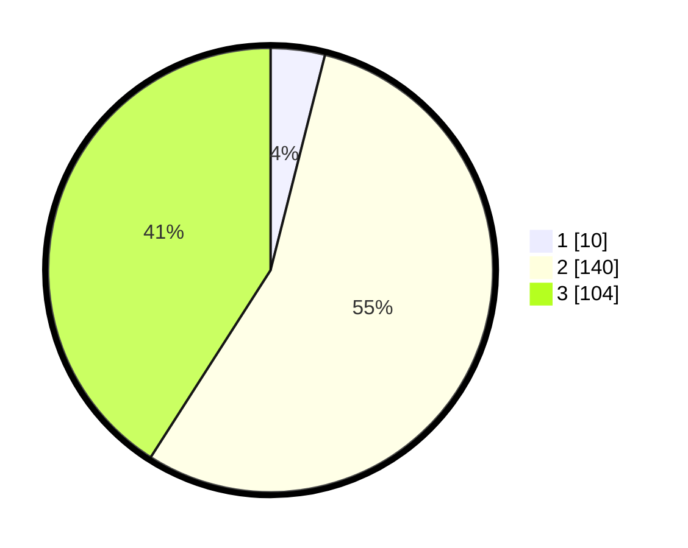

# Hasil

## Grafik

## Tabel

| No. | Nama Paslon    | Suara | Suara (raw) | Persentase |
|:--- |:-------------- | -----:| -----------:| ----------:|
| 1   | ANIES MUHAIMIN | 10    | [10][p-1]   | 3,94       |
| 2   | PRABOWO GIBRAN | 140   | [140][p-2]  | 55,12      |
| 3   | GANJAR MAHFUD  | 104   | [104][p-3]  | 40,94      |

[p-1]: https://github.com/gigit-pemilu/pemilu-2024-33-jawa-tengah/blob/main/pilpres/hitung-suara/sub/33-jawa-tengah/sub/17-rembang/sub/10-rembang/sub/2010-pasar-banggi/sub/005-tps/sub/paslon-1.txt
[p-2]: https://github.com/gigit-pemilu/pemilu-2024-33-jawa-tengah/blob/main/pilpres/hitung-suara/sub/33-jawa-tengah/sub/17-rembang/sub/10-rembang/sub/2010-pasar-banggi/sub/005-tps/sub/paslon-2.txt
[p-3]: https://github.com/gigit-pemilu/pemilu-2024-33-jawa-tengah/blob/main/pilpres/hitung-suara/sub/33-jawa-tengah/sub/17-rembang/sub/10-rembang/sub/2010-pasar-banggi/sub/005-tps/sub/paslon-3.txt

## Foto C Plano

https://sirekap-obj-formc.kpu.go.id/3e26/pemilu/ppwp/33/17/10/20/10/3317102010005-20240215-001029--3112062b-e329-4a10-8b71-a9d25ebef110.jpg

https://sirekap-obj-formc.kpu.go.id/3e26/pemilu/ppwp/33/17/10/20/10/3317102010005-20240215-001149--366462b6-7e89-423c-86b8-b25a78211486.jpg

https://sirekap-obj-formc.kpu.go.id/3e26/pemilu/ppwp/33/17/10/20/10/3317102010005-20240215-001231--0d6d8cda-e561-4e4a-b08e-0a3bfd173442.jpg

## Metadata

| Key        | Value               |
| ---------- | ------------------- |
| Time Stamp | 2024-02-15 20:00:44 |

