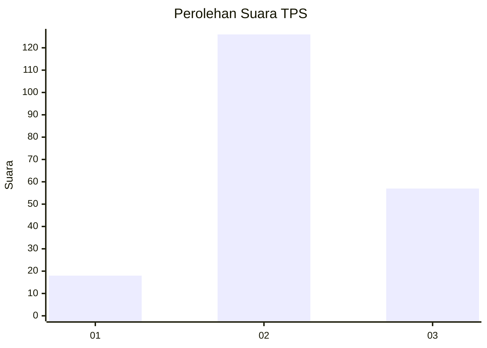
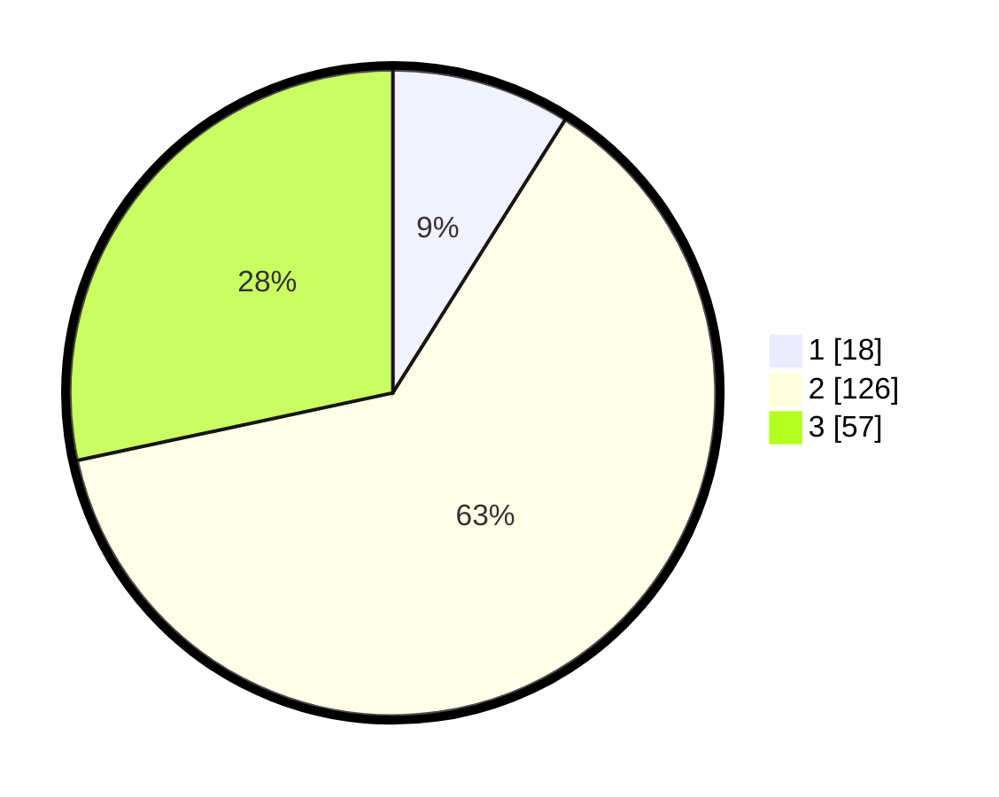

# Hasil

## Grafik

## Tabel

| No. | Nama Paslon    | Suara | Suara (raw) | Persentase |
|:--- |:-------------- | -----:| -----------:| ----------:|
| 1   | ANIES MUHAIMIN | 18    | [18][p-1]   | 8,96       |
| 2   | PRABOWO GIBRAN | 126   | [126][p-2]  | 62,69      |
| 3   | GANJAR MAHFUD  | 57    | [57][p-3]   | 28,36      |

[p-1]: https://github.com/gigit-pemilu/pemilu-2024/blob/main/pilpres/hitung-suara/sub/33-jawa-tengah/sub/17-rembang/sub/10-rembang/sub/2025-tasikagung/sub/006-tps/sub/paslon-1.txt
[p-2]: https://github.com/gigit-pemilu/pemilu-2024/blob/main/pilpres/hitung-suara/sub/33-jawa-tengah/sub/17-rembang/sub/10-rembang/sub/2025-tasikagung/sub/006-tps/sub/paslon-2.txt
[p-3]: https://github.com/gigit-pemilu/pemilu-2024/blob/main/pilpres/hitung-suara/sub/33-jawa-tengah/sub/17-rembang/sub/10-rembang/sub/2025-tasikagung/sub/006-tps/sub/paslon-3.txt

## Foto C Plano

https://sirekap-obj-formc.kpu.go.id/adad/pemilu/ppwp/33/17/10/20/25/3317102025006-20240215-004613--a5a07d2e-b9b0-49a3-9ff9-7b997e321e0f.jpg

https://sirekap-obj-formc.kpu.go.id/adad/pemilu/ppwp/33/17/10/20/25/3317102025006-20240215-004717--b290655b-bb0a-49c8-a2e1-76f2bfdf7789.jpg

https://sirekap-obj-formc.kpu.go.id/adad/pemilu/ppwp/33/17/10/20/25/3317102025006-20240215-004911--69e97694-d0ec-40ff-8296-b229a7cc298f.jpg

## Metadata

| Key        | Value               |
| ---------- | ------------------- |
| Time Stamp | 2024-02-15 15:00:29 |

