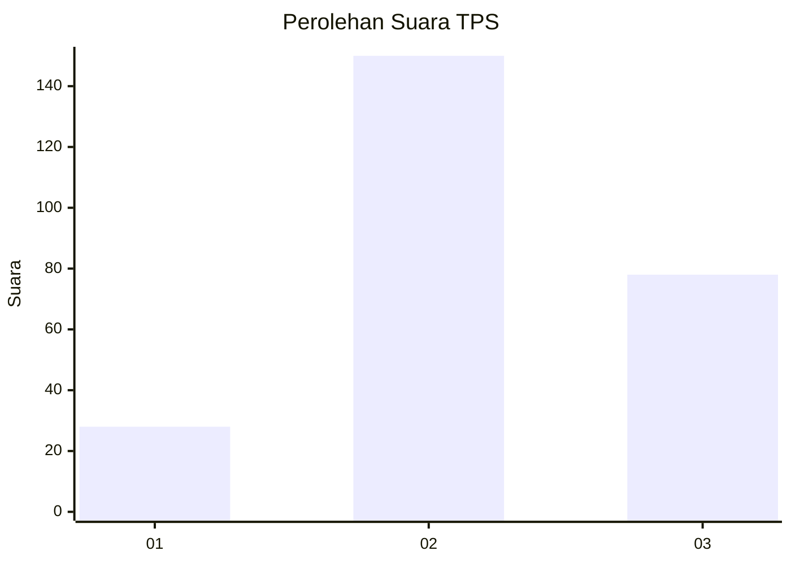
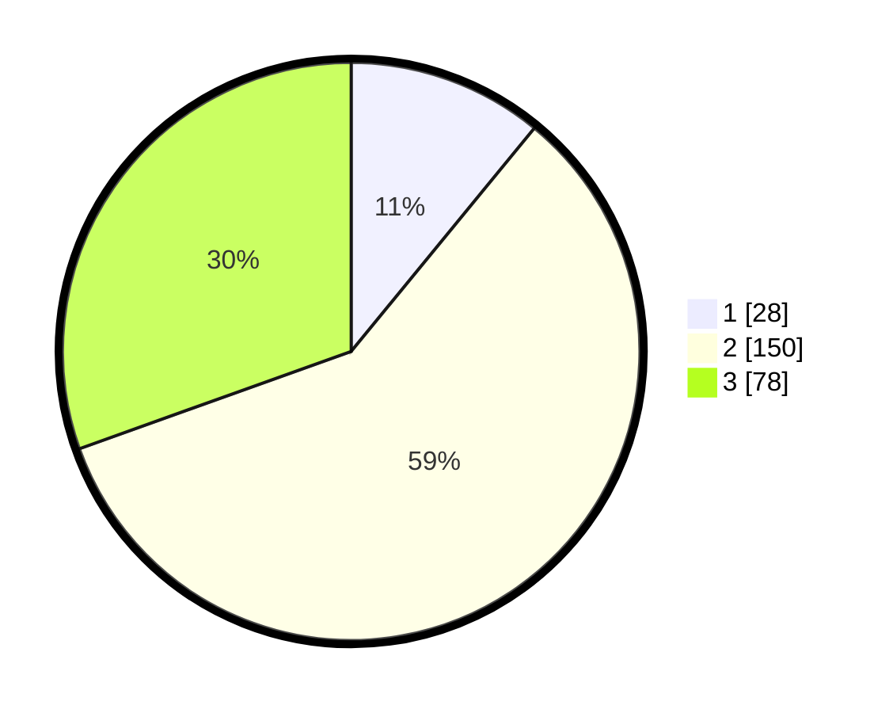

# Hasil

## Grafik

## Tabel

| No. | Nama Paslon    | Suara | Suara (raw) | Persentase |
|:--- |:-------------- | -----:| -----------:| ----------:|
| 1   | ANIES MUHAIMIN | 28    | [28][p-1]   | 10,94      |
| 2   | PRABOWO GIBRAN | 150   | [150][p-2]  | 58,59      |
| 3   | GANJAR MAHFUD  | 78    | [78][p-3]   | 30,47      |

[p-1]: https://github.com/gigit-pemilu/pemilu-2024-33-jawa-tengah/blob/main/pilpres/hitung-suara/sub/33-jawa-tengah/sub/17-rembang/sub/10-rembang/sub/2033-kabongan-kidul/sub/004-tps/sub/paslon-1.txt
[p-2]: https://github.com/gigit-pemilu/pemilu-2024-33-jawa-tengah/blob/main/pilpres/hitung-suara/sub/33-jawa-tengah/sub/17-rembang/sub/10-rembang/sub/2033-kabongan-kidul/sub/004-tps/sub/paslon-2.txt
[p-3]: https://github.com/gigit-pemilu/pemilu-2024-33-jawa-tengah/blob/main/pilpres/hitung-suara/sub/33-jawa-tengah/sub/17-rembang/sub/10-rembang/sub/2033-kabongan-kidul/sub/004-tps/sub/paslon-3.txt

## Foto C Plano

https://sirekap-obj-formc.kpu.go.id/d6cc/pemilu/ppwp/33/17/10/20/33/3317102033004-20240214-191740--a0bf4b48-40ae-47e6-8cb0-5d753056cd5d.jpg

https://sirekap-obj-formc.kpu.go.id/d6cc/pemilu/ppwp/33/17/10/20/33/3317102033004-20240214-191756--f4b2bfde-8e56-490c-9fad-1b38d0fc4b5b.jpg

https://sirekap-obj-formc.kpu.go.id/d6cc/pemilu/ppwp/33/17/10/20/33/3317102033004-20240214-191800--bda20fa5-a008-4d7c-a95f-7df15bd5c212.jpg

## Metadata

| Key        | Value               |
| ---------- | ------------------- |
| Time Stamp | 2024-02-19 06:16:00 |

