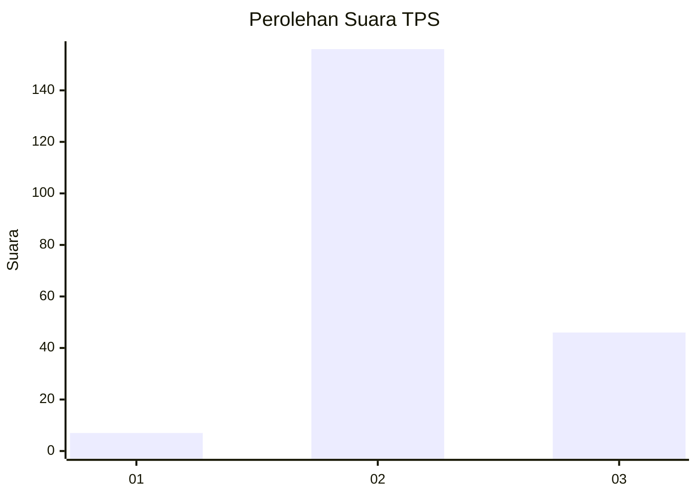

# Hasil

## Grafik

## Tabel

| No. | Nama Paslon    | Suara | Suara (raw) | Persentase |
|:--- |:-------------- | -----:| -----------:| ----------:|
| 1   | ANIES MUHAIMIN | 7     | [7][p-1]    | 3,35       |
| 2   | PRABOWO GIBRAN | 156   | [156][p-2]  | 74,64      |
| 3   | GANJAR MAHFUD  | 46    | [46][p-3]   | 22,01      |

[p-1]: https://github.com/gigit-pemilu/pemilu-2024/blob/main/pilpres/hitung-suara/sub/33-jawa-tengah/sub/17-rembang/sub/11-pancur/sub/2015-pohlandak/sub/003-tps/sub/paslon-1.txt
[p-2]: https://github.com/gigit-pemilu/pemilu-2024/blob/main/pilpres/hitung-suara/sub/33-jawa-tengah/sub/17-rembang/sub/11-pancur/sub/2015-pohlandak/sub/003-tps/sub/paslon-2.txt
[p-3]: https://github.com/gigit-pemilu/pemilu-2024/blob/main/pilpres/hitung-suara/sub/33-jawa-tengah/sub/17-rembang/sub/11-pancur/sub/2015-pohlandak/sub/003-tps/sub/paslon-3.txt

## Foto C Plano

https://sirekap-obj-formc.kpu.go.id/8738/pemilu/ppwp/33/17/11/20/15/3317112015003-20240215-003818--f8118c6d-38b5-4eba-a9e7-e7f4df980b0c.jpg

https://sirekap-obj-formc.kpu.go.id/8738/pemilu/ppwp/33/17/11/20/15/3317112015003-20240215-003933--b7da0462-eaec-4b25-b6c4-4000a732d877.jpg

https://sirekap-obj-formc.kpu.go.id/8738/pemilu/ppwp/33/17/11/20/15/3317112015003-20240215-004036--ee64a37f-d2e8-4fe9-9e1e-628c1d484456.jpg

## Metadata

| Key        | Value               |
| ---------- | ------------------- |
| Time Stamp | 2024-02-15 15:00:29 |

