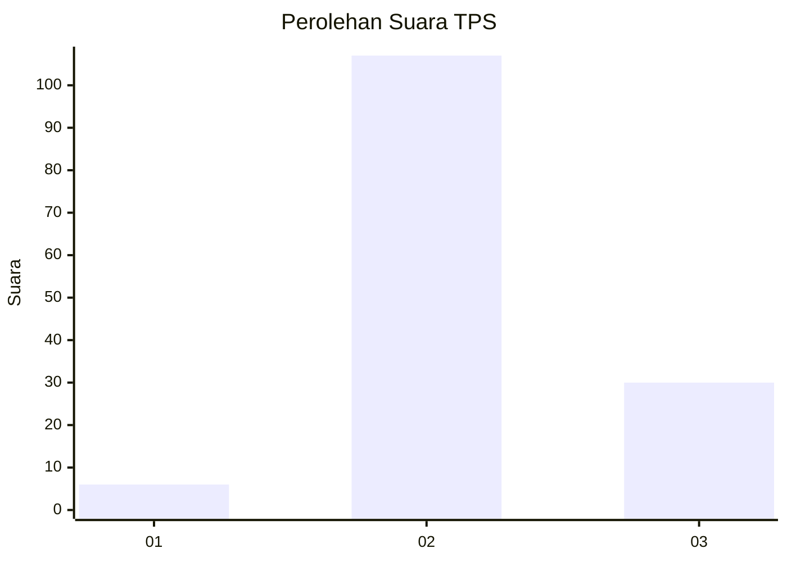

# Hasil

## Grafik

## Tabel

| No. | Nama Paslon    | Suara | Suara (raw) | Persentase |
|:--- |:-------------- | -----:| -----------:| ----------:|
| 1   | ANIES MUHAIMIN | 6     | [6][p-1]    | 4,20       |
| 2   | PRABOWO GIBRAN | 107   | [107][p-2]  | 74,83      |
| 3   | GANJAR MAHFUD  | 30    | [30][p-3]   | 20,98      |

[p-1]: https://github.com/gigit-pemilu/pemilu-2024-33-jawa-tengah/blob/main/pilpres/hitung-suara/sub/33-jawa-tengah/sub/17-rembang/sub/12-kragan/sub/2001-tanjungsari/sub/004-tps/sub/paslon-1.txt
[p-2]: https://github.com/gigit-pemilu/pemilu-2024-33-jawa-tengah/blob/main/pilpres/hitung-suara/sub/33-jawa-tengah/sub/17-rembang/sub/12-kragan/sub/2001-tanjungsari/sub/004-tps/sub/paslon-2.txt
[p-3]: https://github.com/gigit-pemilu/pemilu-2024-33-jawa-tengah/blob/main/pilpres/hitung-suara/sub/33-jawa-tengah/sub/17-rembang/sub/12-kragan/sub/2001-tanjungsari/sub/004-tps/sub/paslon-3.txt

## Foto C Plano

https://sirekap-obj-formc.kpu.go.id/c7b1/pemilu/ppwp/33/17/12/20/01/3317122001004-20240215-024328--6b1202c0-1178-465c-bad2-d2d61e817d3d.jpg

https://sirekap-obj-formc.kpu.go.id/c7b1/pemilu/ppwp/33/17/12/20/01/3317122001004-20240215-024334--dbff1c48-0575-4b5b-a92f-d0441bdc5b50.jpg

https://sirekap-obj-formc.kpu.go.id/c7b1/pemilu/ppwp/33/17/12/20/01/3317122001004-20240217-085626--fad14df8-f954-4c4e-800e-d712c78db9ac.jpg

## Metadata

| Key        | Value               |
| ---------- | ------------------- |
| Time Stamp | 2024-02-17 09:00:02 |

