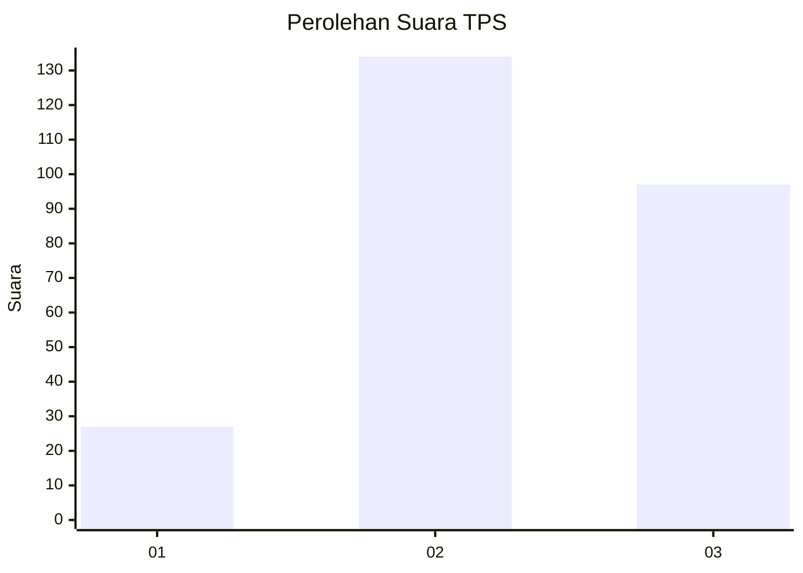
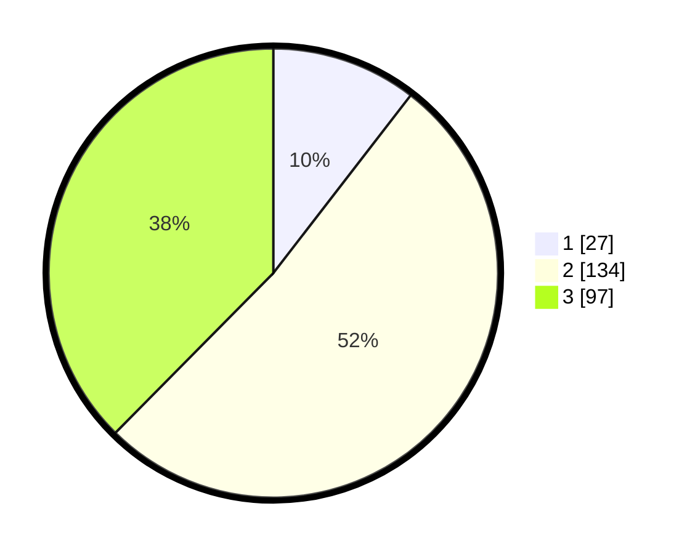

# Hasil

## Grafik

## Tabel

| No. | Nama Paslon    | Suara | Suara (raw) | Persentase |
|:--- |:-------------- | -----:| -----------:| ----------:|
| 1   | ANIES MUHAIMIN | 27    | [27][p-1]   | 10,47      |
| 2   | PRABOWO GIBRAN | 134   | [134][p-2]  | 51,94      |
| 3   | GANJAR MAHFUD  | 97    | [97][p-3]   | 37,60      |

[p-1]: https://github.com/gigit-pemilu/pemilu-2024-33-jawa-tengah/blob/main/pilpres/hitung-suara/sub/33-jawa-tengah/sub/17-rembang/sub/12-kragan/sub/2011-karangharjo/sub/001-tps/sub/paslon-1.txt
[p-2]: https://github.com/gigit-pemilu/pemilu-2024-33-jawa-tengah/blob/main/pilpres/hitung-suara/sub/33-jawa-tengah/sub/17-rembang/sub/12-kragan/sub/2011-karangharjo/sub/001-tps/sub/paslon-2.txt
[p-3]: https://github.com/gigit-pemilu/pemilu-2024-33-jawa-tengah/blob/main/pilpres/hitung-suara/sub/33-jawa-tengah/sub/17-rembang/sub/12-kragan/sub/2011-karangharjo/sub/001-tps/sub/paslon-3.txt

## Foto C Plano

https://sirekap-obj-formc.kpu.go.id/7df3/pemilu/ppwp/33/17/12/20/11/3317122011001-20240216-144510--56e5ce1f-a0a7-4558-a50a-e2d2191fc5f9.jpg

https://sirekap-obj-formc.kpu.go.id/7df3/pemilu/ppwp/33/17/12/20/11/3317122011001-20240214-192321--1eed4c83-3999-467b-a915-fa7cf382e978.jpg

https://sirekap-obj-formc.kpu.go.id/7df3/pemilu/ppwp/33/17/12/20/11/3317122011001-20240217-173514--d704efcb-fb05-44ea-993d-74fd1012b9a3.jpg

## Metadata

| Key        | Value               |
| ---------- | ------------------- |
| Time Stamp | 2024-02-17 18:00:00 |

