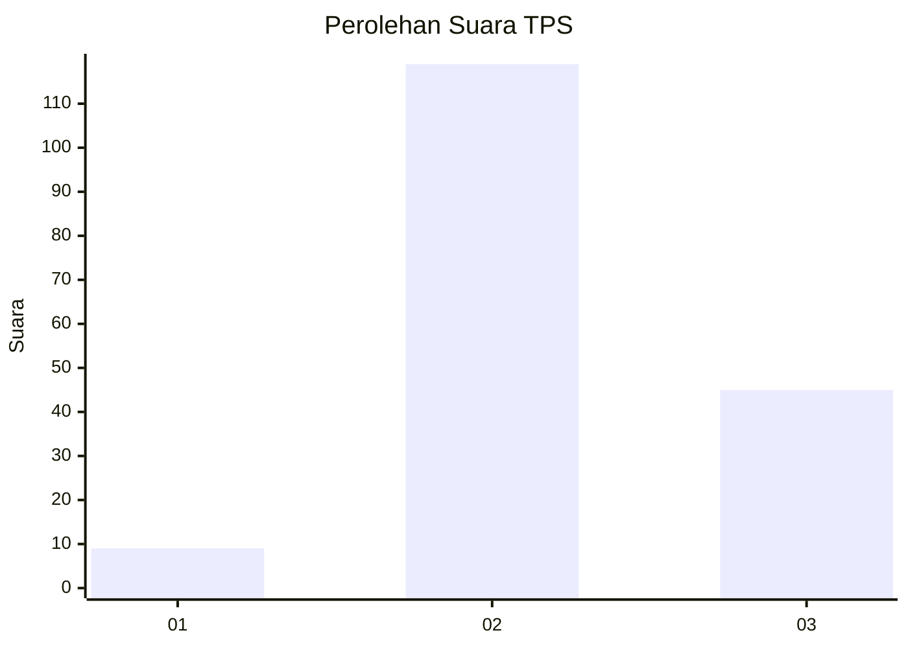

# Hasil

## Grafik

## Tabel

| No. | Nama Paslon    | Suara | Suara (raw) | Persentase |
|:--- |:-------------- | -----:| -----------:| ----------:|
| 1   | ANIES MUHAIMIN | 9     | [9][p-1]    | 5,20       |
| 2   | PRABOWO GIBRAN | 119   | [119][p-2]  | 68,79      |
| 3   | GANJAR MAHFUD  | 45    | [45][p-3]   | 26,01      |

[p-1]: https://github.com/gigit-pemilu/pemilu-2024/blob/main/pilpres/hitung-suara/sub/33-jawa-tengah/sub/17-rembang/sub/12-kragan/sub/2012-kragan/sub/007-tps/sub/paslon-1.txt
[p-2]: https://github.com/gigit-pemilu/pemilu-2024/blob/main/pilpres/hitung-suara/sub/33-jawa-tengah/sub/17-rembang/sub/12-kragan/sub/2012-kragan/sub/007-tps/sub/paslon-2.txt
[p-3]: https://github.com/gigit-pemilu/pemilu-2024/blob/main/pilpres/hitung-suara/sub/33-jawa-tengah/sub/17-rembang/sub/12-kragan/sub/2012-kragan/sub/007-tps/sub/paslon-3.txt

## Foto C Plano

https://sirekap-obj-formc.kpu.go.id/f5c5/pemilu/ppwp/33/17/12/20/12/3317122012007-20240228-231948--6beb283a-58b0-4c0f-802a-180be0c3780f.jpg

https://sirekap-obj-formc.kpu.go.id/f5c5/pemilu/ppwp/33/17/12/20/12/3317122012007-20240214-141117--4d49756f-0f98-4656-8d1e-e314c5d40d7d.jpg

https://sirekap-obj-formc.kpu.go.id/f5c5/pemilu/ppwp/33/17/12/20/12/3317122012007-20240214-141241--1bbd9b01-6301-4e11-aa91-ab5cc4c365b5.jpg

## Metadata

| Key        | Value               |
| ---------- | ------------------- |
| Time Stamp | 2024-02-29 00:00:00 |

