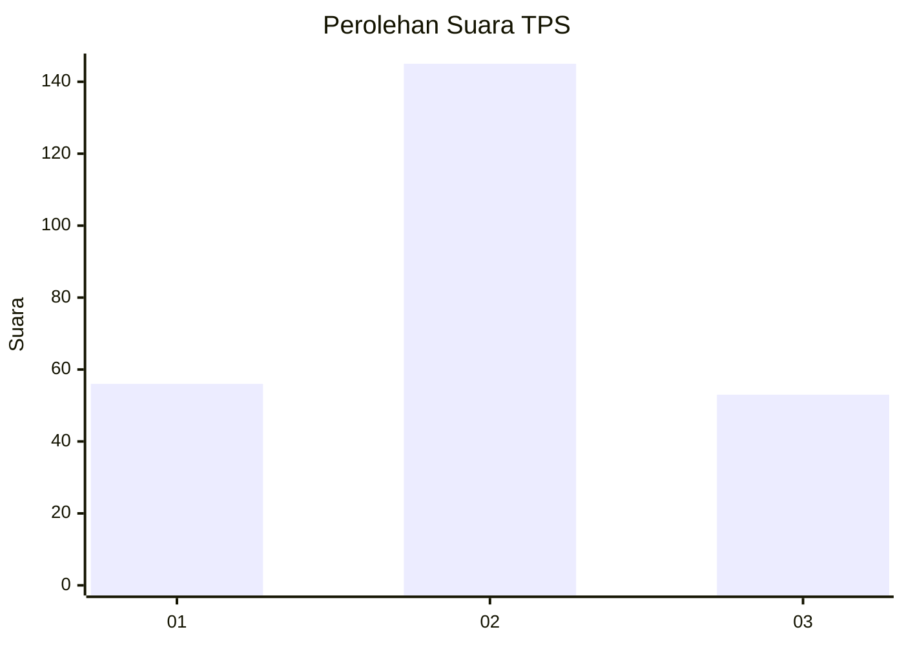
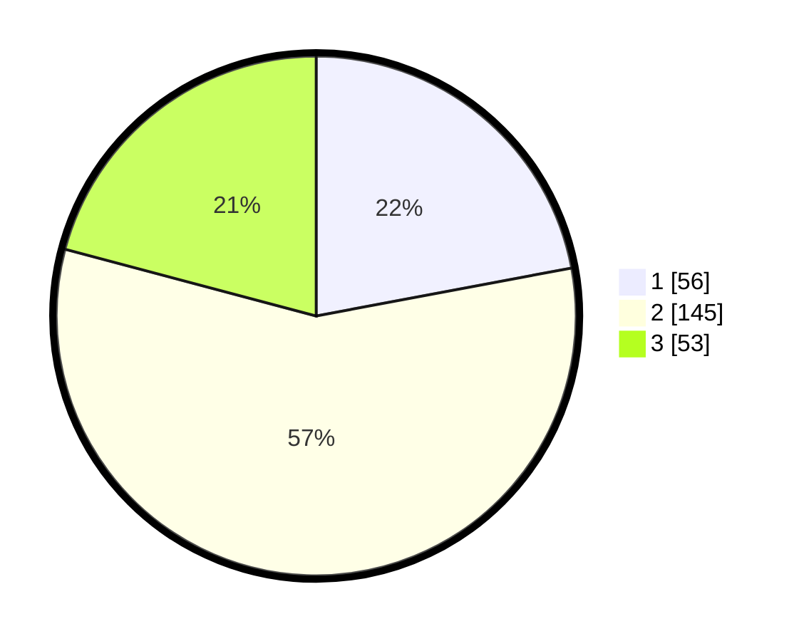

# Hasil

## Grafik

## Tabel

| No. | Nama Paslon    | Suara | Suara (raw) | Persentase |
|:--- |:-------------- | -----:| -----------:| ----------:|
| 1   | ANIES MUHAIMIN | 56    | [56][p-1]   | 22,05      |
| 2   | PRABOWO GIBRAN | 145   | [145][p-2]  | 57,09      |
| 3   | GANJAR MAHFUD  | 53    | [53][p-3]   | 20,87      |

[p-1]: https://github.com/gigit-pemilu/pemilu-2024/blob/main/pilpres/hitung-suara/sub/33-jawa-tengah/sub/17-rembang/sub/12-kragan/sub/2015-narukan/sub/002-tps/sub/paslon-1.txt
[p-2]: https://github.com/gigit-pemilu/pemilu-2024/blob/main/pilpres/hitung-suara/sub/33-jawa-tengah/sub/17-rembang/sub/12-kragan/sub/2015-narukan/sub/002-tps/sub/paslon-2.txt
[p-3]: https://github.com/gigit-pemilu/pemilu-2024/blob/main/pilpres/hitung-suara/sub/33-jawa-tengah/sub/17-rembang/sub/12-kragan/sub/2015-narukan/sub/002-tps/sub/paslon-3.txt

## Foto C Plano

https://sirekap-obj-formc.kpu.go.id/cc6a/pemilu/ppwp/33/17/12/20/15/3317122015002-20240215-000621--21ec85f3-8cb8-496e-af9a-059fe8c3a56a.jpg

https://sirekap-obj-formc.kpu.go.id/cc6a/pemilu/ppwp/33/17/12/20/15/3317122015002-20240215-015034--adcabd7c-3e50-4285-bb79-541597890fbe.jpg

https://sirekap-obj-formc.kpu.go.id/cc6a/pemilu/ppwp/33/17/12/20/15/3317122015002-20240215-015130--a72c4100-b83f-4ee3-b6cc-de2b96ed630e.jpg

## Metadata

| Key        | Value               |
| ---------- | ------------------- |
| Time Stamp | 2024-02-15 12:00:28 |

