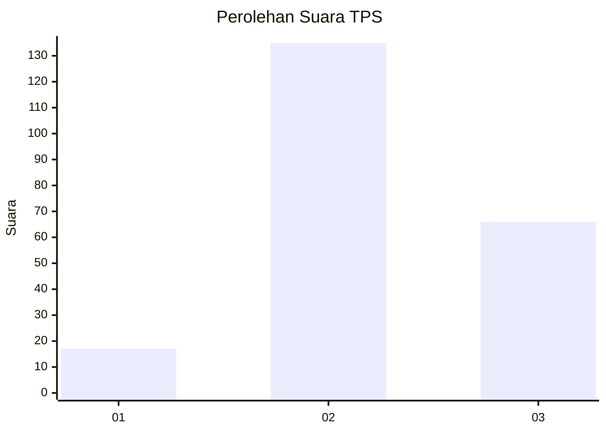
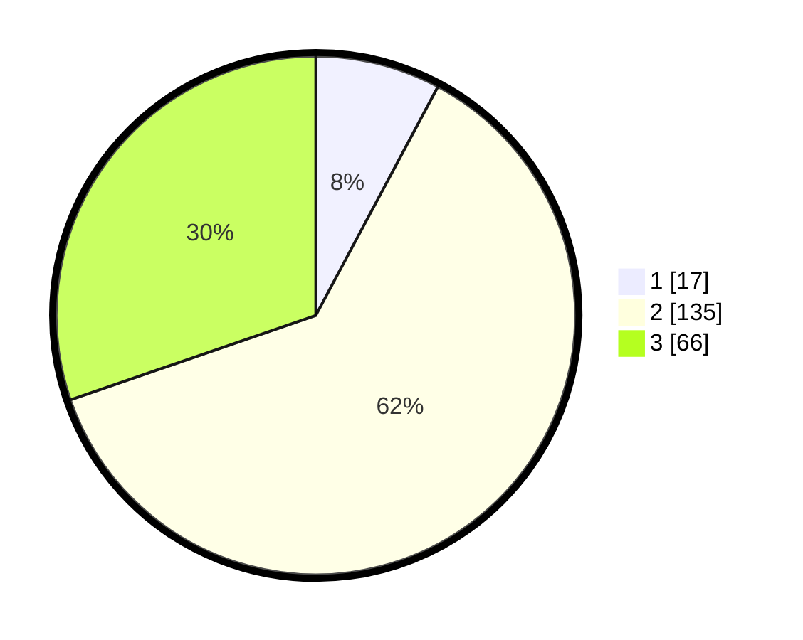

# Hasil

## Grafik

## Tabel

| No. | Nama Paslon    | Suara | Suara (raw) | Persentase |
|:--- |:-------------- | -----:| -----------:| ----------:|
| 1   | ANIES MUHAIMIN | 17    | [17][p-1]   | 7,80       |
| 2   | PRABOWO GIBRAN | 135   | [135][p-2]  | 61,93      |
| 3   | GANJAR MAHFUD  | 66    | [66][p-3]   | 30,28      |

[p-1]: https://github.com/gigit-pemilu/pemilu-2024/blob/main/pilpres/hitung-suara/sub/33-jawa-tengah/sub/17-rembang/sub/12-kragan/sub/2021-sumurpule/sub/007-tps/sub/paslon-1.txt
[p-2]: https://github.com/gigit-pemilu/pemilu-2024/blob/main/pilpres/hitung-suara/sub/33-jawa-tengah/sub/17-rembang/sub/12-kragan/sub/2021-sumurpule/sub/007-tps/sub/paslon-2.txt
[p-3]: https://github.com/gigit-pemilu/pemilu-2024/blob/main/pilpres/hitung-suara/sub/33-jawa-tengah/sub/17-rembang/sub/12-kragan/sub/2021-sumurpule/sub/007-tps/sub/paslon-3.txt

## Foto C Plano

https://sirekap-obj-formc.kpu.go.id/a511/pemilu/ppwp/33/17/12/20/21/3317122021007-20240216-190938--de3b23e9-ea5b-4309-974a-c2884c55c3eb.jpg

https://sirekap-obj-formc.kpu.go.id/a511/pemilu/ppwp/33/17/12/20/21/3317122021007-20240216-191233--be7edb55-cddd-4526-9580-72c6da192f4a.jpg

https://sirekap-obj-formc.kpu.go.id/a511/pemilu/ppwp/33/17/12/20/21/3317122021007-20240216-195423--c44cb2f6-e2a5-4cf2-a2ad-5eb1bcb567a5.jpg

## Metadata

| Key        | Value               |
| ---------- | ------------------- |
| Time Stamp | 2024-02-16 21:01:00 |

