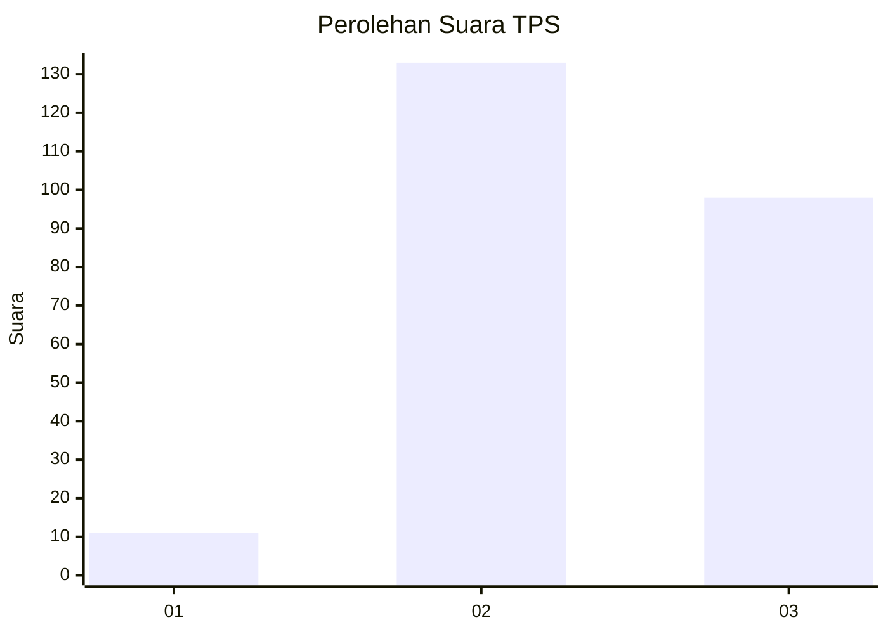
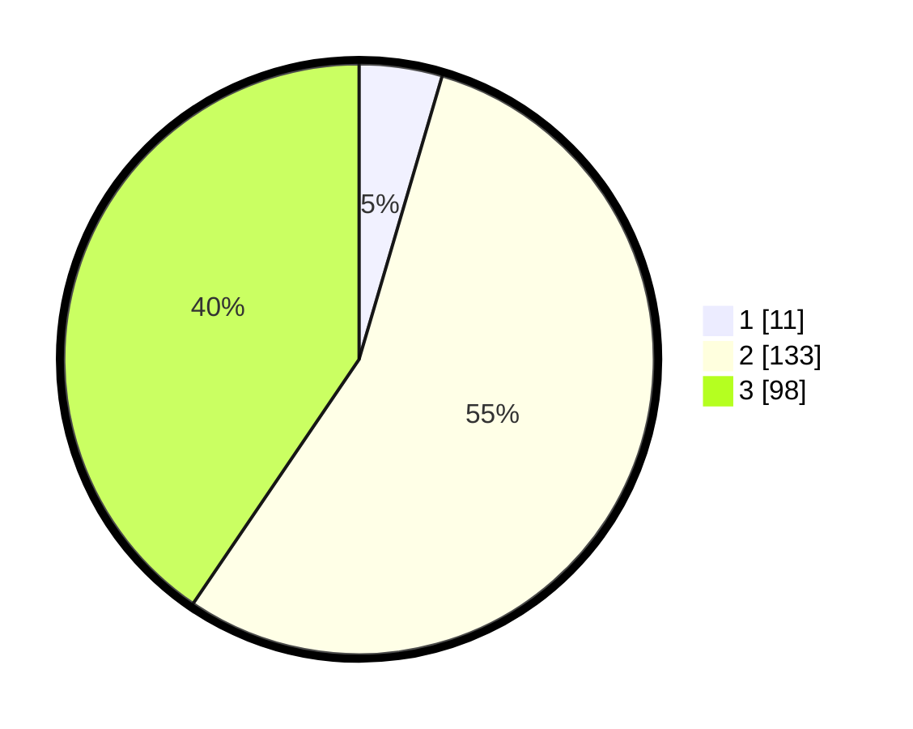

# Hasil

## Grafik

## Tabel

| No. | Nama Paslon    | Suara | Suara (raw) | Persentase |
|:--- |:-------------- | -----:| -----------:| ----------:|
| 1   | ANIES MUHAIMIN | 11    | [11][p-1]   | 4,55       |
| 2   | PRABOWO GIBRAN | 133   | [133][p-2]  | 54,96      |
| 3   | GANJAR MAHFUD  | 98    | [98][p-3]   | 40,50      |

[p-1]: https://github.com/gigit-pemilu/pemilu-2024-33-jawa-tengah/blob/main/pilpres/hitung-suara/sub/33-jawa-tengah/sub/17-rembang/sub/12-kragan/sub/2026-sumurtawang/sub/004-tps/sub/paslon-1.txt
[p-2]: https://github.com/gigit-pemilu/pemilu-2024-33-jawa-tengah/blob/main/pilpres/hitung-suara/sub/33-jawa-tengah/sub/17-rembang/sub/12-kragan/sub/2026-sumurtawang/sub/004-tps/sub/paslon-2.txt
[p-3]: https://github.com/gigit-pemilu/pemilu-2024-33-jawa-tengah/blob/main/pilpres/hitung-suara/sub/33-jawa-tengah/sub/17-rembang/sub/12-kragan/sub/2026-sumurtawang/sub/004-tps/sub/paslon-3.txt

## Foto C Plano

https://sirekap-obj-formc.kpu.go.id/e637/pemilu/ppwp/33/17/12/20/26/3317122026004-20240216-093232--7a8a7180-ee42-4090-95a7-9dbb73482caf.jpg

https://sirekap-obj-formc.kpu.go.id/e637/pemilu/ppwp/33/17/12/20/26/3317122026004-20240216-094624--4e254b10-b55c-41a2-982f-5c929c5dc212.jpg

https://sirekap-obj-formc.kpu.go.id/e637/pemilu/ppwp/33/17/12/20/26/3317122026004-20240216-095123--8a73feb7-17a4-4fdb-96f6-9c9956f56d25.jpg

## Metadata

| Key        | Value               |
| ---------- | ------------------- |
| Time Stamp | 2024-02-16 10:30:29 |

