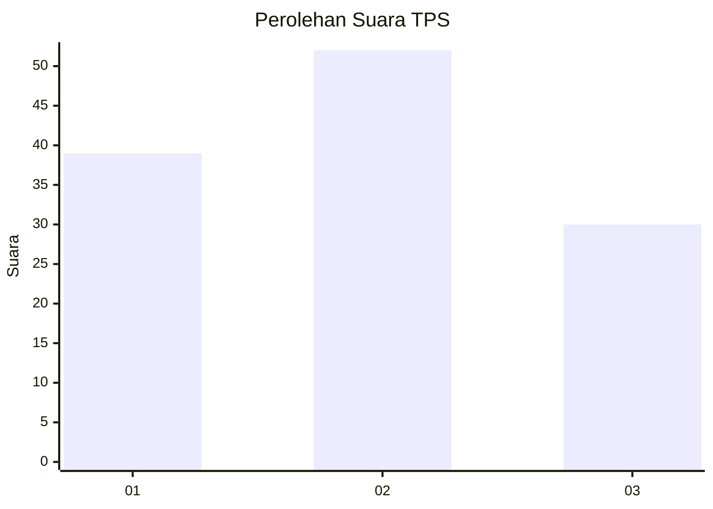
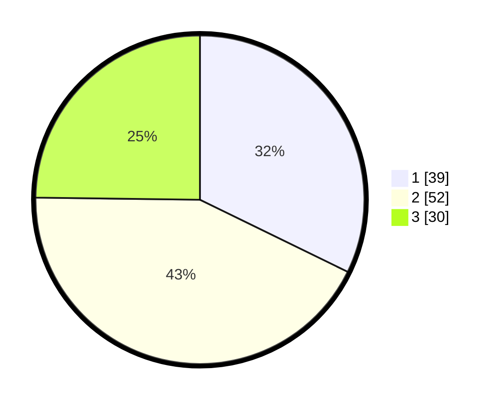

# Hasil

## Grafik

## Tabel

| No. | Nama Paslon    | Suara | Suara (raw) | Persentase |
|:--- |:-------------- | -----:| -----------:| ----------:|
| 1   | ANIES MUHAIMIN | 39    | [39][p-1]   | 32,23      |
| 2   | PRABOWO GIBRAN | 52    | [52][p-2]   | 42,98      |
| 3   | GANJAR MAHFUD  | 30    | [30][p-3]   | 24,79      |

[p-1]: https://github.com/gigit-pemilu/pemilu-2024/blob/main/pilpres/hitung-suara/sub/33-jawa-tengah/sub/17-rembang/sub/12-kragan/sub/2026-sumurtawang/sub/006-tps/sub/paslon-1.txt
[p-2]: https://github.com/gigit-pemilu/pemilu-2024/blob/main/pilpres/hitung-suara/sub/33-jawa-tengah/sub/17-rembang/sub/12-kragan/sub/2026-sumurtawang/sub/006-tps/sub/paslon-2.txt
[p-3]: https://github.com/gigit-pemilu/pemilu-2024/blob/main/pilpres/hitung-suara/sub/33-jawa-tengah/sub/17-rembang/sub/12-kragan/sub/2026-sumurtawang/sub/006-tps/sub/paslon-3.txt

## Foto C Plano

https://sirekap-obj-formc.kpu.go.id/3cbf/pemilu/ppwp/33/17/12/20/26/3317122026006-20240214-141029--50eaa07c-82ff-46a9-a3b8-ba1074edc49d.jpg

https://sirekap-obj-formc.kpu.go.id/3cbf/pemilu/ppwp/33/17/12/20/26/3317122026006-20240214-141317--7974a56d-ae02-4a5a-a3ef-fecf49f2f278.jpg

https://sirekap-obj-formc.kpu.go.id/3cbf/pemilu/ppwp/33/17/12/20/26/3317122026006-20240214-213307--fae9319d-448a-4249-9caf-1986fe75febd.jpg

## Metadata

| Key        | Value               |
| ---------- | ------------------- |
| Time Stamp | 2024-02-15 12:00:28 |

