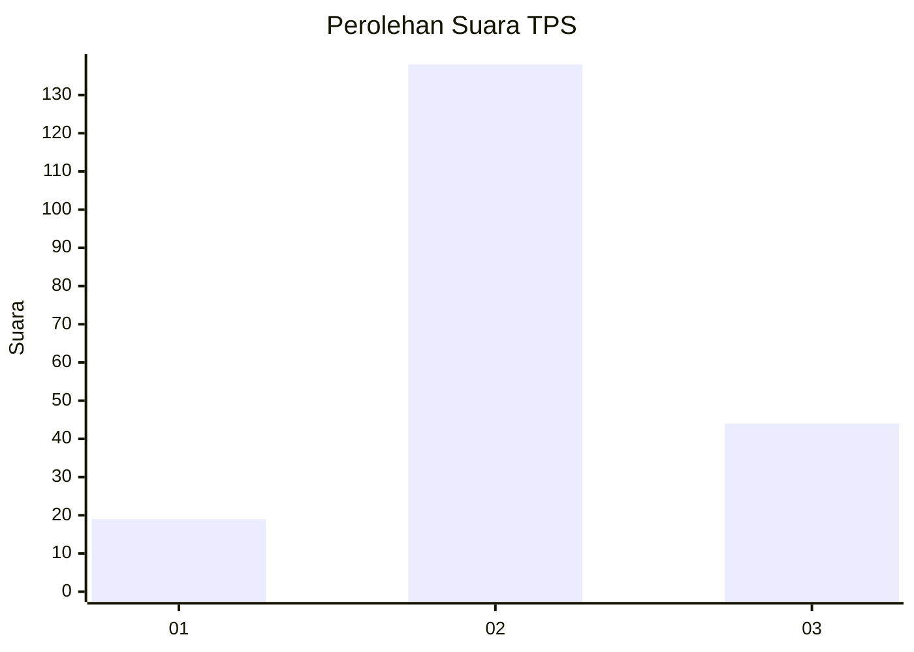
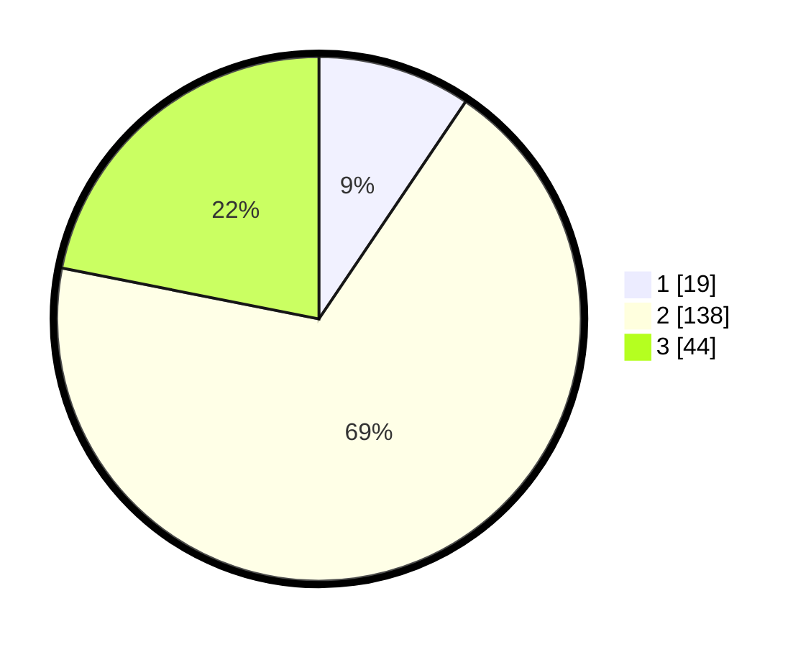

# Hasil

## Grafik

## Tabel

| No. | Nama Paslon    | Suara | Suara (raw) | Persentase |
|:--- |:-------------- | -----:| -----------:| ----------:|
| 1   | ANIES MUHAIMIN | 19    | [19][p-1]   | 9,45       |
| 2   | PRABOWO GIBRAN | 138   | [138][p-2]  | 68,66      |
| 3   | GANJAR MAHFUD  | 44    | [44][p-3]   | 21,89      |

[p-1]: https://github.com/gigit-pemilu/pemilu-2024/blob/main/pilpres/hitung-suara/sub/33-jawa-tengah/sub/17-rembang/sub/13-sluke/sub/2010-sluke/sub/005-tps/sub/paslon-1.txt
[p-2]: https://github.com/gigit-pemilu/pemilu-2024/blob/main/pilpres/hitung-suara/sub/33-jawa-tengah/sub/17-rembang/sub/13-sluke/sub/2010-sluke/sub/005-tps/sub/paslon-2.txt
[p-3]: https://github.com/gigit-pemilu/pemilu-2024/blob/main/pilpres/hitung-suara/sub/33-jawa-tengah/sub/17-rembang/sub/13-sluke/sub/2010-sluke/sub/005-tps/sub/paslon-3.txt

## Foto C Plano

https://sirekap-obj-formc.kpu.go.id/bd24/pemilu/ppwp/33/17/13/20/10/3317132010005-20240215-022006--60229e7c-796e-4a5c-af35-e2e1c1b56cd7.jpg

https://sirekap-obj-formc.kpu.go.id/bd24/pemilu/ppwp/33/17/13/20/10/3317132010005-20240215-022128--edc25b88-c083-4486-ad58-09e1ce031d28.jpg

https://sirekap-obj-formc.kpu.go.id/bd24/pemilu/ppwp/33/17/13/20/10/3317132010005-20240215-022253--2126b6d4-04c6-48f0-bd8b-c021ce35bc6b.jpg

## Metadata

| Key        | Value               |
| ---------- | ------------------- |
| Time Stamp | 2024-02-17 11:00:02 |

