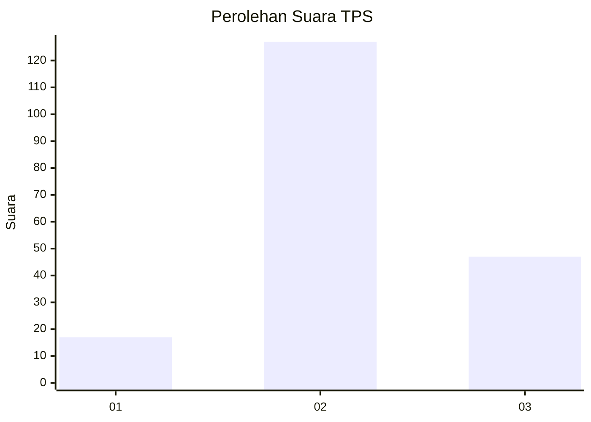
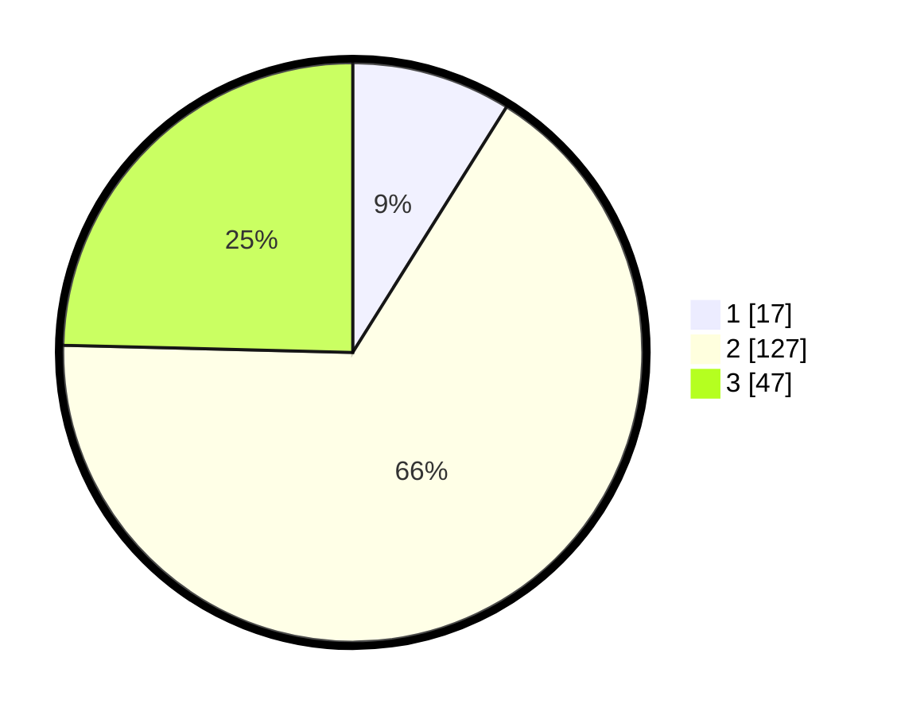

# Hasil

## Grafik

## Tabel

| No. | Nama Paslon    | Suara | Suara (raw) | Persentase |
|:--- |:-------------- | -----:| -----------:| ----------:|
| 1   | ANIES MUHAIMIN | 17    | [17][p-1]   | 8,90       |
| 2   | PRABOWO GIBRAN | 127   | [127][p-2]  | 66,49      |
| 3   | GANJAR MAHFUD  | 47    | [47][p-3]   | 24,61      |

[p-1]: https://github.com/gigit-pemilu/pemilu-2024/blob/main/pilpres/hitung-suara/sub/33-jawa-tengah/sub/18-pati/sub/01-sukolilo/sub/2001-prawoto/sub/003-tps/sub/paslon-1.txt
[p-2]: https://github.com/gigit-pemilu/pemilu-2024/blob/main/pilpres/hitung-suara/sub/33-jawa-tengah/sub/18-pati/sub/01-sukolilo/sub/2001-prawoto/sub/003-tps/sub/paslon-2.txt
[p-3]: https://github.com/gigit-pemilu/pemilu-2024/blob/main/pilpres/hitung-suara/sub/33-jawa-tengah/sub/18-pati/sub/01-sukolilo/sub/2001-prawoto/sub/003-tps/sub/paslon-3.txt

## Foto C Plano

https://sirekap-obj-formc.kpu.go.id/dde1/pemilu/ppwp/33/18/01/20/01/3318012001003-20240215-001523--bdf7cfd6-1833-410c-99d8-84824da0ee49.jpg

https://sirekap-obj-formc.kpu.go.id/dde1/pemilu/ppwp/33/18/01/20/01/3318012001003-20240215-001540--97589321-7c0b-4744-84a5-446e374780c4.jpg

https://sirekap-obj-formc.kpu.go.id/dde1/pemilu/ppwp/33/18/01/20/01/3318012001003-20240214-235445--682eb557-a74c-4a06-993c-9128a3c1f99e.jpg

## Metadata

| Key        | Value               |
| ---------- | ------------------- |
| Time Stamp | 2024-02-15 19:00:26 |

