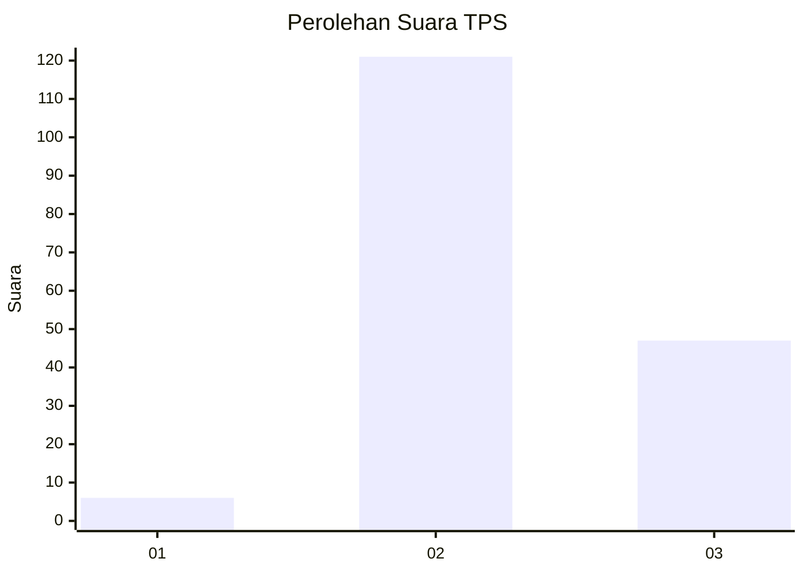

# Hasil

## Grafik

## Tabel

| No. | Nama Paslon    | Suara | Suara (raw) | Persentase |
|:--- |:-------------- | -----:| -----------:| ----------:|
| 1   | ANIES MUHAIMIN | 6     | [6][p-1]    | 3,45       |
| 2   | PRABOWO GIBRAN | 121   | [121][p-2]  | 69,54      |
| 3   | GANJAR MAHFUD  | 47    | [47][p-3]   | 27,01      |

[p-1]: https://github.com/gigit-pemilu/pemilu-2024/blob/main/pilpres/hitung-suara/sub/33-jawa-tengah/sub/18-pati/sub/01-sukolilo/sub/2001-prawoto/sub/004-tps/sub/paslon-1.txt
[p-2]: https://github.com/gigit-pemilu/pemilu-2024/blob/main/pilpres/hitung-suara/sub/33-jawa-tengah/sub/18-pati/sub/01-sukolilo/sub/2001-prawoto/sub/004-tps/sub/paslon-2.txt
[p-3]: https://github.com/gigit-pemilu/pemilu-2024/blob/main/pilpres/hitung-suara/sub/33-jawa-tengah/sub/18-pati/sub/01-sukolilo/sub/2001-prawoto/sub/004-tps/sub/paslon-3.txt

## Foto C Plano

https://sirekap-obj-formc.kpu.go.id/bc0a/pemilu/ppwp/33/18/01/20/01/3318012001004-20240216-231610--8fe14364-ce0e-4a85-b3d9-a73eab7d914f.jpg

https://sirekap-obj-formc.kpu.go.id/bc0a/pemilu/ppwp/33/18/01/20/01/3318012001004-20240216-231714--27b4db69-ef2f-426b-a06f-0a50b8a99cda.jpg

https://sirekap-obj-formc.kpu.go.id/bc0a/pemilu/ppwp/33/18/01/20/01/3318012001004-20240216-231753--fb59c3e9-0ffa-4d5f-a206-1ff14c0a2705.jpg

## Metadata

| Key        | Value               |
| ---------- | ------------------- |
| Time Stamp | 2024-02-16 23:30:00 |

