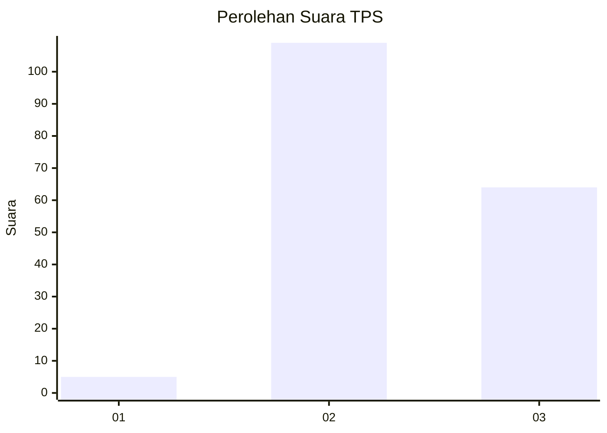
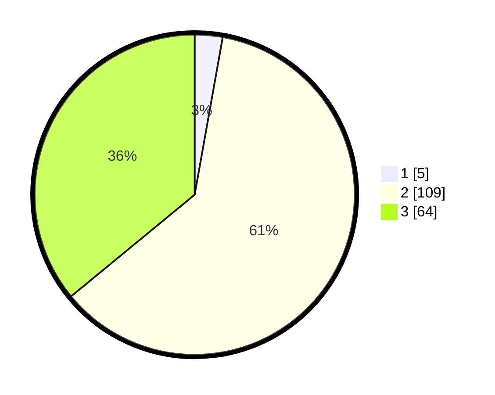

# Hasil

## Grafik

## Tabel

| No. | Nama Paslon    | Suara | Suara (raw) | Persentase |
|:--- |:-------------- | -----:| -----------:| ----------:|
| 1   | ANIES MUHAIMIN | 5     | [5][p-1]    | 2,81       |
| 2   | PRABOWO GIBRAN | 109   | [109][p-2]  | 61,24      |
| 3   | GANJAR MAHFUD  | 64    | [64][p-3]   | 35,96      |

[p-1]: https://github.com/gigit-pemilu/pemilu-2024-33-jawa-tengah/blob/main/pilpres/hitung-suara/sub/33-jawa-tengah/sub/18-pati/sub/01-sukolilo/sub/2001-prawoto/sub/005-tps/sub/paslon-1.txt
[p-2]: https://github.com/gigit-pemilu/pemilu-2024-33-jawa-tengah/blob/main/pilpres/hitung-suara/sub/33-jawa-tengah/sub/18-pati/sub/01-sukolilo/sub/2001-prawoto/sub/005-tps/sub/paslon-2.txt
[p-3]: https://github.com/gigit-pemilu/pemilu-2024-33-jawa-tengah/blob/main/pilpres/hitung-suara/sub/33-jawa-tengah/sub/18-pati/sub/01-sukolilo/sub/2001-prawoto/sub/005-tps/sub/paslon-3.txt

## Foto C Plano

https://sirekap-obj-formc.kpu.go.id/9f43/pemilu/ppwp/33/18/01/20/01/3318012001005-20240216-232213--e33666b3-089a-4a15-bc5b-6aa4443b1f6b.jpg

https://sirekap-obj-formc.kpu.go.id/9f43/pemilu/ppwp/33/18/01/20/01/3318012001005-20240216-232254--8df0e97a-2545-4c27-906a-4c99af83e788.jpg

https://sirekap-obj-formc.kpu.go.id/9f43/pemilu/ppwp/33/18/01/20/01/3318012001005-20240216-232340--234f65a0-3736-4d7b-aaa4-79b824f9dec3.jpg

## Metadata

| Key        | Value               |
| ---------- | ------------------- |
| Time Stamp | 2024-02-17 14:45:18 |

