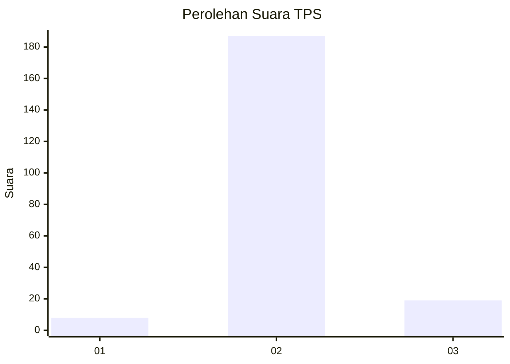
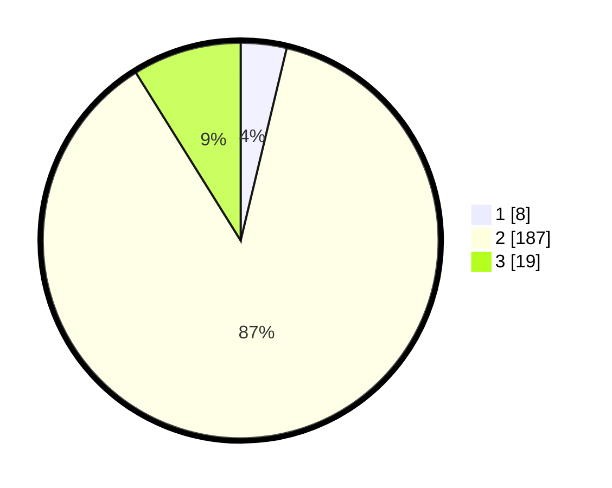

# Hasil

## Grafik

## Tabel

| No. | Nama Paslon    | Suara | Suara (raw) | Persentase |
|:--- |:-------------- | -----:| -----------:| ----------:|
| 1   | ANIES MUHAIMIN | 8     | [8][p-1]    | 3,74       |
| 2   | PRABOWO GIBRAN | 187   | [187][p-2]  | 87,38      |
| 3   | GANJAR MAHFUD  | 19    | [19][p-3]   | 8,88       |

[p-1]: https://github.com/gigit-pemilu/pemilu-2024/blob/main/pilpres/hitung-suara/sub/33-jawa-tengah/sub/18-pati/sub/01-sukolilo/sub/2002-pakem/sub/005-tps/sub/paslon-1.txt
[p-2]: https://github.com/gigit-pemilu/pemilu-2024/blob/main/pilpres/hitung-suara/sub/33-jawa-tengah/sub/18-pati/sub/01-sukolilo/sub/2002-pakem/sub/005-tps/sub/paslon-2.txt
[p-3]: https://github.com/gigit-pemilu/pemilu-2024/blob/main/pilpres/hitung-suara/sub/33-jawa-tengah/sub/18-pati/sub/01-sukolilo/sub/2002-pakem/sub/005-tps/sub/paslon-3.txt

## Foto C Plano

https://sirekap-obj-formc.kpu.go.id/3694/pemilu/ppwp/33/18/01/20/02/3318012002005-20240215-043314--96e1c790-8071-42f9-b42c-3f492992156a.jpg

https://sirekap-obj-formc.kpu.go.id/3694/pemilu/ppwp/33/18/01/20/02/3318012002005-20240215-043428--39a9d81d-98f9-46c3-9d01-f68a2f8ce53a.jpg

https://sirekap-obj-formc.kpu.go.id/3694/pemilu/ppwp/33/18/01/20/02/3318012002005-20240215-043610--ff1f7278-baac-4b0b-88f7-81545e7a1a86.jpg

## Metadata

| Key        | Value               |
| ---------- | ------------------- |
| Time Stamp | 2024-02-15 20:30:46 |

