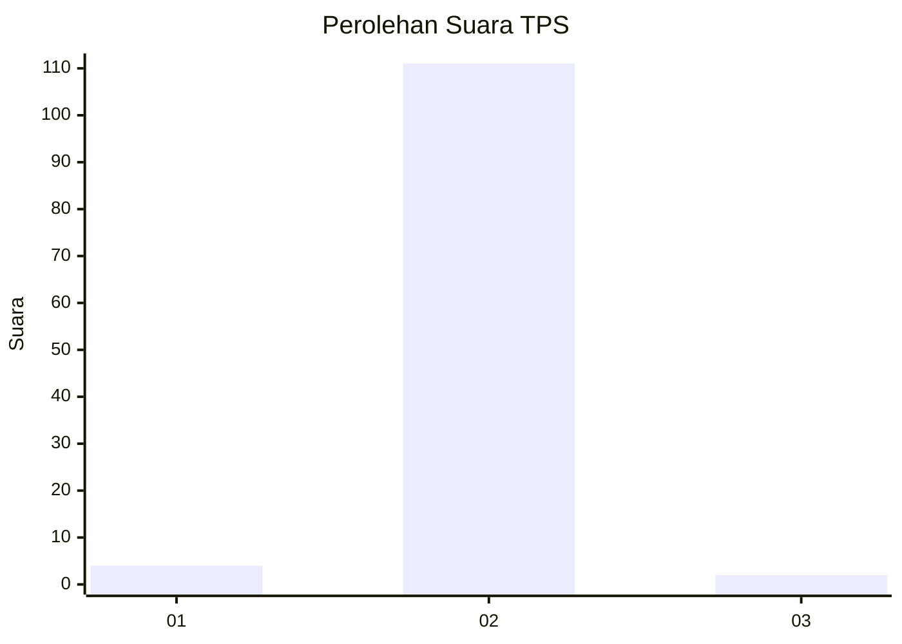
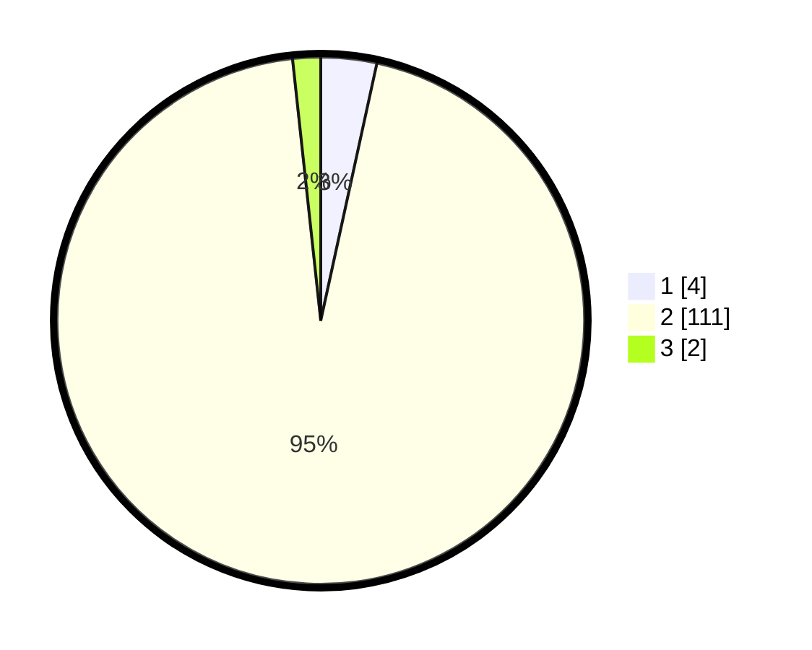

# Hasil

## Grafik

## Tabel

| No. | Nama Paslon    | Suara | Suara (raw) | Persentase |
|:--- |:-------------- | -----:| -----------:| ----------:|
| 1   | ANIES MUHAIMIN | 4     | [4][p-1]    | 3,42       |
| 2   | PRABOWO GIBRAN | 111   | [111][p-2]  | 94,87      |
| 3   | GANJAR MAHFUD  | 2     | [2][p-3]    | 1,71       |

[p-1]: https://github.com/gigit-pemilu/pemilu-2024/blob/main/pilpres/hitung-suara/sub/33-jawa-tengah/sub/18-pati/sub/01-sukolilo/sub/2003-wegil/sub/002-tps/sub/paslon-1.txt
[p-2]: https://github.com/gigit-pemilu/pemilu-2024/blob/main/pilpres/hitung-suara/sub/33-jawa-tengah/sub/18-pati/sub/01-sukolilo/sub/2003-wegil/sub/002-tps/sub/paslon-2.txt
[p-3]: https://github.com/gigit-pemilu/pemilu-2024/blob/main/pilpres/hitung-suara/sub/33-jawa-tengah/sub/18-pati/sub/01-sukolilo/sub/2003-wegil/sub/002-tps/sub/paslon-3.txt

## Foto C Plano

https://sirekap-obj-formc.kpu.go.id/e7c1/pemilu/ppwp/33/18/01/20/03/3318012003002-20240217-155721--0f653130-438a-4eeb-98eb-a97a815ebc37.jpg

https://sirekap-obj-formc.kpu.go.id/e7c1/pemilu/ppwp/33/18/01/20/03/3318012003002-20240217-155849--aa0c31a7-5279-466f-902b-1a73ce50a2e6.jpg

https://sirekap-obj-formc.kpu.go.id/e7c1/pemilu/ppwp/33/18/01/20/03/3318012003002-20240217-155933--3a862bf4-68d7-4183-9e3e-72e59db67739.jpg

## Metadata

| Key        | Value               |
| ---------- | ------------------- |
| Time Stamp | 2024-02-17 16:36:25 |

