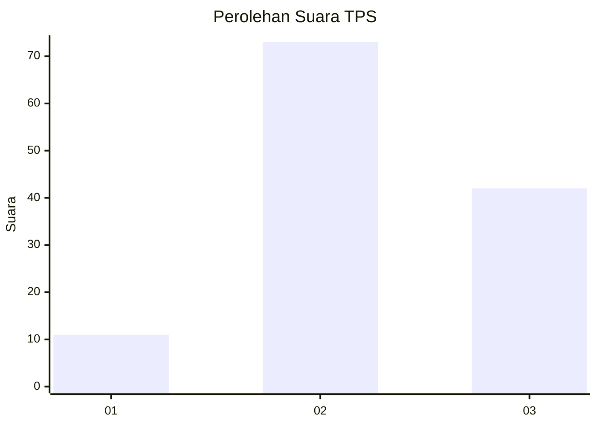
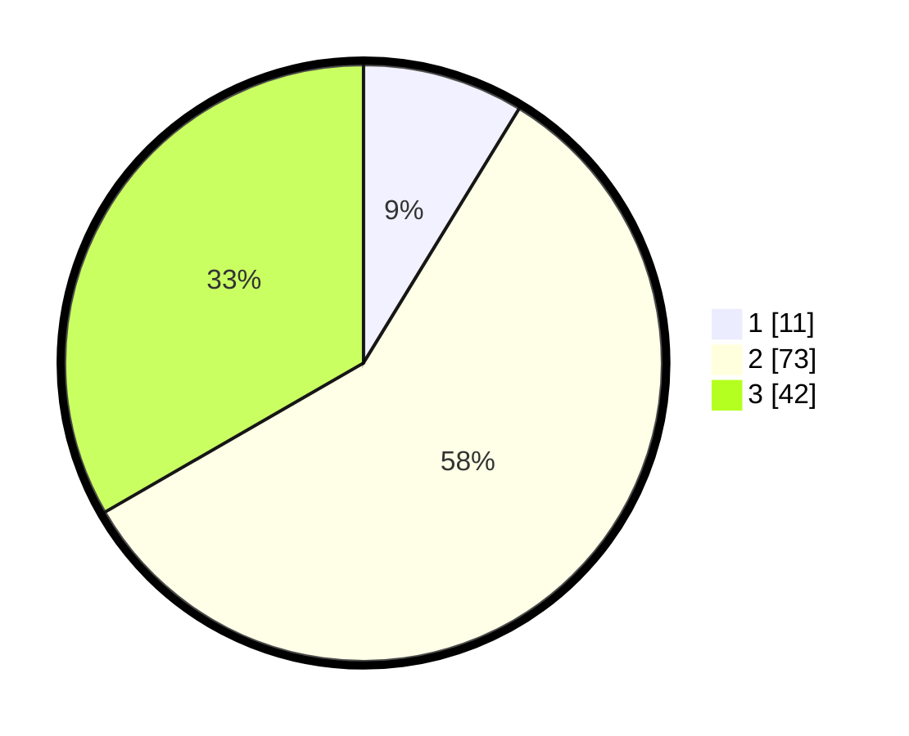

# Hasil

## Grafik

## Tabel

| No. | Nama Paslon    | Suara | Suara (raw) | Persentase |
|:--- |:-------------- | -----:| -----------:| ----------:|
| 1   | ANIES MUHAIMIN | 11    | [11][p-1]   | 8,73       |
| 2   | PRABOWO GIBRAN | 73    | [73][p-2]   | 57,94      |
| 3   | GANJAR MAHFUD  | 42    | [42][p-3]   | 33,33      |

[p-1]: https://github.com/gigit-pemilu/pemilu-2024/blob/main/pilpres/hitung-suara/sub/33-jawa-tengah/sub/18-pati/sub/01-sukolilo/sub/2005-baleadi/sub/002-tps/sub/paslon-1.txt
[p-2]: https://github.com/gigit-pemilu/pemilu-2024/blob/main/pilpres/hitung-suara/sub/33-jawa-tengah/sub/18-pati/sub/01-sukolilo/sub/2005-baleadi/sub/002-tps/sub/paslon-2.txt
[p-3]: https://github.com/gigit-pemilu/pemilu-2024/blob/main/pilpres/hitung-suara/sub/33-jawa-tengah/sub/18-pati/sub/01-sukolilo/sub/2005-baleadi/sub/002-tps/sub/paslon-3.txt

## Foto C Plano

https://sirekap-obj-formc.kpu.go.id/9eb4/pemilu/ppwp/33/18/01/20/05/3318012005002-20240215-205957--2535ae2a-b70b-4852-a353-4b45444ec124.jpg

https://sirekap-obj-formc.kpu.go.id/9eb4/pemilu/ppwp/33/18/01/20/05/3318012005002-20240214-221812--479bd48f-db77-4261-854b-c86d4242dfc0.jpg

https://sirekap-obj-formc.kpu.go.id/9eb4/pemilu/ppwp/33/18/01/20/05/3318012005002-20240214-221941--5bb0c475-1091-4790-bdca-6562be4d2785.jpg

## Metadata

| Key        | Value               |
| ---------- | ------------------- |
| Time Stamp | 2024-02-15 21:01:18 |

