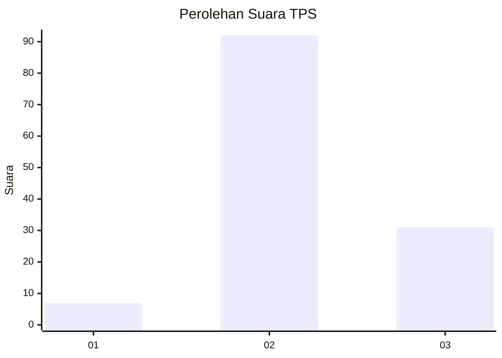
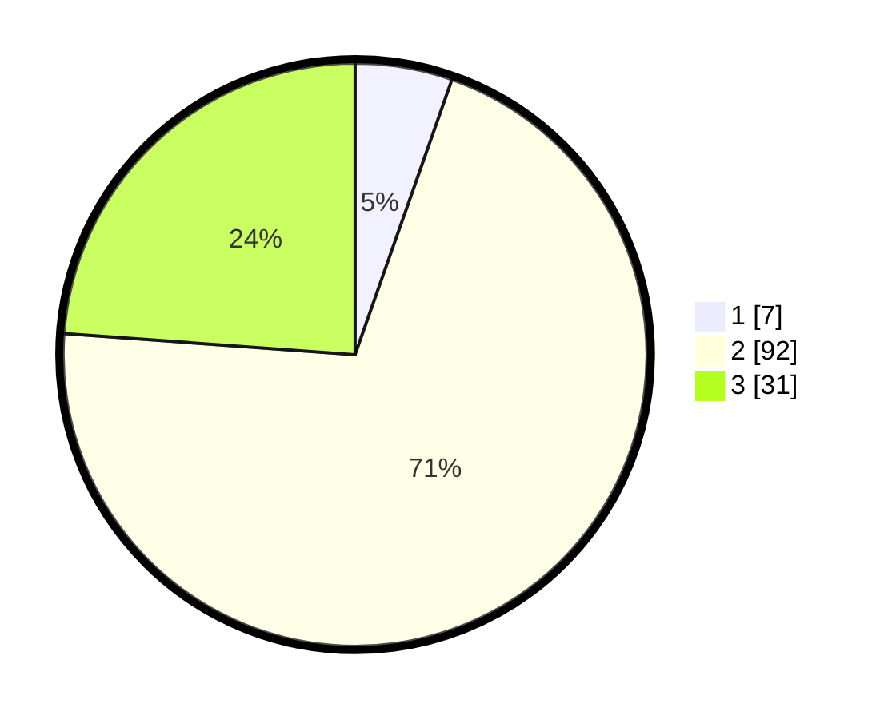

# Hasil

## Grafik

## Tabel

| No. | Nama Paslon    | Suara | Suara (raw) | Persentase |
|:--- |:-------------- | -----:| -----------:| ----------:|
| 1   | ANIES MUHAIMIN | 7     | [7][p-1]    | 5,38       |
| 2   | PRABOWO GIBRAN | 92    | [92][p-2]   | 70,77      |
| 3   | GANJAR MAHFUD  | 31    | [31][p-3]   | 23,85      |

[p-1]: https://github.com/gigit-pemilu/pemilu-2024-33-jawa-tengah/blob/main/pilpres/hitung-suara/sub/33-jawa-tengah/sub/18-pati/sub/01-sukolilo/sub/2006-wotan/sub/005-tps/sub/paslon-1.txt
[p-2]: https://github.com/gigit-pemilu/pemilu-2024-33-jawa-tengah/blob/main/pilpres/hitung-suara/sub/33-jawa-tengah/sub/18-pati/sub/01-sukolilo/sub/2006-wotan/sub/005-tps/sub/paslon-2.txt
[p-3]: https://github.com/gigit-pemilu/pemilu-2024-33-jawa-tengah/blob/main/pilpres/hitung-suara/sub/33-jawa-tengah/sub/18-pati/sub/01-sukolilo/sub/2006-wotan/sub/005-tps/sub/paslon-3.txt

## Foto C Plano

https://sirekap-obj-formc.kpu.go.id/195f/pemilu/ppwp/33/18/01/20/06/3318012006005-20240214-234037--d27b8328-2013-474a-b6c7-7b41e36ef0c4.jpg

https://sirekap-obj-formc.kpu.go.id/195f/pemilu/ppwp/33/18/01/20/06/3318012006005-20240218-173858--afe426e3-1671-442e-89e2-af9597f6970f.jpg

https://sirekap-obj-formc.kpu.go.id/195f/pemilu/ppwp/33/18/01/20/06/3318012006005-20240214-234720--f4f46083-e0cc-4a96-b1ec-02570b6a021d.jpg

## Metadata

| Key        | Value               |
| ---------- | ------------------- |
| Time Stamp | 2024-02-19 12:00:00 |

