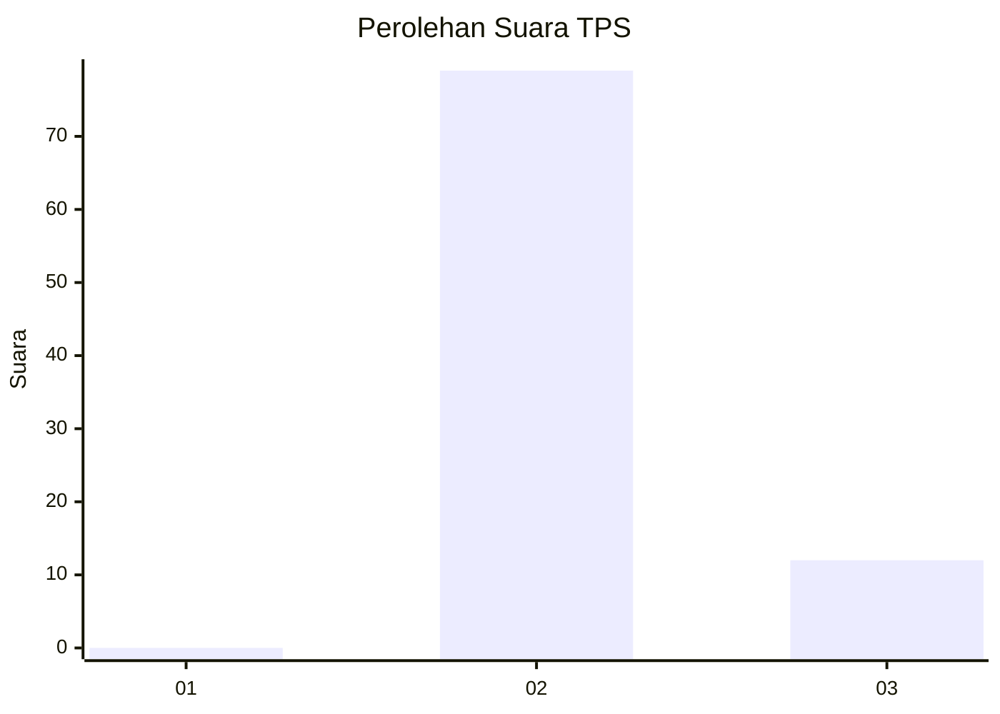
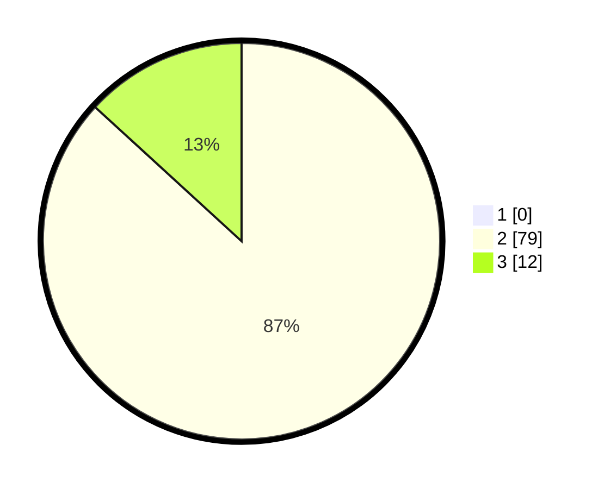

# Hasil

## Grafik

## Tabel

| No. | Nama Paslon    | Suara | Suara (raw) | Persentase |
|:--- |:-------------- | -----:| -----------:| ----------:|
| 1   | ANIES MUHAIMIN | 0     | [0][p-1]    | 0,00       |
| 2   | PRABOWO GIBRAN | 79    | [79][p-2]   | 86,81      |
| 3   | GANJAR MAHFUD  | 12    | [12][p-3]   | 13,19      |

[p-1]: https://github.com/gigit-pemilu/pemilu-2024/blob/main/pilpres/hitung-suara/sub/33-jawa-tengah/sub/18-pati/sub/01-sukolilo/sub/2010-baturejo/sub/021-tps/sub/paslon-1.txt
[p-2]: https://github.com/gigit-pemilu/pemilu-2024/blob/main/pilpres/hitung-suara/sub/33-jawa-tengah/sub/18-pati/sub/01-sukolilo/sub/2010-baturejo/sub/021-tps/sub/paslon-2.txt
[p-3]: https://github.com/gigit-pemilu/pemilu-2024/blob/main/pilpres/hitung-suara/sub/33-jawa-tengah/sub/18-pati/sub/01-sukolilo/sub/2010-baturejo/sub/021-tps/sub/paslon-3.txt

## Foto C Plano

https://sirekap-obj-formc.kpu.go.id/1a7f/pemilu/ppwp/33/18/01/20/10/3318012010021-20240217-113530--d30d9de2-ef46-447f-b0f2-9e6640d2bec3.jpg

https://sirekap-obj-formc.kpu.go.id/1a7f/pemilu/ppwp/33/18/01/20/10/3318012010021-20240217-113744--c49ecb06-8e3d-4b7a-98f4-25ba87678284.jpg

https://sirekap-obj-formc.kpu.go.id/1a7f/pemilu/ppwp/33/18/01/20/10/3318012010021-20240217-113848--62fc306c-9468-4152-8e3b-5bbe2b98687e.jpg

## Metadata

| Key        | Value               |
| ---------- | ------------------- |
| Time Stamp | 2024-02-17 12:00:00 |

