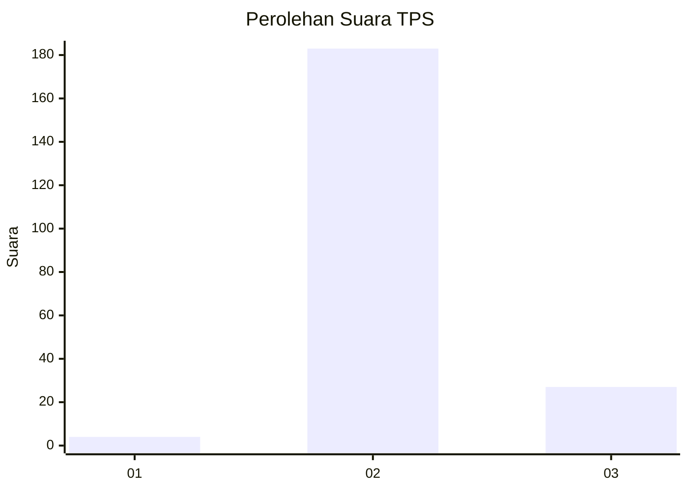
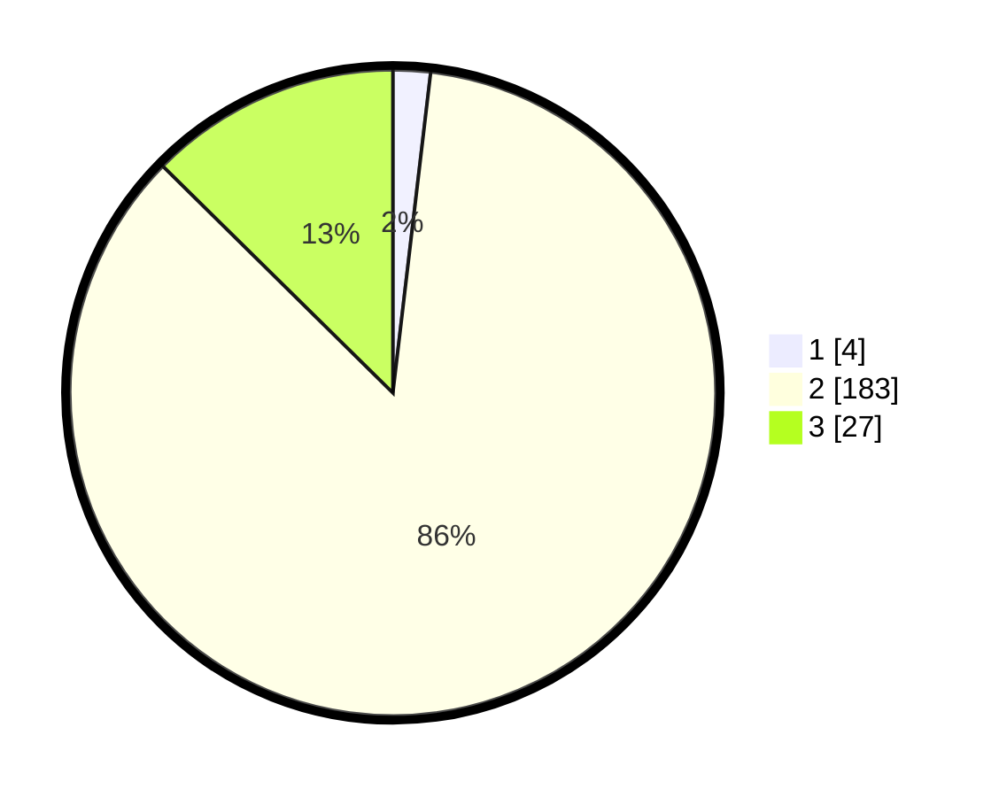

# Hasil

## Grafik

## Tabel

| No. | Nama Paslon    | Suara | Suara (raw) | Persentase |
|:--- |:-------------- | -----:| -----------:| ----------:|
| 1   | ANIES MUHAIMIN | 4     | [4][p-1]    | 1,87       |
| 2   | PRABOWO GIBRAN | 183   | [183][p-2]  | 85,51      |
| 3   | GANJAR MAHFUD  | 27    | [27][p-3]   | 12,62      |

[p-1]: https://github.com/gigit-pemilu/pemilu-2024/blob/main/pilpres/hitung-suara/sub/33-jawa-tengah/sub/18-pati/sub/02-kayen/sub/2001-jimbaran/sub/004-tps/sub/paslon-1.txt
[p-2]: https://github.com/gigit-pemilu/pemilu-2024/blob/main/pilpres/hitung-suara/sub/33-jawa-tengah/sub/18-pati/sub/02-kayen/sub/2001-jimbaran/sub/004-tps/sub/paslon-2.txt
[p-3]: https://github.com/gigit-pemilu/pemilu-2024/blob/main/pilpres/hitung-suara/sub/33-jawa-tengah/sub/18-pati/sub/02-kayen/sub/2001-jimbaran/sub/004-tps/sub/paslon-3.txt

## Foto C Plano

https://sirekap-obj-formc.kpu.go.id/516b/pemilu/ppwp/33/18/02/20/01/3318022001004-20240218-092723--a2d935da-566f-48ed-8382-336856b7e268.jpg

https://sirekap-obj-formc.kpu.go.id/516b/pemilu/ppwp/33/18/02/20/01/3318022001004-20240218-151211--28701ddc-bd37-411c-94cd-861c77724d12.jpg

https://sirekap-obj-formc.kpu.go.id/516b/pemilu/ppwp/33/18/02/20/01/3318022001004-20240215-030546--18daf65a-b52f-4e50-a5ec-7614b5aafb1a.jpg

## Metadata

| Key        | Value               |
| ---------- | ------------------- |
| Time Stamp | 2024-02-24 22:31:28 |

