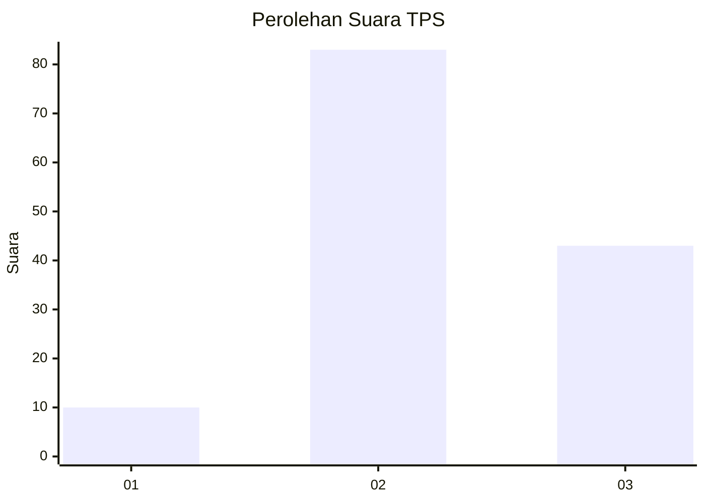
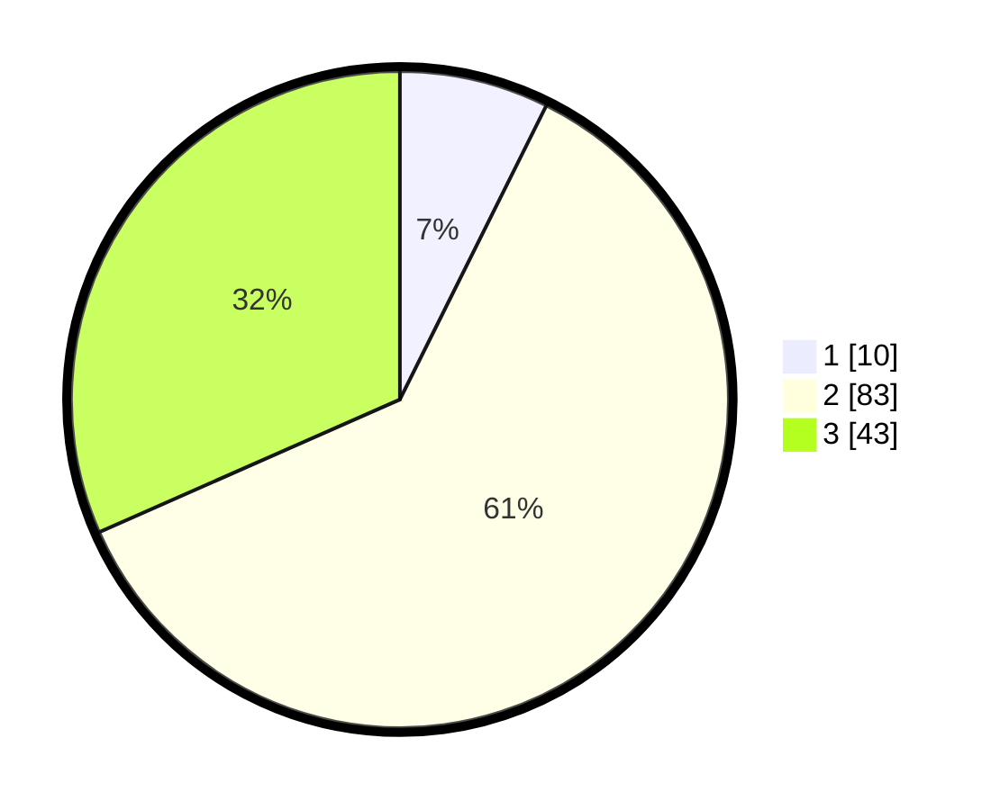

# Hasil

## Grafik

## Tabel

| No. | Nama Paslon    | Suara | Suara (raw) | Persentase |
|:--- |:-------------- | -----:| -----------:| ----------:|
| 1   | ANIES MUHAIMIN | 10    | [10][p-1]   | 7,35       |
| 2   | PRABOWO GIBRAN | 83    | [83][p-2]   | 61,03      |
| 3   | GANJAR MAHFUD  | 43    | [43][p-3]   | 31,62      |

[p-1]: https://github.com/gigit-pemilu/pemilu-2024/blob/main/pilpres/hitung-suara/sub/33-jawa-tengah/sub/18-pati/sub/02-kayen/sub/2010-rogomulyo/sub/003-tps/sub/paslon-1.txt
[p-2]: https://github.com/gigit-pemilu/pemilu-2024/blob/main/pilpres/hitung-suara/sub/33-jawa-tengah/sub/18-pati/sub/02-kayen/sub/2010-rogomulyo/sub/003-tps/sub/paslon-2.txt
[p-3]: https://github.com/gigit-pemilu/pemilu-2024/blob/main/pilpres/hitung-suara/sub/33-jawa-tengah/sub/18-pati/sub/02-kayen/sub/2010-rogomulyo/sub/003-tps/sub/paslon-3.txt

## Foto C Plano

https://sirekap-obj-formc.kpu.go.id/aa5f/pemilu/ppwp/33/18/02/20/10/3318022010003-20240218-104033--5562ecd5-69af-42be-b6ee-6fc0ece829d9.jpg

https://sirekap-obj-formc.kpu.go.id/aa5f/pemilu/ppwp/33/18/02/20/10/3318022010003-20240215-183010--07ce68c1-6bf7-43b2-9bad-ec8c9cbf2971.jpg

https://sirekap-obj-formc.kpu.go.id/aa5f/pemilu/ppwp/33/18/02/20/10/3318022010003-20240215-183117--ed5a7f03-7333-4304-b794-6baa577a7e25.jpg

## Metadata

| Key        | Value               |
| ---------- | ------------------- |
| Time Stamp | 2024-02-19 06:16:00 |

