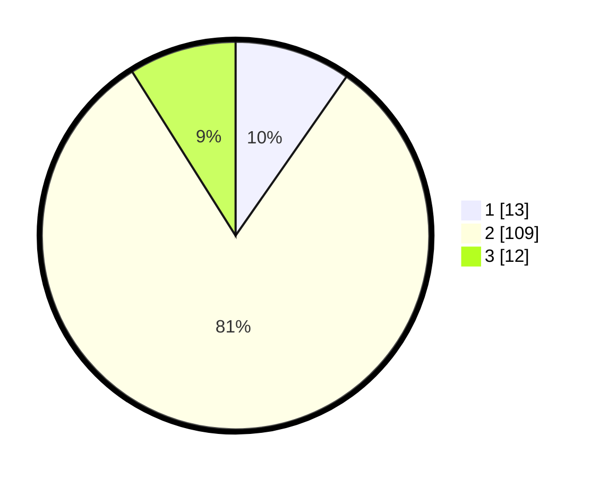

# Hasil

## Grafik

## Tabel

| No. | Nama Paslon    | Suara | Suara (raw) | Persentase |
|:--- |:-------------- | -----:| -----------:| ----------:|
| 1   | ANIES MUHAIMIN | 13    | [13][p-1]   | 9,70       |
| 2   | PRABOWO GIBRAN | 109   | [109][p-2]  | 81,34      |
| 3   | GANJAR MAHFUD  | 12    | [12][p-3]   | 8,96       |

[p-1]: https://github.com/gigit-pemilu/pemilu-2024/blob/main/pilpres/hitung-suara/sub/33-jawa-tengah/sub/18-pati/sub/03-tambakromo/sub/2009-karangawen/sub/001-tps/sub/paslon-1.txt
[p-2]: https://github.com/gigit-pemilu/pemilu-2024/blob/main/pilpres/hitung-suara/sub/33-jawa-tengah/sub/18-pati/sub/03-tambakromo/sub/2009-karangawen/sub/001-tps/sub/paslon-2.txt
[p-3]: https://github.com/gigit-pemilu/pemilu-2024/blob/main/pilpres/hitung-suara/sub/33-jawa-tengah/sub/18-pati/sub/03-tambakromo/sub/2009-karangawen/sub/001-tps/sub/paslon-3.txt

## Foto C Plano

https://sirekap-obj-formc.kpu.go.id/db30/pemilu/ppwp/33/18/03/20/09/3318032009001-20240214-141607--62de85eb-1f3f-4bd2-8635-5b8a4a4eb316.jpg

https://sirekap-obj-formc.kpu.go.id/db30/pemilu/ppwp/33/18/03/20/09/3318032009001-20240215-013634--3a9881a4-0489-4b6e-a29f-9055e81d2946.jpg

https://sirekap-obj-formc.kpu.go.id/db30/pemilu/ppwp/33/18/03/20/09/3318032009001-20240215-012629--21574675-656f-469b-9313-593fa82550fa.jpg

## Metadata

| Key        | Value               |
| ---------- | ------------------- |
| Time Stamp | 2024-02-15 16:30:25 |

