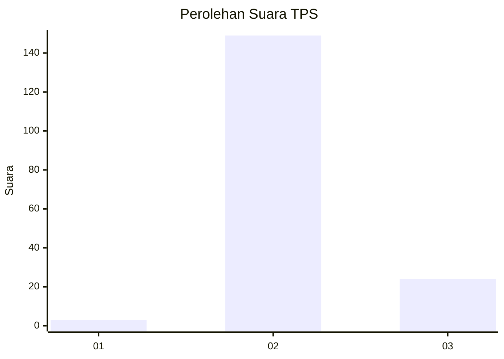
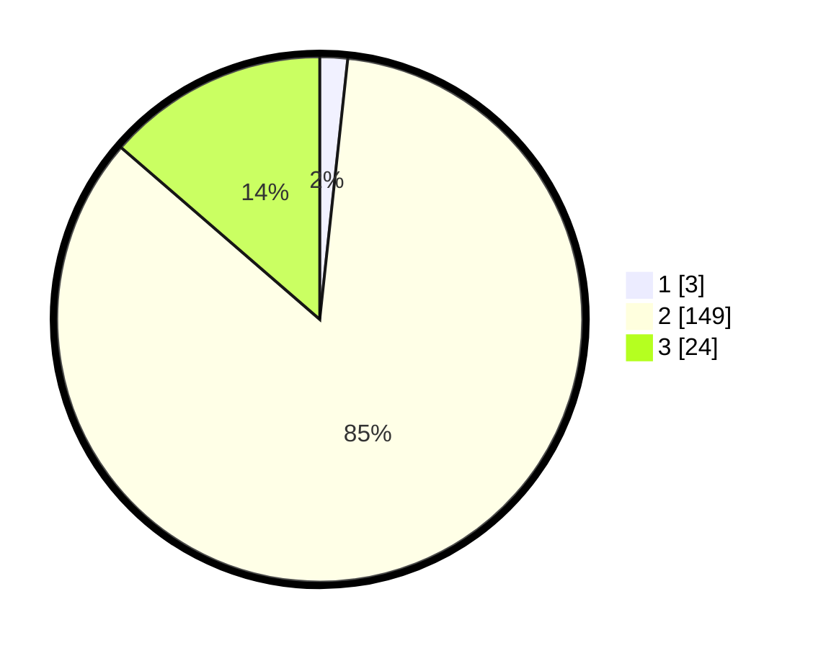

# Hasil

## Grafik

## Tabel

| No. | Nama Paslon    | Suara | Suara (raw) | Persentase |
|:--- |:-------------- | -----:| -----------:| ----------:|
| 1   | ANIES MUHAIMIN | 3     | [3][p-1]    | 1,70       |
| 2   | PRABOWO GIBRAN | 149   | [149][p-2]  | 84,66      |
| 3   | GANJAR MAHFUD  | 24    | [24][p-3]   | 13,64      |

[p-1]: https://github.com/gigit-pemilu/pemilu-2024-33-jawa-tengah/blob/main/pilpres/hitung-suara/sub/33-jawa-tengah/sub/18-pati/sub/04-winong/sub/2001-pohgading/sub/001-tps/sub/paslon-1.txt
[p-2]: https://github.com/gigit-pemilu/pemilu-2024-33-jawa-tengah/blob/main/pilpres/hitung-suara/sub/33-jawa-tengah/sub/18-pati/sub/04-winong/sub/2001-pohgading/sub/001-tps/sub/paslon-2.txt
[p-3]: https://github.com/gigit-pemilu/pemilu-2024-33-jawa-tengah/blob/main/pilpres/hitung-suara/sub/33-jawa-tengah/sub/18-pati/sub/04-winong/sub/2001-pohgading/sub/001-tps/sub/paslon-3.txt

## Foto C Plano

https://sirekap-obj-formc.kpu.go.id/2ec2/pemilu/ppwp/33/18/04/20/01/3318042001001-20240216-205337--e848064a-e06e-4219-a4c0-daacae98590a.jpg

https://sirekap-obj-formc.kpu.go.id/2ec2/pemilu/ppwp/33/18/04/20/01/3318042001001-20240216-205544--4deb2ffd-3cbf-4a9e-bbe6-a3cafefbc854.jpg

https://sirekap-obj-formc.kpu.go.id/2ec2/pemilu/ppwp/33/18/04/20/01/3318042001001-20240216-205650--187349b8-f8aa-4508-98f0-1e1251d84f88.jpg

## Metadata

| Key        | Value               |
| ---------- | ------------------- |
| Time Stamp | 2024-02-16 21:01:00 |

