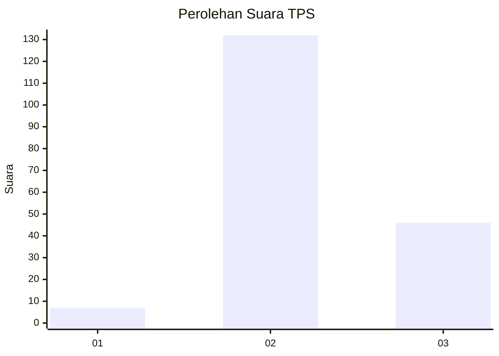
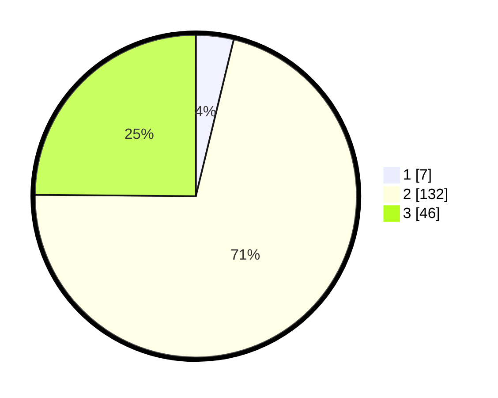

# Hasil

## Grafik

## Tabel

| No. | Nama Paslon    | Suara | Suara (raw) | Persentase |
|:--- |:-------------- | -----:| -----------:| ----------:|
| 1   | ANIES MUHAIMIN | 7     | [7][p-1]    | 3,78       |
| 2   | PRABOWO GIBRAN | 132   | [132][p-2]  | 71,35      |
| 3   | GANJAR MAHFUD  | 46    | [46][p-3]   | 24,86      |

[p-1]: https://github.com/gigit-pemilu/pemilu-2024/blob/main/pilpres/hitung-suara/sub/33-jawa-tengah/sub/18-pati/sub/04-winong/sub/2001-pohgading/sub/002-tps/sub/paslon-1.txt
[p-2]: https://github.com/gigit-pemilu/pemilu-2024/blob/main/pilpres/hitung-suara/sub/33-jawa-tengah/sub/18-pati/sub/04-winong/sub/2001-pohgading/sub/002-tps/sub/paslon-2.txt
[p-3]: https://github.com/gigit-pemilu/pemilu-2024/blob/main/pilpres/hitung-suara/sub/33-jawa-tengah/sub/18-pati/sub/04-winong/sub/2001-pohgading/sub/002-tps/sub/paslon-3.txt

## Foto C Plano

https://sirekap-obj-formc.kpu.go.id/ddf0/pemilu/ppwp/33/18/04/20/01/3318042001002-20240218-100443--ad85d6f8-e29b-476b-8ec1-236846ff0409.jpg

https://sirekap-obj-formc.kpu.go.id/ddf0/pemilu/ppwp/33/18/04/20/01/3318042001002-20240216-204931--58eed75e-2311-4a02-b9bb-630ce3967a10.jpg

https://sirekap-obj-formc.kpu.go.id/ddf0/pemilu/ppwp/33/18/04/20/01/3318042001002-20240218-100610--661f8c8f-d344-4fa4-824a-e2e579101c75.jpg

## Metadata

| Key        | Value               |
| ---------- | ------------------- |
| Time Stamp | 2024-02-20 15:00:00 |

