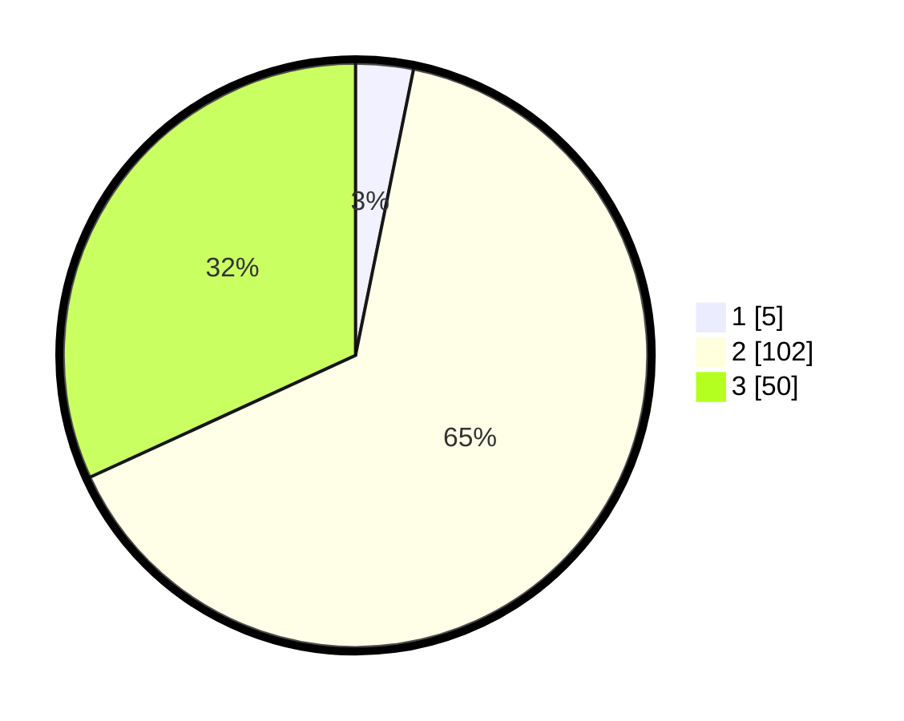

# Hasil

## Grafik

## Tabel

| No. | Nama Paslon    | Suara | Suara (raw) | Persentase |
|:--- |:-------------- | -----:| -----------:| ----------:|
| 1   | ANIES MUHAIMIN | 5     | [5][p-1]    | 3,18       |
| 2   | PRABOWO GIBRAN | 102   | [102][p-2]  | 64,97      |
| 3   | GANJAR MAHFUD  | 50    | [50][p-3]   | 31,85      |

[p-1]: https://github.com/gigit-pemilu/pemilu-2024-33-jawa-tengah/blob/main/pilpres/hitung-suara/sub/33-jawa-tengah/sub/18-pati/sub/04-winong/sub/2001-pohgading/sub/003-tps/sub/paslon-1.txt
[p-2]: https://github.com/gigit-pemilu/pemilu-2024-33-jawa-tengah/blob/main/pilpres/hitung-suara/sub/33-jawa-tengah/sub/18-pati/sub/04-winong/sub/2001-pohgading/sub/003-tps/sub/paslon-2.txt
[p-3]: https://github.com/gigit-pemilu/pemilu-2024-33-jawa-tengah/blob/main/pilpres/hitung-suara/sub/33-jawa-tengah/sub/18-pati/sub/04-winong/sub/2001-pohgading/sub/003-tps/sub/paslon-3.txt

## Foto C Plano

https://sirekap-obj-formc.kpu.go.id/009f/pemilu/ppwp/33/18/04/20/01/3318042001003-20240216-203457--13bfac44-2420-40e2-91eb-055d06725dc2.jpg

https://sirekap-obj-formc.kpu.go.id/009f/pemilu/ppwp/33/18/04/20/01/3318042001003-20240216-210255--dae200fe-9dd3-44b7-92ad-cc91eec54032.jpg

https://sirekap-obj-formc.kpu.go.id/009f/pemilu/ppwp/33/18/04/20/01/3318042001003-20240216-210940--add80994-436b-4dbc-97ea-aae1a759dc9c.jpg

## Metadata

| Key        | Value               |
| ---------- | ------------------- |
| Time Stamp | 2024-02-16 22:01:00 |

