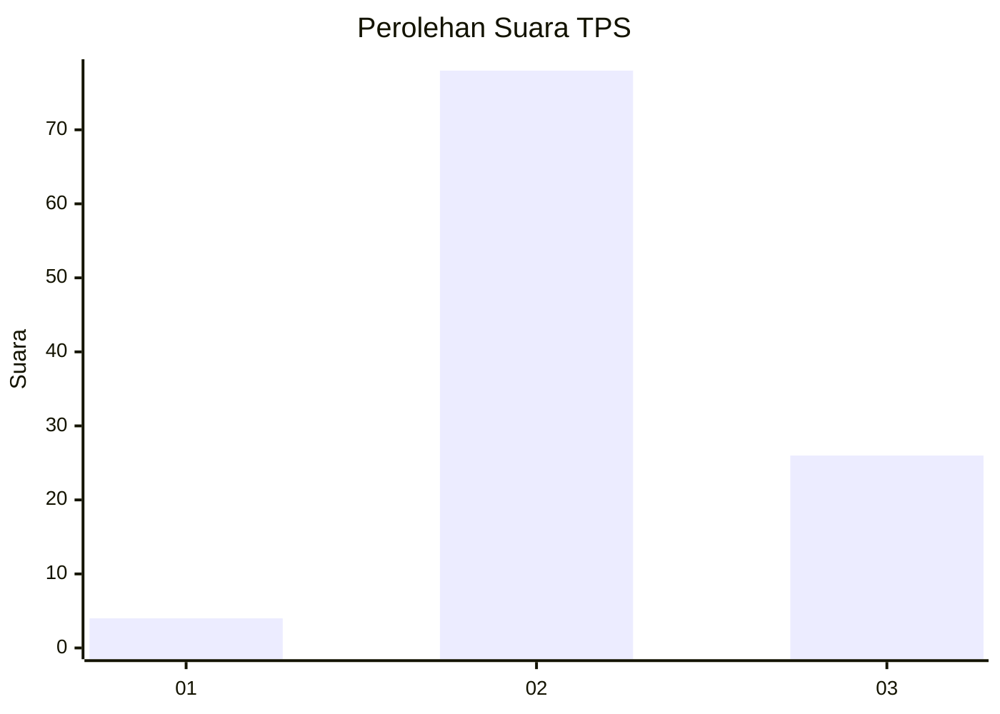
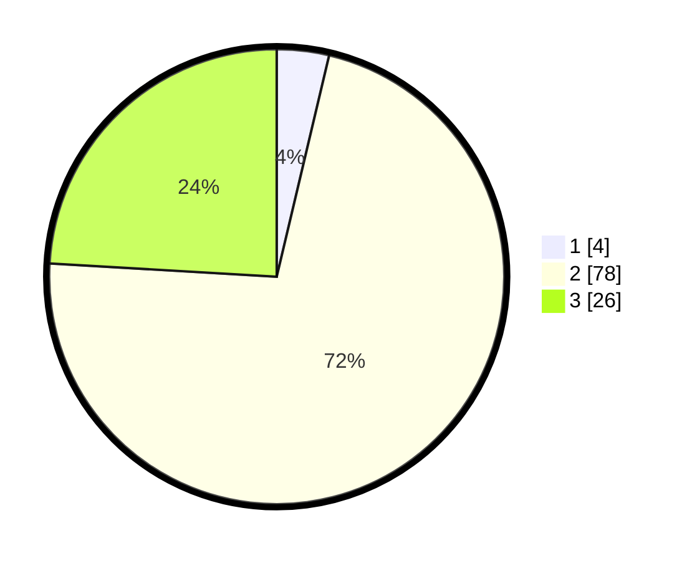

# Hasil

## Grafik

## Tabel

| No. | Nama Paslon    | Suara | Suara (raw) | Persentase |
|:--- |:-------------- | -----:| -----------:| ----------:|
| 1   | ANIES MUHAIMIN | 4     | [4][p-1]    | 3,70       |
| 2   | PRABOWO GIBRAN | 78    | [78][p-2]   | 72,22      |
| 3   | GANJAR MAHFUD  | 26    | [26][p-3]   | 24,07      |

[p-1]: https://github.com/gigit-pemilu/pemilu-2024-33-jawa-tengah/blob/main/pilpres/hitung-suara/sub/33-jawa-tengah/sub/18-pati/sub/04-winong/sub/2001-pohgading/sub/006-tps/sub/paslon-1.txt
[p-2]: https://github.com/gigit-pemilu/pemilu-2024-33-jawa-tengah/blob/main/pilpres/hitung-suara/sub/33-jawa-tengah/sub/18-pati/sub/04-winong/sub/2001-pohgading/sub/006-tps/sub/paslon-2.txt
[p-3]: https://github.com/gigit-pemilu/pemilu-2024-33-jawa-tengah/blob/main/pilpres/hitung-suara/sub/33-jawa-tengah/sub/18-pati/sub/04-winong/sub/2001-pohgading/sub/006-tps/sub/paslon-3.txt

## Foto C Plano

https://sirekap-obj-formc.kpu.go.id/fa13/pemilu/ppwp/33/18/04/20/01/3318042001006-20240217-122503--bc26d1d4-0034-4775-be0c-6cd1605b72e8.jpg

https://sirekap-obj-formc.kpu.go.id/fa13/pemilu/ppwp/33/18/04/20/01/3318042001006-20240217-122003--622ce5e6-a2cf-4eec-abbf-6b9f91be4449.jpg

https://sirekap-obj-formc.kpu.go.id/fa13/pemilu/ppwp/33/18/04/20/01/3318042001006-20240217-122129--402b0ea8-97e5-48cd-9555-bb1965754cc5.jpg

## Metadata

| Key        | Value               |
| ---------- | ------------------- |
| Time Stamp | 2024-02-17 13:37:34 |

