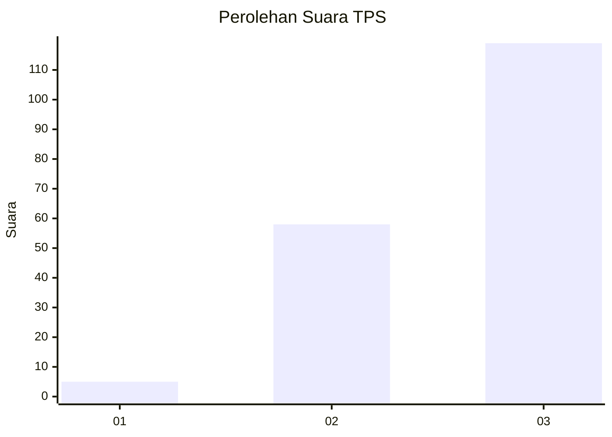
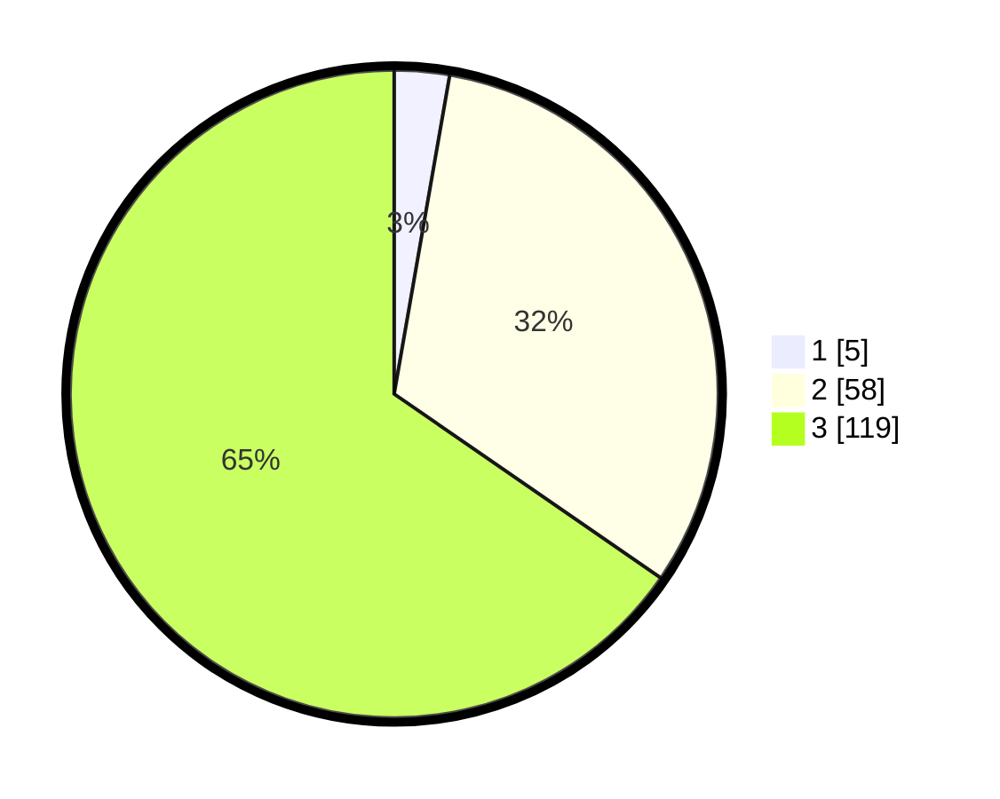

# Hasil

## Grafik

## Tabel

| No. | Nama Paslon    | Suara | Suara (raw) | Persentase |
|:--- |:-------------- | -----:| -----------:| ----------:|
| 1   | ANIES MUHAIMIN | 5     | [5][p-1]    | 2,75       |
| 2   | PRABOWO GIBRAN | 58    | [58][p-2]   | 31,87      |
| 3   | GANJAR MAHFUD  | 119   | [119][p-3]  | 65,38      |

[p-1]: https://github.com/gigit-pemilu/pemilu-2024/blob/main/pilpres/hitung-suara/sub/33-jawa-tengah/sub/18-pati/sub/04-winong/sub/2024-degan/sub/003-tps/sub/paslon-1.txt
[p-2]: https://github.com/gigit-pemilu/pemilu-2024/blob/main/pilpres/hitung-suara/sub/33-jawa-tengah/sub/18-pati/sub/04-winong/sub/2024-degan/sub/003-tps/sub/paslon-2.txt
[p-3]: https://github.com/gigit-pemilu/pemilu-2024/blob/main/pilpres/hitung-suara/sub/33-jawa-tengah/sub/18-pati/sub/04-winong/sub/2024-degan/sub/003-tps/sub/paslon-3.txt

## Foto C Plano

https://sirekap-obj-formc.kpu.go.id/f668/pemilu/ppwp/33/18/04/20/24/3318042024003-20240216-154809--51ee6c38-71b8-483a-a65f-f2fa935110e9.jpg

https://sirekap-obj-formc.kpu.go.id/f668/pemilu/ppwp/33/18/04/20/24/3318042024003-20240216-144410--9b769497-f509-464b-9604-d9d8cff1d26b.jpg

https://sirekap-obj-formc.kpu.go.id/f668/pemilu/ppwp/33/18/04/20/24/3318042024003-20240216-144231--4acc4801-4e57-4082-8a70-66388471b1d8.jpg

## Metadata

| Key        | Value               |
| ---------- | ------------------- |
| Time Stamp | 2024-02-16 21:01:00 |

