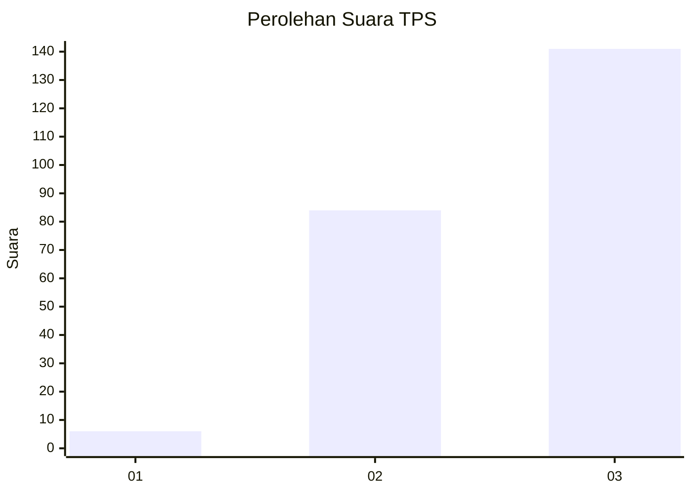
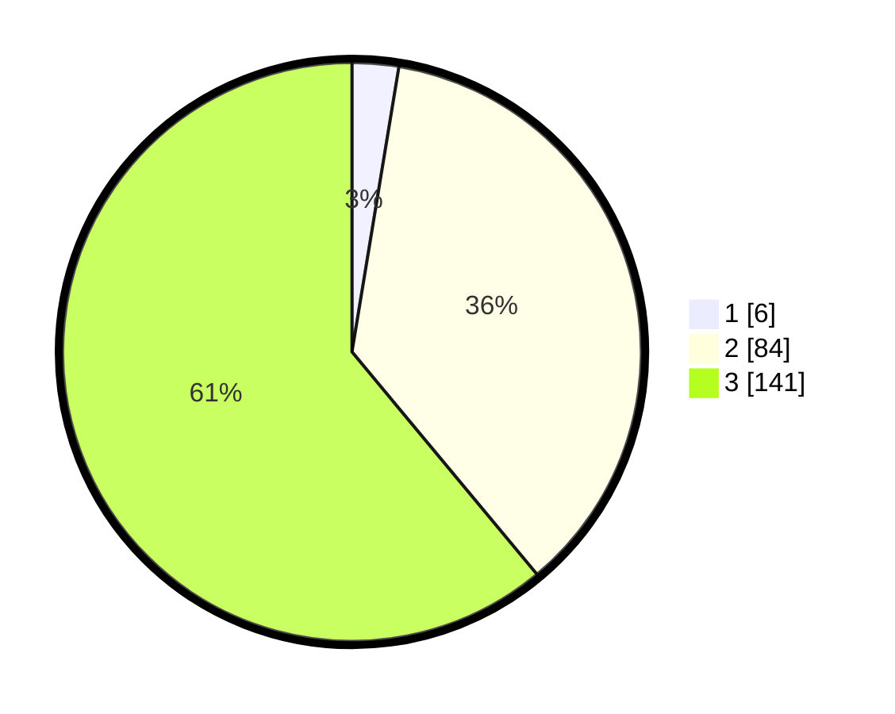

# Hasil

## Grafik

## Tabel

| No. | Nama Paslon    | Suara | Suara (raw) | Persentase |
|:--- |:-------------- | -----:| -----------:| ----------:|
| 1   | ANIES MUHAIMIN | 6     | [6][p-1]    | 2,60       |
| 2   | PRABOWO GIBRAN | 84    | [84][p-2]   | 36,36      |
| 3   | GANJAR MAHFUD  | 141   | [141][p-3]  | 61,04      |

[p-1]: https://github.com/gigit-pemilu/pemilu-2024/blob/main/pilpres/hitung-suara/sub/33-jawa-tengah/sub/18-pati/sub/05-pucakwangi/sub/2005-lumbungmas/sub/007-tps/sub/paslon-1.txt
[p-2]: https://github.com/gigit-pemilu/pemilu-2024/blob/main/pilpres/hitung-suara/sub/33-jawa-tengah/sub/18-pati/sub/05-pucakwangi/sub/2005-lumbungmas/sub/007-tps/sub/paslon-2.txt
[p-3]: https://github.com/gigit-pemilu/pemilu-2024/blob/main/pilpres/hitung-suara/sub/33-jawa-tengah/sub/18-pati/sub/05-pucakwangi/sub/2005-lumbungmas/sub/007-tps/sub/paslon-3.txt

## Foto C Plano

https://sirekap-obj-formc.kpu.go.id/a754/pemilu/ppwp/33/18/05/20/05/3318052005007-20240216-204153--fb0af741-b2e4-41c1-8f46-64ac02f0705b.jpg

https://sirekap-obj-formc.kpu.go.id/a754/pemilu/ppwp/33/18/05/20/05/3318052005007-20240214-215042--1480b918-1583-4368-b352-326b459af74c.jpg

https://sirekap-obj-formc.kpu.go.id/a754/pemilu/ppwp/33/18/05/20/05/3318052005007-20240216-204628--2dd77c89-f5e6-4669-a8e1-9478724aa872.jpg

## Metadata

| Key        | Value               |
| ---------- | ------------------- |
| Time Stamp | 2024-02-16 22:01:00 |

