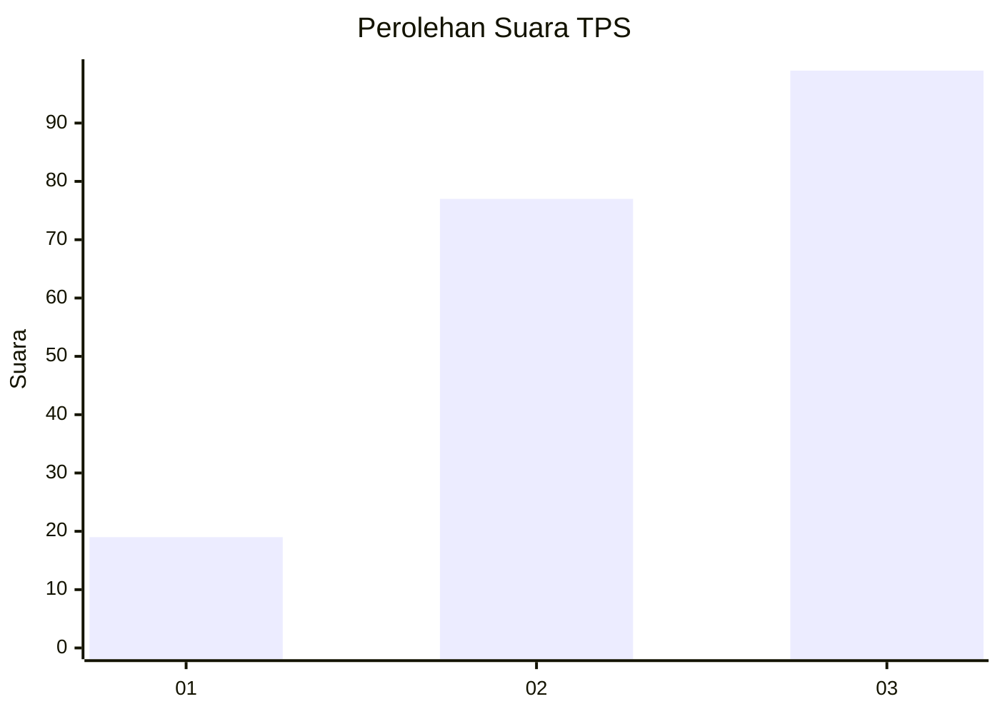
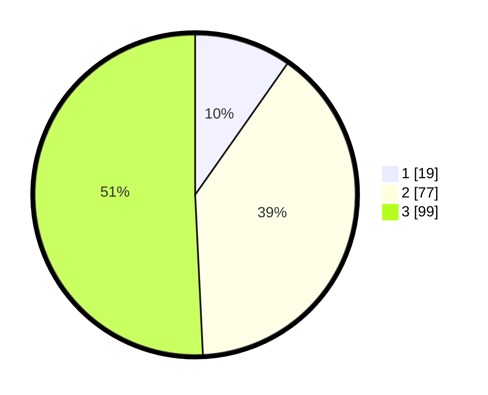

# Hasil

## Grafik

## Tabel

| No. | Nama Paslon    | Suara | Suara (raw) | Persentase |
|:--- |:-------------- | -----:| -----------:| ----------:|
| 1   | ANIES MUHAIMIN | 19    | [19][p-1]   | 9,74       |
| 2   | PRABOWO GIBRAN | 77    | [77][p-2]   | 39,49      |
| 3   | GANJAR MAHFUD  | 99    | [99][p-3]   | 50,77      |

[p-1]: https://github.com/gigit-pemilu/pemilu-2024/blob/main/pilpres/hitung-suara/sub/33-jawa-tengah/sub/18-pati/sub/07-batangan/sub/2017-mangunlegi/sub/003-tps/sub/paslon-1.txt
[p-2]: https://github.com/gigit-pemilu/pemilu-2024/blob/main/pilpres/hitung-suara/sub/33-jawa-tengah/sub/18-pati/sub/07-batangan/sub/2017-mangunlegi/sub/003-tps/sub/paslon-2.txt
[p-3]: https://github.com/gigit-pemilu/pemilu-2024/blob/main/pilpres/hitung-suara/sub/33-jawa-tengah/sub/18-pati/sub/07-batangan/sub/2017-mangunlegi/sub/003-tps/sub/paslon-3.txt

## Foto C Plano

https://sirekap-obj-formc.kpu.go.id/06f9/pemilu/ppwp/33/18/07/20/17/3318072017003-20240214-141156--35e04ef8-3b27-452b-ba07-89edbecaeab5.jpg

https://sirekap-obj-formc.kpu.go.id/06f9/pemilu/ppwp/33/18/07/20/17/3318072017003-20240214-141628--f1d33e40-56a8-4924-a134-c2f432051668.jpg

https://sirekap-obj-formc.kpu.go.id/06f9/pemilu/ppwp/33/18/07/20/17/3318072017003-20240215-183549--4848b765-b868-43de-9407-600504d41198.jpg

## Metadata

| Key        | Value               |
| ---------- | ------------------- |
| Time Stamp | 2024-02-15 23:29:50 |

