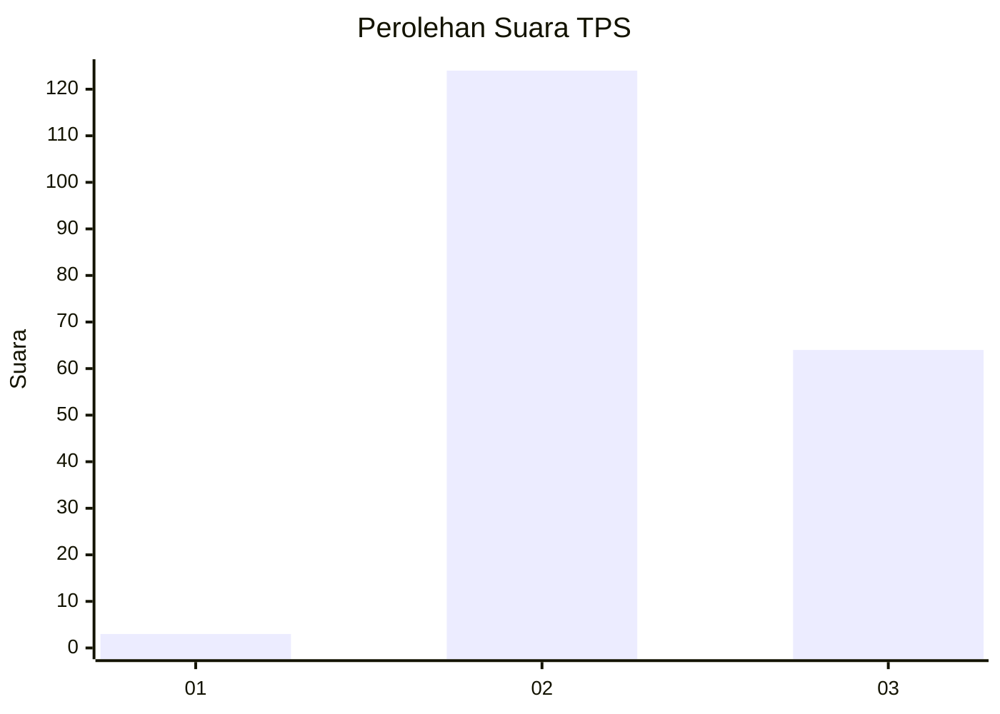
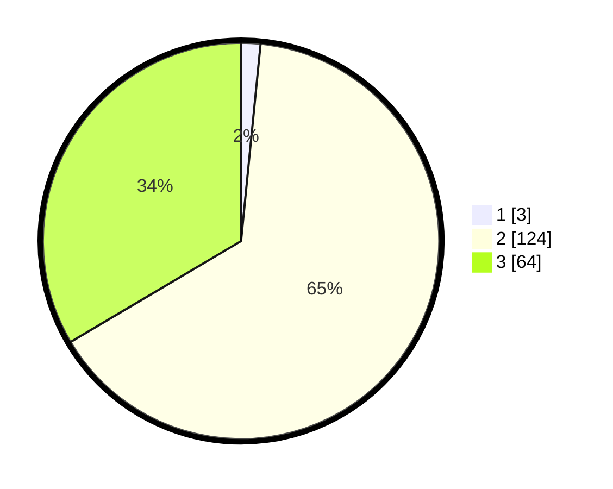

# Hasil

## Grafik

## Tabel

| No. | Nama Paslon    | Suara | Suara (raw) | Persentase |
|:--- |:-------------- | -----:| -----------:| ----------:|
| 1   | ANIES MUHAIMIN | 3     | [3][p-1]    | 1,57       |
| 2   | PRABOWO GIBRAN | 124   | [124][p-2]  | 64,92      |
| 3   | GANJAR MAHFUD  | 64    | [64][p-3]   | 33,51      |

[p-1]: https://github.com/gigit-pemilu/pemilu-2024/blob/main/pilpres/hitung-suara/sub/33-jawa-tengah/sub/18-pati/sub/08-juwana/sub/2013-gadingrejo/sub/002-tps/sub/paslon-1.txt
[p-2]: https://github.com/gigit-pemilu/pemilu-2024/blob/main/pilpres/hitung-suara/sub/33-jawa-tengah/sub/18-pati/sub/08-juwana/sub/2013-gadingrejo/sub/002-tps/sub/paslon-2.txt
[p-3]: https://github.com/gigit-pemilu/pemilu-2024/blob/main/pilpres/hitung-suara/sub/33-jawa-tengah/sub/18-pati/sub/08-juwana/sub/2013-gadingrejo/sub/002-tps/sub/paslon-3.txt

## Foto C Plano

https://sirekap-obj-formc.kpu.go.id/1a9a/pemilu/ppwp/33/18/08/20/13/3318082013002-20240214-231233--be8750ac-cebe-4a2e-a4d9-61ec9b56e95a.jpg

https://sirekap-obj-formc.kpu.go.id/1a9a/pemilu/ppwp/33/18/08/20/13/3318082013002-20240214-231237--4cdbbbfc-0b9a-4745-add1-8ad08d0d358d.jpg

https://sirekap-obj-formc.kpu.go.id/1a9a/pemilu/ppwp/33/18/08/20/13/3318082013002-20240214-231228--56028973-4180-44b0-9a5b-b498e17624be.jpg

## Metadata

| Key        | Value               |
| ---------- | ------------------- |
| Time Stamp | 2024-02-15 23:29:50 |

