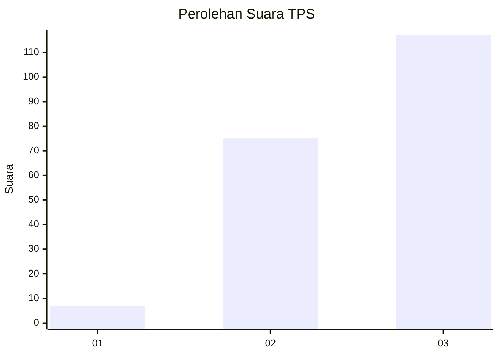
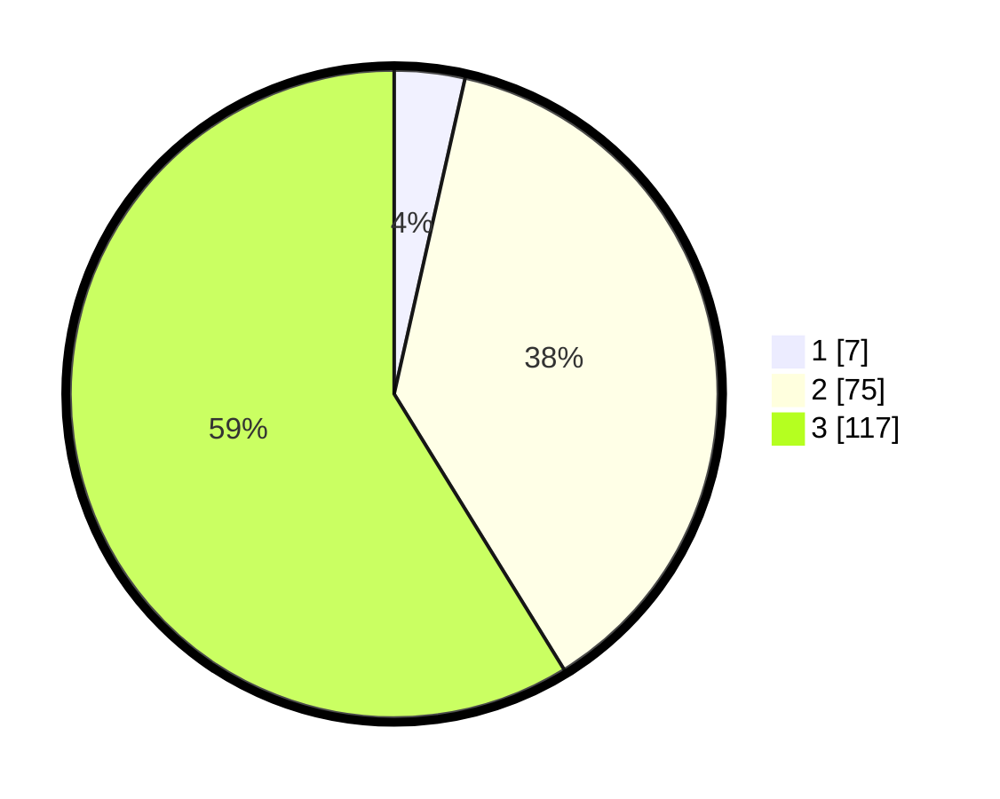

# Hasil

## Grafik

## Tabel

| No. | Nama Paslon    | Suara | Suara (raw) | Persentase |
|:--- |:-------------- | -----:| -----------:| ----------:|
| 1   | ANIES MUHAIMIN | 7     | [7][p-1]    | 3,52       |
| 2   | PRABOWO GIBRAN | 75    | [75][p-2]   | 37,69      |
| 3   | GANJAR MAHFUD  | 117   | [117][p-3]  | 58,79      |

[p-1]: https://github.com/gigit-pemilu/pemilu-2024-33-jawa-tengah/blob/main/pilpres/hitung-suara/sub/33-jawa-tengah/sub/18-pati/sub/08-juwana/sub/2019-bakaran-wetan/sub/011-tps/sub/paslon-1.txt
[p-2]: https://github.com/gigit-pemilu/pemilu-2024-33-jawa-tengah/blob/main/pilpres/hitung-suara/sub/33-jawa-tengah/sub/18-pati/sub/08-juwana/sub/2019-bakaran-wetan/sub/011-tps/sub/paslon-2.txt
[p-3]: https://github.com/gigit-pemilu/pemilu-2024-33-jawa-tengah/blob/main/pilpres/hitung-suara/sub/33-jawa-tengah/sub/18-pati/sub/08-juwana/sub/2019-bakaran-wetan/sub/011-tps/sub/paslon-3.txt

## Foto C Plano

https://sirekap-obj-formc.kpu.go.id/f9f1/pemilu/ppwp/33/18/08/20/19/3318082019011-20240214-192330--e1730f6f-157e-46a6-ba8f-ef5c1064fd4b.jpg

https://sirekap-obj-formc.kpu.go.id/f9f1/pemilu/ppwp/33/18/08/20/19/3318082019011-20240214-192941--b0a02810-b8d9-4c56-90c4-1a780a6ad4b3.jpg

https://sirekap-obj-formc.kpu.go.id/f9f1/pemilu/ppwp/33/18/08/20/19/3318082019011-20240214-192426--09020cee-c920-468e-9558-81239da6c3c5.jpg

## Metadata

| Key        | Value               |
| ---------- | ------------------- |
| Time Stamp | 2024-02-15 15:00:29 |

## DATA PEMILIH TETAP

Jumlah pemilih dalam DPT: **239**.
 * L: **248**.
 * P: **121**.

## DATA PENGGUNA HAK PILIH

Jumlah pengguna hak pilih dalam DPT: **200**.
 * L: **896**.
 * P: **805**.

Jumlah pengguna hak pilih dalam DPTb: **488**.
 * L: **808**.
 * P: **888**.

Jumlah pengguna hak pilih dalam DPK: **881**.
 * L: **885**.
 * P: **888**.

Jumlah pengguna hak pilih: **292**.
 * L: **897**.
 * P: **805**.

## JUMLAH SUARA SAH DAN TIDAK SAH

JUMLAH SELURUH SUARA SAH: **199**.

JUMLAH SUARA TIDAK SAH: **3**.

JUMLAH SELURUH SUARA SAH DAN SUARA TIDAK SAH: **202**.

