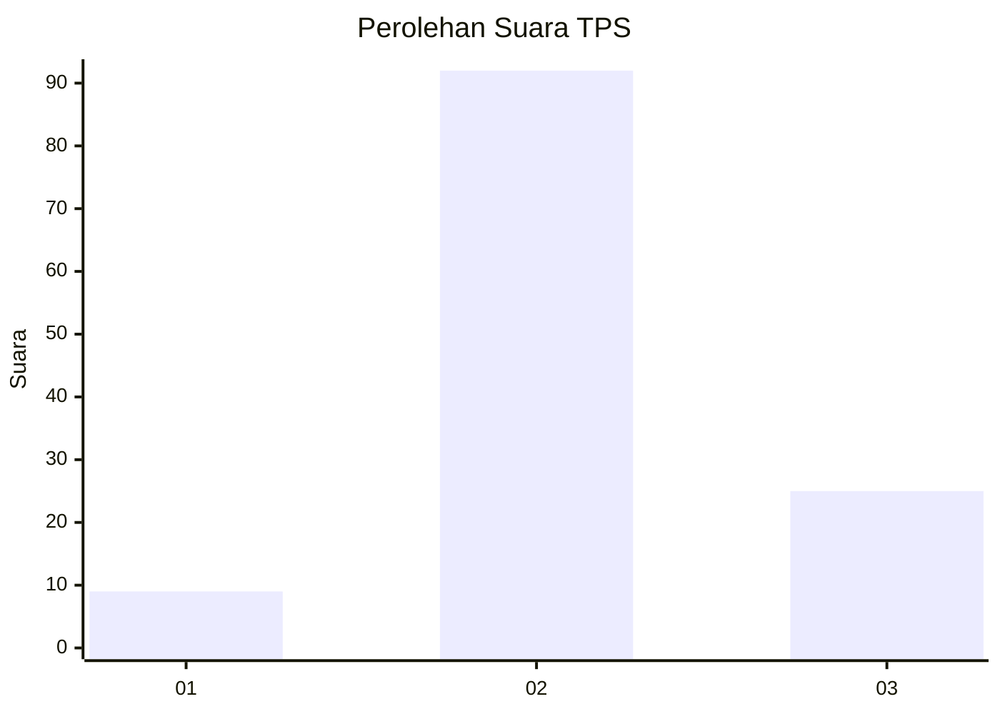
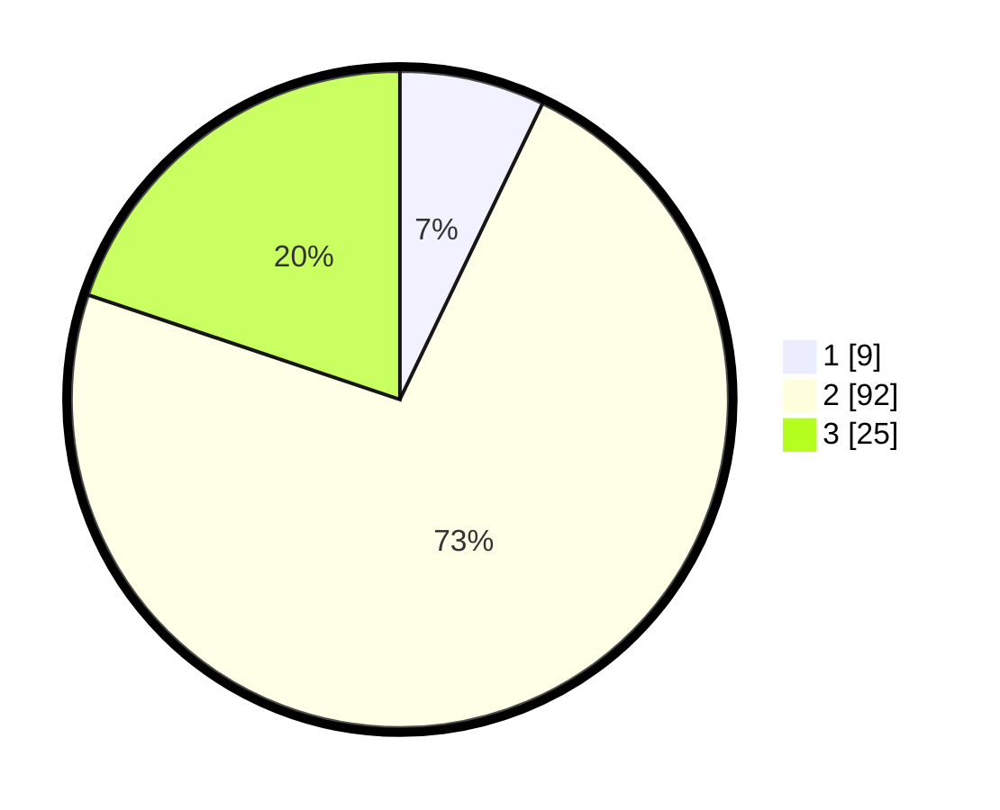

# Hasil

## Grafik

## Tabel

| No. | Nama Paslon    | Suara | Suara (raw) | Persentase |
|:--- |:-------------- | -----:| -----------:| ----------:|
| 1   | ANIES MUHAIMIN | 9     | [9][p-1]    | 7,14       |
| 2   | PRABOWO GIBRAN | 92    | [92][p-2]   | 73,02      |
| 3   | GANJAR MAHFUD  | 25    | [25][p-3]   | 19,84      |

[p-1]: https://github.com/gigit-pemilu/pemilu-2024/blob/main/pilpres/hitung-suara/sub/33-jawa-tengah/sub/18-pati/sub/09-jakenan/sub/2003-karangrowo/sub/003-tps/sub/paslon-1.txt
[p-2]: https://github.com/gigit-pemilu/pemilu-2024/blob/main/pilpres/hitung-suara/sub/33-jawa-tengah/sub/18-pati/sub/09-jakenan/sub/2003-karangrowo/sub/003-tps/sub/paslon-2.txt
[p-3]: https://github.com/gigit-pemilu/pemilu-2024/blob/main/pilpres/hitung-suara/sub/33-jawa-tengah/sub/18-pati/sub/09-jakenan/sub/2003-karangrowo/sub/003-tps/sub/paslon-3.txt

## Foto C Plano

https://sirekap-obj-formc.kpu.go.id/bb0f/pemilu/ppwp/33/18/09/20/03/3318092003003-20240214-231308--81961ce6-0c1b-4be6-86af-0f3b0543991d.jpg

https://sirekap-obj-formc.kpu.go.id/bb0f/pemilu/ppwp/33/18/09/20/03/3318092003003-20240214-231528--2658703b-1b46-4ef2-9ee8-325ef8c42d6f.jpg

https://sirekap-obj-formc.kpu.go.id/bb0f/pemilu/ppwp/33/18/09/20/03/3318092003003-20240214-231720--958103ea-36d1-4765-af41-b6f4a12ad69b.jpg

## Metadata

| Key        | Value               |
| ---------- | ------------------- |
| Time Stamp | 2024-02-15 16:00:26 |

