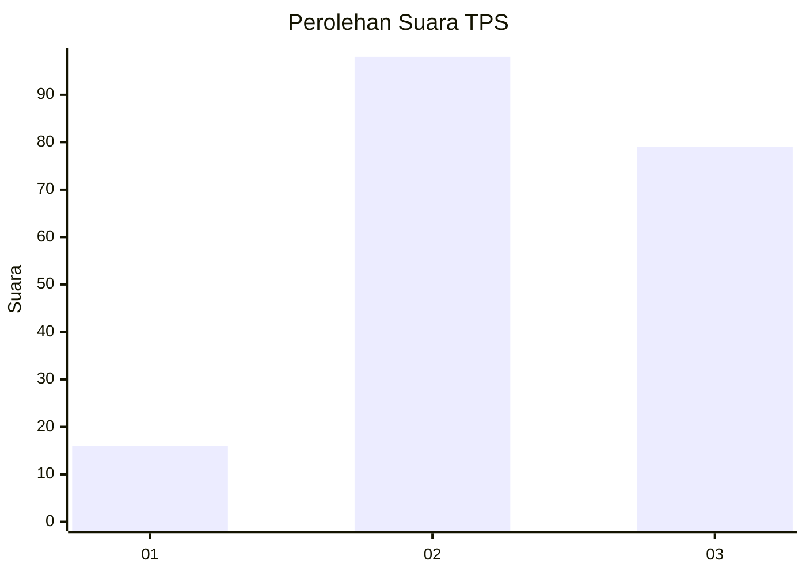
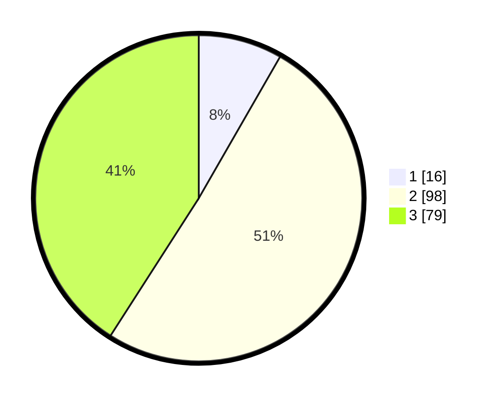

# Hasil

## Grafik

## Tabel

| No. | Nama Paslon    | Suara | Suara (raw) | Persentase |
|:--- |:-------------- | -----:| -----------:| ----------:|
| 1   | ANIES MUHAIMIN | 16    | [16][p-1]   | 8,29       |
| 2   | PRABOWO GIBRAN | 98    | [98][p-2]   | 50,78      |
| 3   | GANJAR MAHFUD  | 79    | [79][p-3]   | 40,93      |

[p-1]: https://github.com/gigit-pemilu/pemilu-2024-33-jawa-tengah/blob/main/pilpres/hitung-suara/sub/33-jawa-tengah/sub/18-pati/sub/10-pati/sub/1005-pati-wetan/sub/001-tps/sub/paslon-1.txt
[p-2]: https://github.com/gigit-pemilu/pemilu-2024-33-jawa-tengah/blob/main/pilpres/hitung-suara/sub/33-jawa-tengah/sub/18-pati/sub/10-pati/sub/1005-pati-wetan/sub/001-tps/sub/paslon-2.txt
[p-3]: https://github.com/gigit-pemilu/pemilu-2024-33-jawa-tengah/blob/main/pilpres/hitung-suara/sub/33-jawa-tengah/sub/18-pati/sub/10-pati/sub/1005-pati-wetan/sub/001-tps/sub/paslon-3.txt

## Foto C Plano

https://sirekap-obj-formc.kpu.go.id/3817/pemilu/ppwp/33/18/10/10/05/3318101005001-20240214-190224--d22bf786-3af2-4a55-9e55-747901c34e6a.jpg

https://sirekap-obj-formc.kpu.go.id/3817/pemilu/ppwp/33/18/10/10/05/3318101005001-20240214-190302--24c74285-2081-46bd-9876-1e80aa346297.jpg

https://sirekap-obj-formc.kpu.go.id/3817/pemilu/ppwp/33/18/10/10/05/3318101005001-20240214-190614--0add1b8a-e6ff-4ccd-a736-311f9e795769.jpg

## Metadata

| Key        | Value               |
| ---------- | ------------------- |
| Time Stamp | 2024-02-15 19:30:26 |

