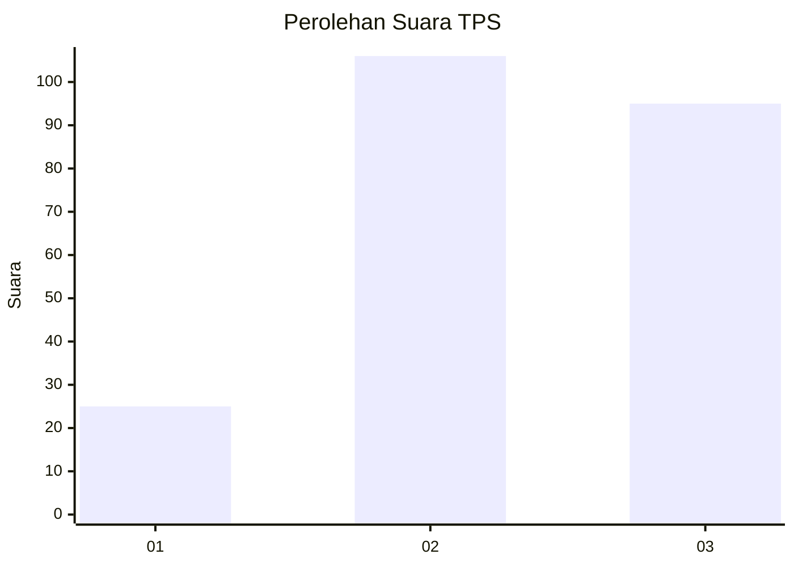
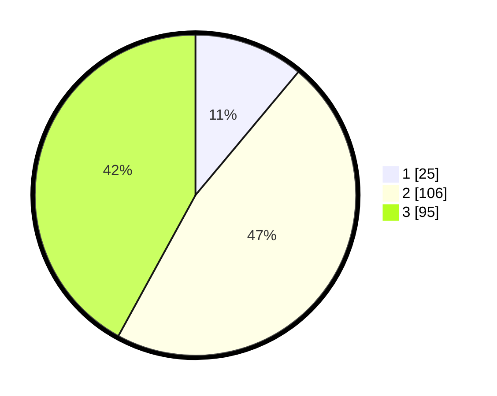

# Hasil

## Grafik

## Tabel

| No. | Nama Paslon    | Suara | Suara (raw) | Persentase |
|:--- |:-------------- | -----:| -----------:| ----------:|
| 1   | ANIES MUHAIMIN | 25    | [25][p-1]   | 11,06      |
| 2   | PRABOWO GIBRAN | 106   | [106][p-2]  | 46,90      |
| 3   | GANJAR MAHFUD  | 95    | [95][p-3]   | 42,04      |

[p-1]: https://github.com/gigit-pemilu/pemilu-2024/blob/main/pilpres/hitung-suara/sub/33-jawa-tengah/sub/18-pati/sub/10-pati/sub/2001-panjunan/sub/001-tps/sub/paslon-1.txt
[p-2]: https://github.com/gigit-pemilu/pemilu-2024/blob/main/pilpres/hitung-suara/sub/33-jawa-tengah/sub/18-pati/sub/10-pati/sub/2001-panjunan/sub/001-tps/sub/paslon-2.txt
[p-3]: https://github.com/gigit-pemilu/pemilu-2024/blob/main/pilpres/hitung-suara/sub/33-jawa-tengah/sub/18-pati/sub/10-pati/sub/2001-panjunan/sub/001-tps/sub/paslon-3.txt

## Foto C Plano

https://sirekap-obj-formc.kpu.go.id/3fda/pemilu/ppwp/33/18/10/20/01/3318102001001-20240216-184839--9e89a667-5a18-4583-a2dd-bf3077daf865.jpg

https://sirekap-obj-formc.kpu.go.id/3fda/pemilu/ppwp/33/18/10/20/01/3318102001001-20240216-184946--db89d672-24df-48b2-9fd5-ef427413eec2.jpg

https://sirekap-obj-formc.kpu.go.id/3fda/pemilu/ppwp/33/18/10/20/01/3318102001001-20240216-185115--4fd8a3ca-ae8d-4766-8cde-8c12a5062ccd.jpg

## Metadata

| Key        | Value               |
| ---------- | ------------------- |
| Time Stamp | 2024-02-16 21:01:00 |

