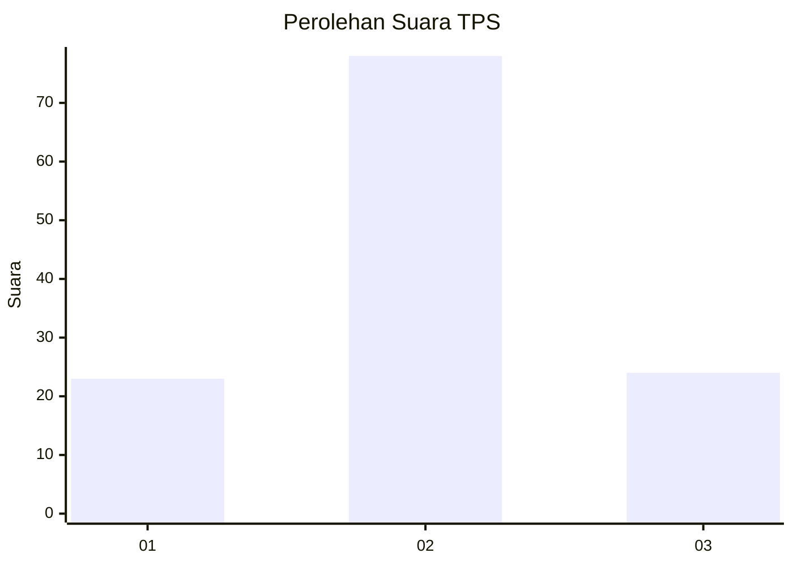
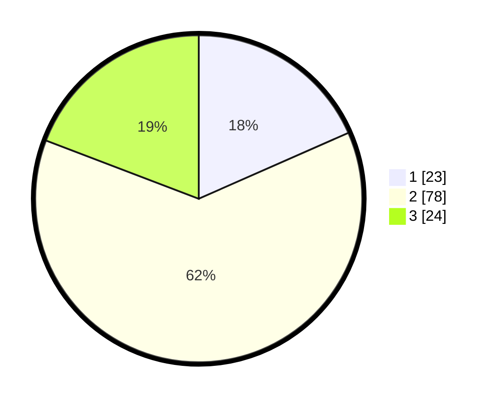

# Hasil

## Grafik

## Tabel

| No. | Nama Paslon    | Suara | Suara (raw) | Persentase |
|:--- |:-------------- | -----:| -----------:| ----------:|
| 1   | ANIES MUHAIMIN | 23    | [23][p-1]   | 18,40      |
| 2   | PRABOWO GIBRAN | 78    | [78][p-2]   | 62,40      |
| 3   | GANJAR MAHFUD  | 24    | [24][p-3]   | 19,20      |

[p-1]: https://github.com/gigit-pemilu/pemilu-2024-33-jawa-tengah/blob/main/pilpres/hitung-suara/sub/33-jawa-tengah/sub/18-pati/sub/10-pati/sub/2006-blaru/sub/011-tps/sub/paslon-1.txt
[p-2]: https://github.com/gigit-pemilu/pemilu-2024-33-jawa-tengah/blob/main/pilpres/hitung-suara/sub/33-jawa-tengah/sub/18-pati/sub/10-pati/sub/2006-blaru/sub/011-tps/sub/paslon-2.txt
[p-3]: https://github.com/gigit-pemilu/pemilu-2024-33-jawa-tengah/blob/main/pilpres/hitung-suara/sub/33-jawa-tengah/sub/18-pati/sub/10-pati/sub/2006-blaru/sub/011-tps/sub/paslon-3.txt

## Foto C Plano

https://sirekap-obj-formc.kpu.go.id/b071/pemilu/ppwp/33/18/10/20/06/3318102006011-20240214-141124--a9812641-6f3a-46f4-9bb5-a40a68985b36.jpg

https://sirekap-obj-formc.kpu.go.id/b071/pemilu/ppwp/33/18/10/20/06/3318102006011-20240214-141129--f72f5bf2-09ff-4fa6-ac95-90ebab34ed35.jpg

https://sirekap-obj-formc.kpu.go.id/b071/pemilu/ppwp/33/18/10/20/06/3318102006011-20240214-225122--48aac6fa-2d45-4776-b86e-4585de269fee.jpg

## Metadata

| Key        | Value               |
| ---------- | ------------------- |
| Time Stamp | 2024-02-15 12:00:28 |

